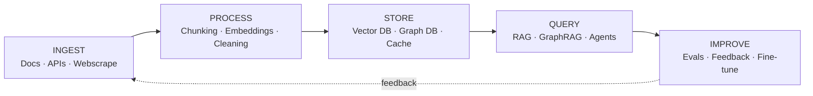
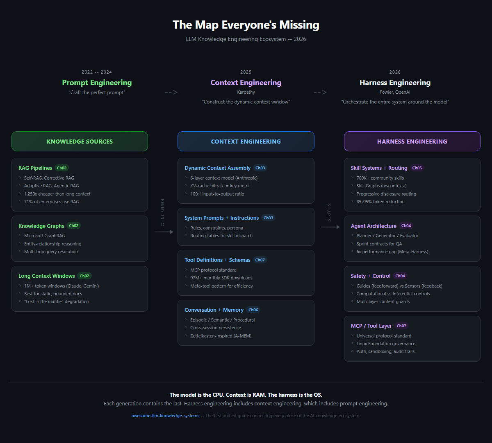

```mermaid
graph LR
    subgraph Sources["Knowledge Sources"]
        RAG[RAG Pipelines]
        KG[Knowledge Graphs]
        LC[Long Context Windows]
    end

    subgraph Context["Context Engineering"]
        DCA[Dynamic Context Assembly]
        KVC[KV-Cache Optimization]
        SP[System Prompts + Instructions]
        TD[Tool Definitions + Schemas]
        FSE[Few-shot Examples]
        CH[Conversation History]
    end

    subgraph Harness["Harness Engineering"]
        SK[Skill Systems + Routing]
        MEM[Memory Frameworks]
        MCP[MCP / Tool Layer]
        AR[Agent Runtime + Planning]
        PD[Progressive Disclosure]
    end

    Sources --> Context --> Harness
```

# The Map Everyone's Missing: LLM Knowledge Engineering in 2026

**English** | [繁體中文](translations/README-zh.md) | [简体中文](translations/README_zh-CN.md) | [日本語](translations/README_ja.md) | [한국어](translations/README_ko.md) | [Español](translations/README_es.md)

> I analyzed 50+ awesome lists, surveys, and guides -- none of them connected the dots. RAG papers don't mention harness engineering. Memory frameworks ignore skill systems. MCP docs skip progressive disclosure. This guide draws the complete map.

<details>
<summary><b>What's new in May 2026</b> (click to expand)</summary>

Late-April / early-May 2026 added seven structurally significant timeline entries plus a full attribution-audit pass. If you visited before May 6, here is what shifted (full chronological log: [CHANGELOG.md](CHANGELOG.md)):

- **April 7 Mythos breach addendum** — the Glasswing distribution model was breached within ~14 hours of public announcement, foreshadowing the offensive-side cyber thesis ([Ch11](chapters/11-timeline.md))
- **April 8 Anthropic Managed Agents** — first frontier-vendor primitive that meters the orchestrator seat itself, separately from inference ([Ch04 §4.9](chapters/04-harness-engineering.md), [Ch11](chapters/11-timeline.md), glossary)
- **April 23 Memory for Managed Agents** — closes the loop with the March 31 Claude Code source-leak finding (three-layer self-healing memory now ships as a vendor-managed primitive) ([Ch04 §4.9](chapters/04-harness-engineering.md), [Ch11](chapters/11-timeline.md))
- **April 27 Microsoft–OpenAI restructure** — cloud exclusivity ends, AGI provision no longer load-bearing; reframes the substrate-portability narrative ([Ch08](chapters/08-tools-landscape.md), [Ch11](chapters/11-timeline.md))
- **April 28 Bedrock Managed Agents (AWS × OpenAI)** — first time *the OpenAI agent harness* is named and sold as a separate product surface; cross-vendor convergence on the Managed Agents pattern ([Ch04 §4.9](chapters/04-harness-engineering.md), [Ch11](chapters/11-timeline.md))
- **April 28 AHE paper** ([arXiv 2604.25850](https://arxiv.org/abs/2604.25850)) — observability-driven harness evolution; 69.7% → 77.0% on Terminal-Bench 2 with cross-family transfer ([Ch04 §4.5](chapters/04-harness-engineering.md), [Ch11](chapters/11-timeline.md))
- **Late April AgentFlow** ([arXiv 2604.20801](https://arxiv.org/abs/2604.20801)) — harness synthesis as a viable engineering surface; 84.3% TerminalBench-2 plus ten externally-validated zero-day CVEs on Chrome with Kimi K2.5 ([Ch04](chapters/04-harness-engineering.md), [Ch07](chapters/07-mcp.md), [Ch11](chapters/11-timeline.md))
- **`## The Pattern` updated** — adds a fifth thread (harness synthesis), revises the cloud-native-primitives thread to reflect substrate / triggering / memory unbundling
- **Attribution audit, all chapters** — twelve fixes across Ch01 / Ch02 / Ch03 / Ch04 / Ch05 / Ch06 / Ch07 / Ch09 / Ch11 / Ch12. Notable factual corrections: §4.2 renamed "The Böckeler Taxonomy" (was misattributed Fowler 2025; actual is Birgitta Böckeler April 2026 on martinfowler.com); Ch03 §3.5 cited two academic surveys that conflated or fabricated (real survey is Mei et al. arXiv 2507.13334); Ch06 MIRIX was described as four-layer (actual is six memory types per arXiv 2507.07957)

</details>

---

## TL;DR

- **Prompt engineering was just the beginning.** The field has evolved through three generations: Prompt Engineering (2022-2024), Context Engineering (2025), and Harness Engineering (2026). Each layer subsumes the last.
- **RAG is not dead.** 71% of enterprises that tried context-stuffing came back to RAG within 12 months (Gartner Q4 2025). Hybrid architectures are winning.
- **Context engineering is about what surrounds the call, not the call itself.** Andrej Karpathy's mid-2025 reframe shifted focus from crafting prompts to constructing the entire context window dynamically.
- **Harness engineering is the operating system layer.** Birgitta Böckeler (writing in Martin Fowler's *Exploring Generative AI* memo series, April 2026) and the OpenAI Codex team's harness-design framing formalized this -- the model is the CPU, context is RAM, and the harness is the OS that orchestrates everything.
- **No single guide connected all of this until now.** RAG, knowledge graphs, long context, MCP, skill routing, memory systems, and progressive disclosure are all part of one ecosystem. This is the map.

---

## Start Here

AI tools are getting smarter every year, but they only work well when they receive the right information at the right time. This guide explains how that works -- from the basics of telling an AI what to do, all the way up to designing entire systems around AI models.

Think of AI like a brilliant new employee on their first day. Prompt engineering is giving them a single task. Context engineering is giving them all the background information they need to do the task well. Harness engineering is designing their entire work environment -- their desk, their tools, their filing system, their team structure -- so they can do their best work consistently. This guide covers all three, and shows how they connect.

If you are new to this topic, start with the [Glossary](glossary.md) for definitions of key terms. If you build AI applications, jump straight into the chapters below. If you just want the big picture, look at the Ecosystem Map diagram further down this page.

---

## Which Path Should You Take?

Not sure where to start? Pick the description that fits you best:

- **"I just want to understand what all these AI buzzwords mean."** -- Start with the [Glossary](glossary.md), then read [Chapter 1: The Three Generations](chapters/01-evolution.md).
- **"I'm building an AI application."** -- Read [Ch02: RAG, Long Context & Knowledge Graphs](chapters/02-knowledge-layer.md), then [Ch03: Context Engineering](chapters/03-context-engineering.md), then [Ch04: Harness Engineering](chapters/04-harness-engineering.md).
- **"I want to make my AI tools work better."** -- Read [Ch05: Skill Systems](chapters/05-skill-systems.md), then [Ch06: Agent Memory](chapters/06-agent-memory.md), then [Ch10: Case Study](chapters/10-case-study.md).
- **"I want to see real examples."** -- Jump straight to [Ch10: Case Study](chapters/10-case-study.md).
- **"I work with Chinese AI tools."** -- Start with [Ch09: The Chinese AI Ecosystem](chapters/09-china-ecosystem.md).
- **"I want the complete picture."** -- Read front to back, starting with Chapter 1.

---

## Use Cases

This guide helps you design systems for these real-world scenarios. Each row links to the chapters that matter most for that build:

| Scenario | What You're Building | Core Chapters |
|----------|---------------------|---------------|
| **Personal Second Brain** | Personal notes + papers + web clippings searchable via natural-language queries | [Ch02](/chapters/02-knowledge-layer.md) · [Ch05](/chapters/05-skill-systems.md) · [Ch08](/chapters/08-tools-landscape.md) |
| **Internal Company Knowledge Base** | Employees query policy / handbooks / runbooks — low hallucination bar, citations required | [Ch02](/chapters/02-knowledge-layer.md) · [Ch04](/chapters/04-harness-engineering.md) · [Ch06](/chapters/06-agent-memory.md) |
| **Developer Documentation Assistant** | Engineers query codebases / API docs / past incident postmortems across multi-repo environments | [Ch02](/chapters/02-knowledge-layer.md) · [Ch05](/chapters/05-skill-systems.md) · [Ch07](/chapters/07-mcp.md) |
| **Support / QA Agent** | Customer or internal tickets → context-aware replies with cited sources and follow-up memory | [Ch03](/chapters/03-context-engineering.md) · [Ch06](/chapters/06-agent-memory.md) · [Ch04](/chapters/04-harness-engineering.md) |
| **Domain-Specific Knowledge Automation** *(legal, healthcare, finance, engineering)* | Reuse decades of domain documents — regulated, IP-sensitive, often requires local models and audit trails | [Ch02](/chapters/02-knowledge-layer.md) · [Ch09](/chapters/09-china-ecosystem.md) · [Ch12](/chapters/12-local-models.md) |

If your scenario doesn't fit cleanly, it's probably a composition of these — start from the closest row and adapt.

---

## The Evolution

```
2022-2024               2025                    2026
PROMPT ENG        -->   CONTEXT ENG       -->   HARNESS ENG
                        (Karpathy)              (Fowler, OpenAI)

"Craft the          "Construct the          "Orchestrate the
 perfect prompt"     dynamic context          entire system
                     window"                  around the model"
```

Each generation does not replace the last -- it contains it. Harness engineering includes context engineering, which includes prompt engineering.

---

## The Lifecycle

The Ecosystem Map shows **what** the pieces are. The Lifecycle shows **how data moves through them**:

```
                    ┌───── feedback ──────────────┐
                    ▼                             │
 INGEST  ───▶ PROCESS  ───▶ STORE  ───▶ QUERY ───▶ IMPROVE
    │             │            │          │           │
 Docs          Chunking      Vector DB    RAG        Evals
 APIs          Embeddings    Graph DB     GraphRAG   Feedback
 Web clips     Cleaning      Cache        Agents     Fine-tune
 Crawlers      Multi-modal   Long doc     Tool use   Skill updates
    │             │            │          │           │
   Ch02       Ch02 · Ch03    Ch02-08    Ch02-07     Ch06
```



Every production system moves data through all five stages — even if some are implicit. A good harness design makes **each stage inspectable and replaceable**. Ch02 covers Ingest/Process/Store; Ch03–Ch07 cover Query; Ch06 and Ch10 cover Improve.

---

## Ecosystem Map



*[View interactive HTML version](diagrams/ecosystem-map.html)*

```
+---------------------------+     +---------------------------+     +---------------------------+
|    KNOWLEDGE SOURCES      |     |   CONTEXT ENGINEERING     |     |   HARNESS ENGINEERING     |
|                           |     |                           |     |                           |
|  +---------------------+ | --> |  +---------------------+ | --> |  +---------------------+ |
|  | RAG Pipelines       | |     |  | Dynamic Context     | |     |  | Skill Systems       | |
|  | - Self-RAG          | |     |  |   Assembly          | |     |  | - Routing Logic     | |
|  | - Corrective RAG    | |     |  |                     | |     |  | - Progressive       | |
|  | - Adaptive RAG      | |     |  | KV-Cache            | |     |  |   Disclosure        | |
|  +---------------------+ |     |  |   Optimization      | |     |  +---------------------+ |
|                           |     |  |                     | |     |                           |
|  +---------------------+ |     |  | System Prompts      | |     |  +---------------------+ |
|  | Knowledge Graphs    | |     |  |   + Instructions    | |     |  | Memory Frameworks   | |
|  | - GraphRAG          | |     |  |                     | |     |  | - Short-term        | |
|  | - Entity Relations  | |     |  | Tool Definitions    | |     |  | - Long-term         | |
|  | - Multi-hop Queries | |     |  |   + Schemas         | |     |  | - Episodic          | |
|  +---------------------+ |     |  |                     | |     |  +---------------------+ |
|                           |     |  | Few-shot Examples   | |     |                           |
|  +---------------------+ |     |  |                     | |     |  +---------------------+ |
|  | Long Context        | |     |  | Conversation        | |     |  | MCP / Tool Layer    | |
|  | - 1M+ token windows | |     |  |   History           | |     |  | - Protocol Std      | |
|  | - Static doc ingest | |     |  +---------------------+ |     |  | - Tool Routing      | |
|  +---------------------+ |     +---------------------------+     |  | - Auth + Sandboxing | |
+---------------------------+                                       |  +---------------------+ |
                                                                    |                           |
                                                                    |  +---------------------+ |
                                                                    |  | Agent Runtime       | |
                                                                    |  | - Planning Loops    | |
                                                                    |  | - Error Recovery    | |
                                                                    |  | - Multi-agent       | |
                                                                    |  |   Coordination      | |
                                                                    |  +---------------------+ |
                                                                    +---------------------------+
```



---

## Table of Contents

### Chapters

| # | Chapter | Description |
|---|---------|-------------|
| 01 | [The Three Generations](/chapters/01-evolution.md) | From prompt engineering to context engineering to harness engineering |
| 02 | [RAG, Long Context & Knowledge Graphs](/chapters/02-knowledge-layer.md) | The knowledge retrieval layer -- what works, what doesn't, and why hybrid wins |
| 03 | [Context Engineering](/chapters/03-context-engineering.md) | The art of filling the context window -- KV-cache, the 100:1 ratio, dynamic assembly |
| 04 | [Harness Engineering](/chapters/04-harness-engineering.md) | Building the OS around the model -- guides, sensors, and the 6x performance gap |
| 05 | [Skill Systems & Skill Graphs](/chapters/05-skill-systems.md) | From flat files to traversable graphs -- progressive disclosure in practice |
| 06 | [Agent Memory](/chapters/06-agent-memory.md) | The missing layer -- episodic, semantic, and procedural memory architectures |
| 07 | [MCP: The Standard That Won](/chapters/07-mcp.md) | Model Context Protocol -- from launch to 97M+ monthly downloads |
| 08 | [AI-Native Knowledge Management](/chapters/08-tools-landscape.md) | Tools landscape -- Notion AI, Obsidian, Mem, and the AI-native gap |
| 09 | [The Chinese AI Ecosystem](/chapters/09-china-ecosystem.md) | Dify, RAGFlow, DeepSeek, Kimi -- a parallel universe of innovation |
| 10 | [Case Study: A Real-World Knowledge Harness](/chapters/10-case-study.md) | How one developer built a complete harness with 65% token reduction |
| 11 | [Timeline](/chapters/11-timeline.md) | Key moments in LLM knowledge engineering, 2022-2026 |
| 12 | [Local Models for Knowledge Engineering](/chapters/12-local-models.md) | Run your knowledge harness locally -- embedding, RAG, compilation, and the fine-tuning endgame |

---

## Why This Guide Exists

The LLM ecosystem in 2026 has a fragmentation problem. Not a lack of information -- an excess of disconnected information.

There are mass surveys on RAG. Comprehensive prompt engineering guides. MCP specification documents. Agent framework comparisons. Memory system papers. Each one is excellent in isolation. None of them show you how the pieces fit together.

This guide is that missing layer. It connects RAG to context engineering, context engineering to harness engineering, harness engineering to agent runtimes -- and shows you the decisions that matter at each boundary.

---

## Contributing

Contributions are welcome! This list is community-maintained.

- **Add a resource:** [Submit a Pull Request](../../pulls) -- see [CONTRIBUTING.md](CONTRIBUTING.md) for guidelines
- **Suggest a resource:** [Open an Issue](../../issues/new?template=suggest-resource.md)
- **Report a broken link:** [Open an Issue](../../issues/new?template=report-broken-link.md)
- **Discuss:** [Join the Discussion](../../discussions)
- **Translations**: Translation PRs go in `/translations/`. Maintain the same file structure. Available translations: [繁體中文](translations/README-zh.md) | [简体中文](translations/README_zh-CN.md) | [日本語](translations/README_ja.md) | [한국어](translations/README_ko.md) | [Español](translations/README_es.md)

Please keep the tone professional but accessible. Cite sources. No hype.

---

## License

MIT License. See [LICENSE](LICENSE) for details.

Use this however you want. Attribution appreciated but not required.

---

*Last updated: May 2026*
