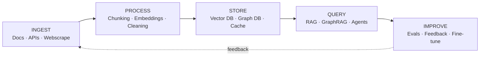

# The Map Everyone's Missing: LLM Knowledge Engineering in 2026

**English** | [繁體中文](translations/README-zh.md) | [简体中文](translations/README_zh-CN.md) | [日本語](translations/README_ja.md) | [한국어](translations/README_ko.md) | [Español](translations/README_es.md)

> I analyzed 50+ awesome lists, surveys, and guides -- none of them connected the dots. RAG papers don't mention harness engineering. Memory frameworks ignore skill systems. MCP docs skip progressive disclosure. This guide draws the complete map.

<details>
<summary><b>What's new in August 2026</b> (click to expand)</summary>

The late-August 2026 wave adds ten timeline entries and integrations across nine chapters: the harness layer goes open-source on both sides of the Pacific inside a week, skill supply-chain attacks generalize from one fake skill to a whole trending family, agent sessions become addressable to each other, and MCP publishes its first post-final-spec roadmap. It builds on the early-August wave (Metis) and the late-July wave (Chapter 14 plus six timeline entries). Most recent first (full chronological log: [CHANGELOG.md](CHANGELOG.md)):

- **August 22 The new MCP roadmap** — under four weeks after the final specification, the core maintainers formalize governance (Contributor Ladder, Working-Group SEP triage, a feature lifecycle and deprecation policy) and name five priorities: agentic messaging primitives with *Tasks moving toward the core*, HTTP-native transport for local deployments, agent identity via DPoP and Workload Identity Federation, tool-result handling and progressive discovery over large catalogs, and SDK conformance ([Ch07](chapters/07-mcp.md), [Ch11](chapters/11-timeline.md))
- **August 19 OpenAI repositions Codex as a platform** — `codex exec`, the Codex SDK, and *app-server* ship under Apache 2.0 as a decoupled harness product while model access stays proprietary; note that `openai/codex` has been public and Apache-2.0 since April 2025, so this is a repositioning, not a first open-sourcing, and the ARC-AGI-3 13.3%→38.3% at 6x fewer output tokens figure is OpenAI's own ([Ch04 §4.7](chapters/04-harness-engineering.md), [Ch11](chapters/11-timeline.md))
- **August 19 Anthropic's Skills API reaches GA** — `/v1/skills` leaves beta (release note August 19, companion blog August 20) inside a wider production-agent GA wave; twelve days earlier, GitHub-hosted skills let Managed Agents auto-discover a mounted repo's `.claude/skills` at session start, with Anthropic's own docs noting the repo becomes part of the agent's *trust boundary* with no review step ([Ch05 §5.2](chapters/05-skill-systems.md), [Ch11](chapters/11-timeline.md))
- **August 13 DeepSeek Harness (dsh)** — an MIT-licensed agent harness whose model adapter, tool registry, session log, sandbox, storage, scheduler, and UI are all swappable plugins ("Cordis"), with an append-only log of every context injection; 190,630 stars / 21,319 forks in 11 days (GitHub API, checked August 24) extends China's open-source-first logic from weights to the harness ([Ch09](chapters/09-china-ecosystem.md), [Ch11](chapters/11-timeline.md))
- **August 10 Meta Muse Glimmer** — a 30B dense Apache-2.0 model distilled from Muse Spark and built for local agents (under 20GB at 4-bit, single consumer GPU) with day-0 support across Ollama, llama.cpp, MLX, ExecuTorch, vLLM and more; the first US frontier lab shipping for the single-GPU local case rather than server-class open weights, with all speedup and benchmark figures Meta's own ([Ch12](chapters/12-local-models.md), [Ch11](chapters/11-timeline.md))
- **August 7 Claude Code ships cross-session agent messaging** — `ListAgents` and `SendMessage` make named sessions addressable to each other with per-session inbound accept / hold / refuse governance, while no history, files, or permission approvals cross the boundary; a major vendor shipping Chapter 14's *org graph* primitive without ever using the phrase "graph engineering" ([Ch14 §14.2](chapters/14-graph-engineering.md), [Ch11](chapters/11-timeline.md))
- **August 6 The Paperclip skill campaign** — impersonated `paperclipai` and `browser-use` orgs published skills that were benign on July 5, weaponized on July 11, and #8 trending; the payload swept 138 credential paths through four independent trigger mechanisms, and the >1.7M install counter is an aggregate, not unique agents — the time-of-check-to-time-of-use pattern scaling from one fake skill to a whole family ([Ch05 §5.10](chapters/05-skill-systems.md), [Ch11](chapters/11-timeline.md))
- **August 6 AWS AgentCore: Temporal Policies + Runtime Instances GA** — deterministic, deny-by-default authorization that evaluates a tool call against the agent's *prior session history*, written in the new Apache-2.0 Dogwood policy language; shipped the same day as Runtime Instances GA, whose customer-selected EC2 sessions run up to 14 days against the serverless default's 8 hours ([Ch04 §4.1](chapters/04-harness-engineering.md), [Ch11](chapters/11-timeline.md), glossary)
- **August 3 TencentDB Agent Memory v2.0 adds Team Memory** — private / team / restricted / agent *visibility tiers* over four versioned memory asset types, a Memory Proxy speaking both Anthropic's and OpenAI's protocols, and L0-L3 distillation: the first shipped answer to the access-control axis GateMem found no framework satisfies, though every governance claim is Tencent's own and no independent benchmark exists ([Ch06](chapters/06-agent-memory.md), [Ch11](chapters/11-timeline.md))
- **August 2 Practical online KV-cache compaction for agents** — the first systematic study of compaction on *agent trajectories*: compacting immediately costs accuracy, delaying until the agent's own later queries act as a proxy-query signal recovers most of it, and token eviction beats attention-matching reconstruction — 80% cache reduction with better throughput than no compaction at all ([Ch03 §3.3](chapters/03-context-engineering.md), [Ch11](chapters/11-timeline.md))

*From earlier waves (full detail in [CHANGELOG.md](CHANGELOG.md)):*

- **July 29 MemTensor's Metis proposes memory foundation models** — MemTensor (Shanghai), the same lab behind June's agent-native-memory survey, joined by co-authors from Renmin University / NUS / SJTU / Tongji, proposes agent memory as *persistent, parametric state inside the transformer backbone itself* rather than an external store: a frozen Qwen3.5 backbone (4B/9B/27B) with only a Fast-Weight-Programming-inspired "hyper memory block" and "local memory block" trained, updated at inference by a gradient-free EMA-style pass; the paper itself reports long-horizon information loss under fixed-size compression and "information confusion in some cases, possibly caused by the blending of semantics within the latent space" ([Ch06](chapters/06-agent-memory.md), [Ch11](chapters/11-timeline.md), glossary)
- **July 29 LangChain ships Deep Agents v0.7** — removes the framework's default base system prompt, trims built-in tool descriptions 43%, and makes the todo-list planning scaffold opt-in after evals across three model families found no measurable gain from it, cutting base input tokens on a default agent turn roughly 65% (~6k to ~2k) — a production instance of this guide's stress-testing discipline ([Ch04 §4.8](chapters/04-harness-engineering.md), [Ch11](chapters/11-timeline.md))
- **July 29 MinIO ships AIStor Memory** — an object-storage-backed layer for agent memory, workspace state, and credentials, positioned to replace a hand-assembled stack of vector store, metadata database, and credential tooling with a durable, customer-owned, full-fidelity record ([Ch11](chapters/11-timeline.md))
- **July 28 The MCP 2026-07-28 specification ships final** — the largest revision since authorization was added: a *stateless request/response core*, Multi Round-Trip Requests (SEP-2322), RFC 9207 issuer validation, Client ID Metadata Documents replacing Dynamic Client Registration, and a formal extensions framework, with a 12-month deprecation window for Roots / Sampling / Logging / HTTP+SSE ([Ch07](chapters/07-mcp.md), [Ch11](chapters/11-timeline.md), glossary)
- **July 24 Claude Opus 5** — pricing unchanged from Opus 4.8 at half Fable 5's rate, 1M context / 128K output, a *five-level `effort` dial*, paid Fast mode, and mid-conversation tool changes without prompt-cache invalidation (beta); benchmark figures are Anthropic's own claims ([Ch04 §4.10](chapters/04-harness-engineering.md), [Ch11](chapters/11-timeline.md))
- **July 17-22 New Chapter 14 — Graph Engineering** — the second layer-name in six weeks gets a full chapter: Steinberger's July 17-18 catalyst post, the org-graph / work-graph split (Thakker), loops supervising loops held down by *anchors* (Perez), governed topologies (TrueFoundry, Eigent), and LangChain's double-edged "3 Years of Graph Engineering with LangGraph" response — framed as *emerging and contested*, two weeks old, with the skeptics given equal weight and an explicit September 2026 survival gate ([Ch14](chapters/14-graph-engineering.md), [Ch01](chapters/01-evolution.md), glossary)
- **July 18 Anthropic resolves Fable 5 subscription access** — Max and Team Premium keep Fable 5 permanently from July 20 at 50% of weekly usage limits, while Pro and Team Standard move to usage-credit rates — closing the arc that began with the June 12 export-control suspension ([Ch11](chapters/11-timeline.md))
- **July 17 Moonshot releases Kimi K3** — at 2.8T parameters (MoE) the largest open-weight model ever released, with 1M context and native vision; topping Arena's frontend coding leaderboard as an open-weight model, weights following July 27 under Moonshot's bespoke Kimi K3 License ("open weight," in the company's own framing, not "open source") — server-class only, so the open-weight frontier widens without changing the local-deployment story ([Ch09](chapters/09-china-ecosystem.md), [Ch11](chapters/11-timeline.md))
- **July 17 WAIC 2026 and the founding of WAICO** — the World AI Conference in Shanghai produces the agreement establishing the World Artificial Intelligence Cooperation Organization, the first intergovernmental organization dedicated to AI, headquartered in Shanghai ([Ch09](chapters/09-china-ecosystem.md), [Ch11](chapters/11-timeline.md))
- **July 14 New Chapter 13 — Loop Engineering** — the June 2026 "loop engineering" frame gets a full chapter: Peter Steinberger's catalyst post, Addy Osmani's naming essay and "Own the Outer Loop" follow-up, Boris Cherny, the generator-evaluator split (Rajasekaran), Stripe's minions, LangChain's four stacked rungs, and adoption signals — framed as *emerging and contested*, five weeks old with no academic literature yet ([Ch13](chapters/13-loop-engineering.md), [Ch01](chapters/01-evolution.md), glossary)
- **July 6 Anthropic J-space — a second interpretability channel** — Anthropic's "A global workspace in language models" identifies *J-space*, a small set of internal residual-stream directions Claude can report and modulate, giving harness engineers a *CoT-independent sensor class* for reading internal state ([Ch04 §4.2](chapters/04-harness-engineering.md), [Ch11](chapters/11-timeline.md))
- **July 6 Tencent open-sources Hy3** — the 295B-parameter Hunyuan 3.0 ships under *unrestricted Apache 2.0* with geographic carve-outs removed; the last major closed Chinese frontier lab defaulting to fully open weights completes the open-source-convergence thesis ([Ch09](chapters/09-china-ecosystem.md), [Ch11](chapters/11-timeline.md))
- **July 2 Cloak-and-Detonate (HKUST)** — systematic demonstration that static skill scanning has a *structural* ceiling: SkillCloak evades >90% of the time across 8 scanners, and the same team's runtime checker SkillDetonate catches 97% of attacks at a 2% false-positive rate ([Ch05 §5.10](chapters/05-skill-systems.md), [Ch11](chapters/11-timeline.md), glossary)
- **June 29 DeepSeek V4 peak/off-peak pricing** — the mid-July official release adds *demand-responsive time-of-day API pricing* (peak hours at 2x off-peak), reframing price itself as a scheduling primitive for harness designers ([Ch09](chapters/09-china-ecosystem.md), [Ch11](chapters/11-timeline.md))

</details>

---

## TL;DR

- **Prompt engineering was just the beginning.** The field has evolved through three generations: Prompt Engineering (2022-2024), Context Engineering (2025), and Harness Engineering (2026). Each layer subsumes the last -- and a contested fourth layer, *loop engineering*, emerged in mid-2026 ([Ch13](chapters/13-loop-engineering.md)), followed six weeks later by a fifth claim, *graph engineering* ([Ch14](chapters/14-graph-engineering.md)).
- **RAG is not dead.** 71% of enterprises that tried context-stuffing came back to RAG within 12 months (Gartner Q4 2025). Hybrid architectures are winning.
- **Context engineering is about what surrounds the call, not the call itself.** Andrej Karpathy's mid-2025 reframe shifted focus from crafting prompts to constructing the entire context window dynamically.
- **Harness engineering is the operating system layer.** Birgitta Böckeler (writing in Martin Fowler's *Exploring Generative AI* memo series, April 2026) and the OpenAI Codex team's harness-design framing formalized this -- the model is the CPU, context is RAM, and the harness is the OS that orchestrates everything.
- **No single guide connected all of this until now.** RAG, knowledge graphs, long context, MCP, skill routing, memory systems, and progressive disclosure are all part of one ecosystem. This is the map.

---

## Start Here

AI tools are getting smarter every year, but they only work well when they receive the right information at the right time. This guide explains how that works -- from the basics of telling an AI what to do, all the way up to designing entire systems around AI models.

Think of AI like a brilliant new employee on their first day. Prompt engineering is giving them a single task. Context engineering is giving them all the background information they need to do the task well. Harness engineering is designing their entire work environment -- their desk, their tools, their filing system, their team structure -- so they can do their best work consistently. This guide covers all three, and shows how they connect.

If you are new to this topic, start with the [Glossary](glossary.md) for definitions of key terms. If you build AI applications, jump straight into the chapters below. If you just want the big picture, look at the Ecosystem Map diagram further down this page.

---

## Which Path Should You Take?

Not sure where to start? Pick the description that fits you best:

- **"I just want to understand what all these AI buzzwords mean."** -- Start with the [Glossary](glossary.md), then read [Chapter 1: The Three Generations](chapters/01-evolution.md).
- **"I'm building an AI application."** -- Read [Ch02: RAG, Long Context & Knowledge Graphs](chapters/02-knowledge-layer.md), then [Ch03: Context Engineering](chapters/03-context-engineering.md), then [Ch04: Harness Engineering](chapters/04-harness-engineering.md).
- **"I want to make my AI tools work better."** -- Read [Ch05: Skill Systems](chapters/05-skill-systems.md), then [Ch06: Agent Memory](chapters/06-agent-memory.md), then [Ch10: Case Study](chapters/10-case-study.md).
- **"I want my agents to run without me pushing every step."** -- Read [Ch13: Loop Engineering](chapters/13-loop-engineering.md), then [Ch04: Harness Engineering](chapters/04-harness-engineering.md) and [Ch06: Agent Memory](chapters/06-agent-memory.md).
- **"I'm wiring multiple agents together."** -- Read [Ch14: Graph Engineering](chapters/14-graph-engineering.md), then [Ch13: Loop Engineering](chapters/13-loop-engineering.md) and [Ch04: Harness Engineering](chapters/04-harness-engineering.md).
- **"I want to see real examples."** -- Jump straight to [Ch10: Case Study](chapters/10-case-study.md).
- **"I work with Chinese AI tools."** -- Start with [Ch09: The Chinese AI Ecosystem](chapters/09-china-ecosystem.md).
- **"I want the complete picture."** -- Read front to back, starting with Chapter 1.

---

## Use Cases

This guide helps you design systems for these real-world scenarios. Each row links to the chapters that matter most for that build:

| Scenario | What You're Building | Core Chapters |
|----------|---------------------|---------------|
| **Personal Second Brain** | Personal notes + papers + web clippings searchable via natural-language queries | [Ch02](/chapters/02-knowledge-layer.md) · [Ch05](/chapters/05-skill-systems.md) · [Ch08](/chapters/08-tools-landscape.md) |
| **Internal Company Knowledge Base** | Employees query policy / handbooks / runbooks — low hallucination bar, citations required | [Ch02](/chapters/02-knowledge-layer.md) · [Ch04](/chapters/04-harness-engineering.md) · [Ch06](/chapters/06-agent-memory.md) |
| **Developer Documentation Assistant** | Engineers query codebases / API docs / past incident postmortems across multi-repo environments | [Ch02](/chapters/02-knowledge-layer.md) · [Ch05](/chapters/05-skill-systems.md) · [Ch07](/chapters/07-mcp.md) |
| **Support / QA Agent** | Customer or internal tickets → context-aware replies with cited sources and follow-up memory | [Ch03](/chapters/03-context-engineering.md) · [Ch06](/chapters/06-agent-memory.md) · [Ch04](/chapters/04-harness-engineering.md) |
| **Domain-Specific Knowledge Automation** *(legal, healthcare, finance, engineering)* | Reuse decades of domain documents — regulated, IP-sensitive, often requires local models and audit trails | [Ch02](/chapters/02-knowledge-layer.md) · [Ch09](/chapters/09-china-ecosystem.md) · [Ch12](/chapters/12-local-models.md) |

If your scenario doesn't fit cleanly, it's probably a composition of these — start from the closest row and adapt.

---

## The Evolution

```
2022-2024               2025                    2026                    2026 (mid)?             2026 (late)??
PROMPT ENG        -->   CONTEXT ENG       -->   HARNESS ENG       -->   LOOP ENG (emerging) --> GRAPH ENG (contested)
                        (Karpathy)              (Fowler, OpenAI)        (Steinberger, Osmani)   (Steinberger, Perez)

"Craft the              "Construct the          "Orchestrate the        "Design the system      "Wire the org
 perfect prompt"        dynamic context         entire system           that prompts            of agents that
                        window"                 around the model"       the agent"              run the loops"
```

Each generation does not replace the last -- it contains it. Harness engineering includes context engineering, which includes prompt engineering. Loop engineering, a still-contested fourth layer, wraps all three -- the system that runs the harness on a timer, spawns helpers, and feeds it back to itself. Graph engineering, the July 2026 claim covered in [Ch14](chapters/14-graph-engineering.md), would wrap even that -- the wiring of multiple loops into a designed organization -- though whether it is a real fifth layer or three-year-old practice with a new name (LangChain's counter) is exactly what its chapter leaves open.

---

## The Lifecycle

The Ecosystem Map shows **what** the pieces are. The Lifecycle shows **how data moves through them**:

```
                    ┌───── feedback ──────────────┐
                    ▼                             │
 INGEST  ───▶ PROCESS  ───▶ STORE  ───▶ QUERY ───▶ IMPROVE
    │             │            │          │           │
 Docs          Chunking      Vector DB    RAG        Evals
 APIs          Embeddings    Graph DB     GraphRAG   Feedback
 Web clips     Cleaning      Cache        Agents     Fine-tune
 Crawlers      Multi-modal   Long doc     Tool use   Skill updates
    │             │            │          │           │
   Ch02       Ch02 · Ch03    Ch02-08    Ch02-07     Ch06
```


```mermaid
flowchart LR
    I[INGEST<br/>Docs · APIs · Webscrape] --> P[PROCESS<br/>Chunking · Embeddings · Cleaning]
    P --> S[STORE<br/>Vector DB · Graph DB · Cache]
    S --> Q[QUERY<br/>RAG · GraphRAG · Agents]
    Q --> M[IMPROVE<br/>Evals · Feedback · Fine-tune]
    M -. feedback .-> I
```

Every production system moves data through all five stages — even if some are implicit. A good harness design makes **each stage inspectable and replaceable**. Ch02 covers Ingest/Process/Store; Ch03–Ch07 cover Query; Ch06 and Ch10 cover Improve.

---

## Ecosystem Map


*[View interactive HTML version](diagrams/ecosystem-map.html)*

```
+---------------------------+     +---------------------------+     +---------------------------+
|    KNOWLEDGE SOURCES      |     |   CONTEXT ENGINEERING     |     |   HARNESS ENGINEERING     |
|                           |     |                           |     |                           |
|  +---------------------+ | --> |  +---------------------+ | --> |  +---------------------+ |
|  | RAG Pipelines       | |     |  | Dynamic Context     | |     |  | Skill Systems       | |
|  | - Self-RAG          | |     |  |   Assembly          | |     |  | - Routing Logic     | |
|  | - Corrective RAG    | |     |  |                     | |     |  | - Progressive       | |
|  | - Adaptive RAG      | |     |  | KV-Cache            | |     |  |   Disclosure        | |
|  +---------------------+ |     |  |   Optimization      | |     |  +---------------------+ |
|                           |     |  |                     | |     |                           |
|  +---------------------+ |     |  | System Prompts      | |     |  +---------------------+ |
|  | Knowledge Graphs    | |     |  |   + Instructions    | |     |  | Memory Frameworks   | |
|  | - GraphRAG          | |     |  |                     | |     |  | - Short-term        | |
|  | - Entity Relations  | |     |  | Tool Definitions    | |     |  | - Long-term         | |
|  | - Multi-hop Queries | |     |  |   + Schemas         | |     |  | - Episodic          | |
|  +---------------------+ |     |  |                     | |     |  +---------------------+ |
|                           |     |  | Few-shot Examples   | |     |                           |
|  +---------------------+ |     |  |                     | |     |  +---------------------+ |
|  | Long Context        | |     |  | Conversation        | |     |  | MCP / Tool Layer    | |
|  | - 1M+ token windows | |     |  |   History           | |     |  | - Protocol Std      | |
|  | - Static doc ingest | |     |  +---------------------+ |     |  | - Tool Routing      | |
|  +---------------------+ |     +---------------------------+     |  | - Auth + Sandboxing | |
+---------------------------+                                       |  +---------------------+ |
                                                                    |                           |
                                                                    |  +---------------------+ |
                                                                    |  | Agent Runtime       | |
                                                                    |  | - Planning Loops    | |
                                                                    |  | - Error Recovery    | |
                                                                    |  | - Multi-agent       | |
                                                                    |  |   Coordination      | |
                                                                    |  +---------------------+ |
                                                                    +---------------------------+
```


```mermaid
graph LR
    subgraph Sources["Knowledge Sources"]
        RAG[RAG Pipelines]
        KG[Knowledge Graphs]
        LC[Long Context Windows]
    end

    subgraph Context["Context Engineering"]
        DCA[Dynamic Context Assembly]
        KVC[KV-Cache Optimization]
        SP[System Prompts + Instructions]
        TD[Tool Definitions + Schemas]
        FSE[Few-shot Examples]
        CH[Conversation History]
    end

    subgraph Harness["Harness Engineering"]
        SK[Skill Systems + Routing]
        MEM[Memory Frameworks]
        MCP[MCP / Tool Layer]
        AR[Agent Runtime + Planning]
        PD[Progressive Disclosure]
    end

    Sources --> Context --> Harness
```

---

## Table of Contents

### Chapters

| # | Chapter | Description |
|---|---------|-------------|
| 01 | [The Three Generations](/chapters/01-evolution.md) | From prompt engineering to context engineering to harness engineering |
| 02 | [RAG, Long Context & Knowledge Graphs](/chapters/02-knowledge-layer.md) | The knowledge retrieval layer -- what works, what doesn't, and why hybrid wins |
| 03 | [Context Engineering](/chapters/03-context-engineering.md) | The art of filling the context window -- KV-cache, the 100:1 ratio, dynamic assembly |
| 04 | [Harness Engineering](/chapters/04-harness-engineering.md) | Building the OS around the model -- guides, sensors, and the 6x performance gap |
| 05 | [Skill Systems & Skill Graphs](/chapters/05-skill-systems.md) | From flat files to traversable graphs -- progressive disclosure in practice |
| 06 | [Agent Memory](/chapters/06-agent-memory.md) | The missing layer -- episodic, semantic, and procedural memory architectures |
| 07 | [MCP: The Standard That Won](/chapters/07-mcp.md) | Model Context Protocol -- from launch to 97M+ monthly downloads (Q1 2026) |
| 08 | [AI-Native Knowledge Management](/chapters/08-tools-landscape.md) | Tools landscape -- Notion AI, Obsidian, Mem, and the AI-native gap |
| 09 | [The Chinese AI Ecosystem](/chapters/09-china-ecosystem.md) | Dify, RAGFlow, DeepSeek, Kimi -- a parallel universe of innovation |
| 10 | [Case Study: A Real-World Knowledge Harness](/chapters/10-case-study.md) | How one developer built a complete harness with 65% token reduction |
| 11 | [Timeline](/chapters/11-timeline.md) | Key moments in LLM knowledge engineering, 2022-2026 |
| 12 | [Local Models for Knowledge Engineering](/chapters/12-local-models.md) | Run your knowledge harness locally -- embedding, RAG, compilation, and the fine-tuning endgame |
| 13 | [Loop Engineering](/chapters/13-loop-engineering.md) | The emerging fourth layer -- designing the system that prompts the agent, and whether it is its own generation |
| 14 | [Graph Engineering](/chapters/14-graph-engineering.md) | The contested fifth claim -- wiring the organization of agents, and whether it is more than a new name |

---

## Why This Guide Exists

The LLM ecosystem in 2026 has a fragmentation problem. Not a lack of information -- an excess of disconnected information.

There are mass surveys on RAG. Comprehensive prompt engineering guides. MCP specification documents. Agent framework comparisons. Memory system papers. Each one is excellent in isolation. None of them show you how the pieces fit together.

This guide is that missing layer. It connects RAG to context engineering, context engineering to harness engineering, harness engineering to agent runtimes -- and shows you the decisions that matter at each boundary.

---

## Contributing

Contributions are welcome! This list is community-maintained.

- **Add a resource:** [Submit a Pull Request](../../pulls) -- see [CONTRIBUTING.md](CONTRIBUTING.md) for guidelines
- **Suggest a resource:** [Open an Issue](../../issues/new?template=suggest-resource.md)
- **Report a broken link:** [Open an Issue](../../issues/new?template=report-broken-link.md)
- **Discuss:** [Join the Discussion](../../discussions)
- **Translations**: Translation PRs go in `/translations/`. Maintain the same file structure. Available translations: [繁體中文](translations/README-zh.md) | [简体中文](translations/README_zh-CN.md) | [日本語](translations/README_ja.md) | [한국어](translations/README_ko.md) | [Español](translations/README_es.md)

Please keep the tone professional but accessible. Cite sources. No hype.

---

## License

MIT License. See [LICENSE](LICENSE) for details.

Use this however you want. Attribution appreciated but not required.

---

*Last updated: August 2026*
