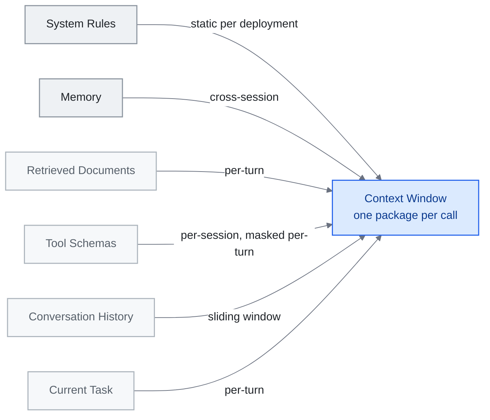

# Chapter 3: Context Engineering -- The Art of Filling the Window

> **In one sentence:** Context engineering is the art of giving AI exactly the right information at the right time -- not too much, not too little.
>
> **Why it matters:** Better context means better AI answers. This is why some people get amazing results from AI while others get generic responses.
>
> **Reading time:** ~13 min (2,891 words / 230 wpm)

*Figure: The six layers of section 3.2, ordered most persistent at the top to most ephemeral at the bottom. The arrow labels are each layer's update frequency -- the reason each needs its own compression strategy. They also compete for the same window: over-stuffing Retrieved Documents is what drowns the Current Task signal.*

> "Context engineering is the delicate art and science of filling the context window with just the right information for the next step."
> -- Andrej Karpathy, June 2025

If prompt engineering is writing a good question, context engineering is building the entire briefing packet that surrounds it. The shift from one to the other marks a fundamental change in how practitioners think about LLM systems: the unit of design is no longer a single instruction but an *information environment*.

This chapter maps the landscape -- from theoretical frameworks to production-tested patterns -- and points you to the primary sources that define the discipline.

---

## 3.1 From Prompts to Contexts

The term "context engineering" entered mainstream usage in mid-2025 when Karpathy drew a sharp line between it and prompt engineering. A prompt is a static string. A context is a dynamically assembled package of everything the model needs -- instructions, memory, retrieved documents, tool definitions, conversation history, and the immediate task -- composed programmatically and updated at every turn.

The distinction matters because modern agents rarely send the same context twice. Each inference call is the product of routing logic, retrieval pipelines, compression heuristics, and tool availability checks that together determine what fills the window and what gets left out.

## 3.2 A Six-Layer Context Model

Drawing on patterns described in Anthropic's [Building Effective Agents](https://www.anthropic.com/engineering/building-effective-agents) and adjacent practitioner writing, the context window can usefully be decomposed into six conceptual layers, ordered from most persistent to most ephemeral. The labels here are this guide's pedagogical synthesis, not a taxonomy Anthropic itself publishes:

| Layer | Contents | Typical Persistence |
|-------|----------|-------------------|
| **System Rules** | Safety constraints, persona definitions, behavioral guardrails | Static per deployment |
| **Memory** | User preferences, prior session summaries, learned facts | Cross-session |
| **Retrieved Documents** | RAG results, search snippets, file contents | Per-turn |
| **Tool Schemas** | Function definitions, API specs, capability declarations | Per-session or masked per-turn |
| **Conversation History** | Prior messages, assistant responses, tool call results | Sliding window |
| **Current Task** | The immediate user request plus any task-specific injections | Per-turn |

The key insight is that each layer has different update frequencies, different compression strategies, and different failure modes. Over-stuffing the Retrieved Documents layer drowns the Current Task signal. Under-populating Memory forces the model to re-derive context it should already have. Good context engineering is about balance across all six layers simultaneously.

## 3.3 Lessons from Manus: KV-Cache as the North Star

In July 2025, Yichao "Peak" Ji (CTO of Manus) published a set of production lessons that reframed context engineering around a single operational metric: **KV-cache hit rate**.

Manus observed a consistent 100:1 ratio between input and output tokens in their agent system. At that ratio, input cost dominates everything. KV-cache hits -- where previously computed key-value pairs are reused rather than recomputed -- become the primary lever for both latency and cost.

Three techniques emerged from this insight:

1. **Append-only context structure.** Never rewrite earlier portions of the context. Insertions or edits in the middle invalidate cached prefixes, forcing full recomputation. Design your context as a log, not a document.

2. **Tool masking via logit bias, not schema removal.** When a tool is temporarily unavailable, Manus suppressed its selection through logit-level masking rather than removing the tool definition from the context. Removing definitions changes the token sequence, busting the cache. Masking preserves the prefix while preventing selection.

3. **Rolling todo-list rewrites.** Rather than relying on the model to recall objectives from early in a long conversation, Manus periodically appended a rewritten todo list near the end of the context. This exploits recency bias in attention -- objectives in the most recent tokens receive stronger attention weight than identical objectives buried thousands of tokens earlier.

These are infrastructure-level decisions, not prompt-level ones. They illustrate why "context engineering" requires systems thinking.

**The cache principle gets a research toolkit (mid-2026).** Manus's rules were operational heuristics; two June 2026 papers turn the same principle into measured mechanisms. **Still** (arXiv 2606.07878, June 5, 2026) performs amortized, single-pass KV-cache compaction via a per-layer Perceiver trained against a frozen base model, reporting **8x-200x compression at 8k-128k contexts** and **8-22 points over the strongest baseline on RULER**. **TokenPilot** (arXiv 2606.17016, June 15, 2026) is dual-granularity: an *Ingestion-Aware Compaction* stage stabilizes prefixes globally while a *Lifecycle-Aware Eviction* stage tracks each segment's utility locally, reporting **61% / 56% cost reduction** in the isolated-session setting and **61% / 87%** in the continuous-session setting on PinchBench and Claw-Eval. TokenPilot matters here because it operationalizes with hard numbers exactly the "append-only, don't bust the cache" discipline this section states qualitatively: the eviction stage is what lets a long-lived session keep its cache-friendly prefix without unbounded growth.

**When to compact, and how (August 2026).** A follow-on empirical study, "Practical Online KV Cache Compaction for LLM Agents" (arXiv 2608.00902, August 2, 2026), narrows the guidance further by studying compaction specifically on agent trajectories: compacting immediately hurts accuracy, but delaying until the agent's own future queries can serve as a proxy-query signal recovers most of the lost accuracy. Under imperfect proxies, scoring tokens for eviction by proxy-query-induced attention mass (token eviction, TE) proves more robust than attention-matching reconstruction (AM). On BrowseComp-Plus and WideSearch, TE cuts KV cache by 80% while improving throughput over no compaction at all -- a concrete rule (delay, then evict rather than reconstruct) for the append-only discipline this section states qualitatively.

## 3.4 Five Dominant Patterns

Aurimas Griciūnas synthesized the emerging practice into five recurring patterns observed across production systems (canonical write-up: "State of Context Engineering in 2026," SwirlAI Newsletter, March 22, 2026, [https://www.newsletter.swirlai.com/p/state-of-context-engineering-in-2026](https://www.newsletter.swirlai.com/p/state-of-context-engineering-in-2026); see also "Breaking Down Context Engineering"):

**Progressive Disclosure.** Do not load everything upfront. Present a lightweight index first; expand sections only when the model (or routing logic) determines they are relevant. This is the context-window equivalent of lazy loading. Anthropic's own agent skills system uses this pattern -- 17 skills consume roughly 1,700 tokens at rest, expanding only on invocation.

**Context Compression.** Summarize, truncate, or distill information before injection. Conversation history beyond a sliding window gets compressed into summaries. Retrieved documents get excerpted to relevant passages. The goal is to preserve semantic density while reducing token count.

**Context Routing.** Not all queries need the same context. A routing layer examines the incoming request and selects which memory banks, tool sets, and document collections to include. This is the context-window analog of a database query planner.

**Retrieval Evolution.** Static RAG (retrieve once, inject, generate) gives way to iterative retrieval where the model can request additional information mid-generation. The context is not assembled once but evolves through the generation process.

**Tool and Capability Management.** As tool libraries grow, loading all schemas becomes prohibitive. Systems use meta-tool patterns (a discovery tool that returns relevant tool schemas on demand) or skill-graph architectures to keep the tool layer lean.

**A frontier lab revises its own rules (July 2026).** The five patterns above were synthesized from practice observed across many systems. On July 24, 2026, Anthropic published a first-party revision of its own guidance, "The new rules of context engineering for Claude 5 generation models," by Thariq Shihipar --- and the headline is a subtraction. The Claude Code team removed more than 80% of the system prompt for its Claude 5 generation models with no measurable loss on coding evaluations. Anthropic reports that figure from its own coding evaluations; it is not independently benchmarked. The reasoning behind it is the part that travels. The post argues for moving from rules to judgment, giving a capable agent principles and trust rather than exhaustive instructions; for progressive, just-in-time context loading instead of stuffing the window upfront; and for briefing an agent the way you would brief a person, with a role, constraints, and examples only where they earn their place. The second restates Progressive Disclosure above, now with a lab's production evidence behind it. The first cuts against the instinct the discipline was built on: it says that as models improve, a growing share of context-engineering work is not optimization but accumulated distrust, and the right move on that share is deletion rather than tuning.

**Compaction is not one policy (August 2026).** The KV-cache work above and Context Compression in this section both treat the window as a budget of interchangeable tokens. A nine-author study (arXiv 2608.31057, August 31, 2026) argues that is the wrong unit of account. Analyzing 55 archived coding-agent trajectories, it sorts working-memory contents into four categories --- instructions, artifacts, tool outputs, and agent-generated state --- with different size, retention, and representation profiles, and proposes a four-level evaluation framework separating stored state, delivered context, management work, and task or process outcome. In the authors' words, "equal token budgets do not imply equal delivered context or management cost." They test two semantically-informed strategies, object-aware compression and retrieval-based policies, and caution that calibration gains tuned on one task set "may not transfer to held-out tasks." At 55 trajectories this is an open empirical finding rather than a settled pattern. The practical consequence is narrow but sharp: a single compaction rule applied uniformly across the window is already making a policy choice about four different kinds of object, and it is making that choice blind.

## 3.5 The Academic Landscape

Mid-2025 brought the first comprehensive academic survey of context engineering as a formal research area: **"A Survey of Context Engineering for Large Language Models"** (Mei et al., arXiv 2507.13334, July 17-21, 2025), which through systematic analysis of over 1,400 research papers established a technical roadmap for the field. The survey organizes the design space along two axes: **foundational components** (context retrieval and generation, context processing, context management) and **system implementations** (RAG, memory systems, tool-integrated reasoning, multi-agent systems). Its load-bearing finding is a fundamental capability asymmetry: current models are remarkably proficient at understanding complex contexts but exhibit pronounced limitations in generating equally sophisticated long-form outputs. For practitioners, the survey is the closest thing the field has to a textbook --- it formalized what had been discovered empirically that context engineering is not a single technique but a design space with multiple independent dimensions.

## 3.6 Agentic Context Engineering (ACE)

The ACE paper, **"Agentic Context Engineering: Evolving Contexts for Self-Improving Language Models"** (Zhang et al., arXiv 2510.04618, October 6, 2025; companion repo at [github.com/ace-agent/ace](https://github.com/ace-agent/ace)), introduced a conceptual shift: treating contexts not as static assemblies but as **evolving playbooks**. In an ACE system, the context is a living document that the agent itself maintains --- adding observations, updating plans, pruning irrelevant history, and restructuring its own instructions based on task progress. Reported headline gains: +10.6% on agent benchmarks and +8.6% on finance tasks, with reductions in adaptation latency and rollout cost; on the AppWorld leaderboard, ACE matches the top-ranked production-level agent on the overall average and surpasses it on the harder test-challenge split despite using a smaller open-source model. ACE also names the failure modes it is engineered against: **brevity bias** (drops domain insights for concise summaries) and **context collapse** (iterative rewriting erodes details over time).

This moves context engineering from a purely infrastructure concern (what the harness assembles before each call) into a collaborative one (what the harness prepares *and* what the model actively reshapes). The boundary between "context the system provides" and "context the model creates" becomes fluid.

ACE systems typically maintain a structured scratchpad within the context -- a designated region where the model writes working notes, intermediate results, and revised plans. The harness preserves this region across turns while managing the surrounding layers according to its own policies.

## 3.7 Practical Implications

Several principles emerge from this landscape:

- **Measure input tokens, not just output.** At production scale, the 100:1 input/output ratio means context assembly cost dominates. Optimize for cache hits and minimal redundancy.
- **Design contexts as layered systems.** Each layer has its own update policy, compression strategy, and failure mode. Treat them independently.
- **Use progressive disclosure by default.** Start lean. Expand on demand. The cost of including irrelevant information is not just tokens -- it is degraded attention and increased hallucination risk.
- **Test context composition, not just prompts.** The same prompt in different contexts produces different results. Your test suite should vary the context, not just the final instruction.
- **Anticipate model improvements.** As models get better at long-context reasoning, some compression and routing strategies become unnecessary overhead. Build with clear abstraction boundaries so layers can be simplified or removed.

---

## Three things to take away

- **A prompt is a string, a context is an assembly.** Each inference call is the product of routing logic, retrieval, compression and tool-availability checks, so the unit of design is the package, not the instruction.
- **Input tokens are the bill.** At the 100:1 input-to-output ratio Manus measured, KV-cache hit rate is the lever for both latency and cost, which is why the context is built as an append-only log.
- **Part of what you engineer is accumulated distrust.** Anthropic removed more than 80% of the system prompt for its Claude 5 generation models with no measurable coding-eval loss, so the right move on that share of the context is deletion rather than tuning.

---

## Sources

- **Karpathy, Andrej.** Public remarks on "context engineering" (mid-2025). Widely-shared framing across X and the AI engineering community that coined the working definition adopted across the field.
- **Anthropic.** "Building Effective Agents." Anthropic engineering blog, December 19, 2024. [https://www.anthropic.com/engineering/building-effective-agents](https://www.anthropic.com/engineering/building-effective-agents) --- describes orchestrator-worker patterns and evaluator-optimizer workflows; this guide labels the six conceptual layers in §3.2 pedagogically.
- **Ji, Yichao "Peak"** (Manus). "Context Engineering Lessons from Building Manus." Blog post, July 2025. [manus.im/blog](https://manus.im/blog) --- KV-cache hit rate as the operational metric, append-only context structure, tool masking via logit bias, rolling todo-list rewrites.
- **Griciūnas, Aurimas.** "State of Context Engineering in 2026." SwirlAI Newsletter, March 22, 2026. [https://www.newsletter.swirlai.com/p/state-of-context-engineering-in-2026](https://www.newsletter.swirlai.com/p/state-of-context-engineering-in-2026). See also "Breaking Down Context Engineering": [https://www.newsletter.swirlai.com/p/breaking-down-context-engineering](https://www.newsletter.swirlai.com/p/breaking-down-context-engineering)
- **Mei, Lingrui et al.** "A Survey of Context Engineering for Large Language Models." arXiv 2507.13334, July 17-21, 2025. [https://arxiv.org/abs/2507.13334](https://arxiv.org/abs/2507.13334) --- 1,400+ paper review establishing context engineering as a formal research area.
- **Zhang, Qizheng et al.** "Agentic Context Engineering: Evolving Contexts for Self-Improving Language Models." arXiv 2510.04618, October 6, 2025. [https://arxiv.org/abs/2510.04618](https://arxiv.org/abs/2510.04618). Companion repo: [github.com/ace-agent/ace](https://github.com/ace-agent/ace). Frames contexts as evolving playbooks; names brevity bias and context collapse.
- **Schmid, Philipp.** "The New Skill in AI is Not Prompting, It's Context Engineering" and follow-up. [https://www.philschmid.de/context-engineering](https://www.philschmid.de/context-engineering); [https://www.philschmid.de/context-engineering-part-2](https://www.philschmid.de/context-engineering-part-2)
- **LangChain blog.** Context-engineering coverage at [blog.langchain.com](https://blog.langchain.com) --- the Agent Engineer framing as a practitioner pattern (no single canonical post; cited as discourse anchor).
- **Willison, Simon.** Ongoing AI engineering coverage at [simonwillison.net](https://simonwillison.net) --- accessible practitioner introductions that connect the ecosystem.
- **Still.** Amortized single-pass KV-cache compaction. arXiv 2606.07878, June 5, 2026. [https://arxiv.org/abs/2606.07878](https://arxiv.org/abs/2606.07878) --- per-layer Perceiver trained against a frozen base model; 8x-200x compression at 8k-128k contexts; 8-22 points over the strongest baseline on RULER.
- **TokenPilot.** Dual-granularity KV-cache management. arXiv 2606.17016, June 15, 2026. [https://arxiv.org/abs/2606.17016](https://arxiv.org/abs/2606.17016) --- Ingestion-Aware Compaction (global prefix stabilization) + Lifecycle-Aware Eviction (local segment-utility tracking); 61% / 56% cost reduction isolated-session, 61% / 87% continuous-session on PinchBench and Claw-Eval.
- **"Practical Online KV Cache Compaction for LLM Agents."** arXiv 2608.00902, August 2, 2026. [https://arxiv.org/abs/2608.00902](https://arxiv.org/abs/2608.00902) --- systematic study of compaction on agent trajectories; delaying compaction until a proxy-query signal is available recovers most of the accuracy lost to immediate compaction; token eviction (TE) more robust than attention-matching reconstruction (AM) under imperfect proxies; TE cuts KV cache 80% while improving throughput over no compaction on BrowseComp-Plus and WideSearch.
- **Shihipar, Thariq** (Anthropic). "The new rules of context engineering for Claude 5 generation models." Anthropic blog, July 24, 2026. [https://claude.com/blog/the-new-rules-of-context-engineering-for-claude-5-generation-models](https://claude.com/blog/the-new-rules-of-context-engineering-for-claude-5-generation-models) --- reports an 80%+ system-prompt reduction for Claude 5 generation models with no measured coding-eval loss (Anthropic's own coding evaluations, not independently benchmarked); rules to judgment, just-in-time context loading, briefing agents as you would a person.
- **Chen, Le et al.** "Measure Before You Manage: Evaluating Agent Working Memory in Coding Agents" (nine authors). arXiv 2608.31057, August 31, 2026. [https://arxiv.org/abs/2608.31057](https://arxiv.org/abs/2608.31057) --- 55 archived coding-agent trajectories; four-category taxonomy of working-memory objects (instructions, artifacts, tool outputs, agent-generated state); four-level evaluation framework (stored state, delivered context, management work, task or process outcome); object-aware compression and retrieval-based policies tested; authors state that "equal token budgets do not imply equal delivered context or management cost" and that calibration gains "may not transfer to held-out tasks." Small sample, unreplicated.
