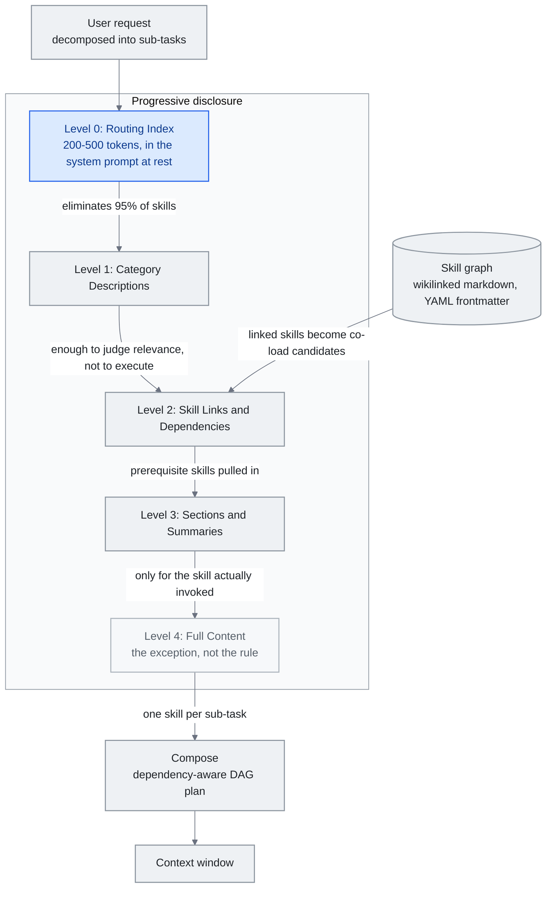

# Chapter 5: Skill Systems -- Skills, Skill Graphs, and Progressive Disclosure

> **In one sentence:** Skills are reusable instruction sets that tell AI how to do specific tasks, and skill graphs connect them into a navigable knowledge network.
>
> **Why it matters:** Instead of explaining the same thing to AI every time, skills let you teach it once and reuse that knowledge forever.
>
> **Reading time:** ~21 min (4,821 words / 230 wpm)

*Figure: The five disclosure levels of section 5.4, with the skill graph of section 5.5 feeding the level that resolves links and dependencies and the compositional plan of section 5.5 assembling what finally loads. The edge out of Level 0 carries the argument: the routing index eliminates 95% of skills before a single full file is read, which is why Level 4 is reached for only the one or two skills actually invoked.*

Skills are pre-packaged instruction sets -- self-contained bundles of prompts, tool configurations, and behavioral rules -- injected into an agent's context window when a specific capability is needed. They are the mechanism by which agent systems scale from a handful of built-in behaviors to hundreds or thousands of specialized capabilities without drowning the model in irrelevant instructions.

This chapter covers the architecture of skill systems, the combinatorial problem they create, and the progressive disclosure patterns that solve it.

---

## 5.1 The Skill Concept

A skill, in its simplest form, is a markdown file (or structured text block) containing instructions for a specific task. When a user request matches the skill's trigger conditions, the skill's content is loaded into the context window. When no match occurs, the skill contributes zero tokens.

This is fundamentally different from a monolithic system prompt that tries to cover every capability. A system prompt that describes 90 tools and 50 behavioral modes might consume 50,000 or more tokens before the user even types a message. A skill-based system loads only what is relevant, keeping the baseline context lean and reserving window capacity for the actual task.

The design pattern is borrowed from software engineering: skills are to agents what plugins are to applications. They provide extensibility without bloat.

## 5.2 The Anthropic Skills Ecosystem

Anthropic launched skills for Claude Code in October 2025, initially as a project-specific feature -- markdown files in a `.claude/` directory that Claude could invoke when relevant. The format was intentionally simple: a markdown file with a description, trigger conditions, and instructions.

By December 2025, Anthropic published skills as an open standard through agentskills.io, defining a portable format that any agent system could adopt. The specification covered:

- Skill metadata (name, description, version, author)
- Trigger definitions (keyword matches, intent classifiers, regex patterns)
- Content structure (instructions, examples, tool configurations)
- Dependency declarations (other skills this skill builds on)

The ecosystem response was rapid. By early 2026, the official repository had accumulated over 87,000 GitHub stars, and community-contributed skills exceeded 700,000. Collections like awesome-llm-skills, awesome-agent-skills (featuring 1,000+ skills from official platform teams), and awesome-claude-code became primary discovery channels.

This growth created the very problem skills were designed to solve: too many capabilities competing for limited context space.

Registry scale got a formal footing in mid-2026. On **June 5, 2026**, Vercel took the **skills.sh API** to general availability --- a queryable registry API indexing **600,000+ skills** from the open-source ecosystem, with OIDC-token auth (short-lived, auto-rotated, no long-lived secret), a rate limit of 600 requests per minute **per team and per project**, and a per-skill security-audit lookup. That a registry ships with an audit endpoint at all is an implicit admission that a registry at this scale is also an attack surface --- a thread §5.10 picks up.

The skill primitive completed its move to production infrastructure in August 2026, roughly ten months after the Claude Code launch this section opens with. Anthropic took the **Skills API out of beta on August 19**, with a companion blog post dated a day later on August 20 -- a discrepancy across Anthropic's own surfaces that reads as publish lag rather than two separate events. `/v1/skills` is now a stable endpoint; the `skills-2025-10-02` beta header is no longer required, though still accepted. The move shipped as part of a wider production-agent GA wave alongside computer use, browser use, and the Files API, and the API is available through the Claude Platform and Microsoft Foundry.

A second change landed twelve days earlier, on **August 7**: GitHub-hosted skills for Managed Agents. A mounted repository's root `.claude/skills` directory is auto-discovered at session start -- no separate publish or install step. Anthropic's own documentation is explicit that the mounted repo becomes part of the agent's trust boundary with no review step in between, which folds a live GitHub repository into the same class of problem §5.10 traces through the AIR, Cloak-and-Detonate, and Paperclip incidents: whoever can write to that repo can add or edit what the agent treats as production instructions.

## 5.3 The Scaling Problem

OpenAI's agent documentation includes a practical guideline: **keep agents under 20 tools, and expect accuracy degradation past 10.** Empirical testing across multiple model families confirms this threshold. Each additional tool definition adds tokens to the context and decision branches to the model's selection space. At 90 tools, the schema overhead alone can exceed 50,000 tokens -- before any conversation, memory, or retrieved documents enter the window.

The degradation is not just about token count. It is about decision complexity. When a model must choose among 90 tools, the probability mass spreads thin. The model spends more reasoning capacity on tool selection and less on task execution. Error rates on tool parameter construction increase. The model begins selecting plausible-but-wrong tools more frequently.

Skills face the same scaling pressure. A system with 500 available skills cannot load all 500 descriptions into the context. Even loading just the trigger descriptions for 500 skills could consume thousands of tokens and degrade the model's ability to process the actual request.

The solution is progressive disclosure.

## 5.4 Progressive Disclosure Architecture

Progressive disclosure is a multi-level information architecture where each level provides just enough detail for the next routing decision:

**Level 0: Routing Index.** A compact table mapping categories to skill groups. Might consume 200-500 tokens total for an entire skill library. This is what sits in the system prompt at rest.

**Level 1: Category Descriptions.** When the routing index identifies a relevant category, load the one-paragraph descriptions for skills in that category. Each description is optimized for scanning -- enough to determine relevance, not enough to execute.

**Level 2: Skill Links and Dependencies.** For the selected skill, load its dependency graph -- what other skills or tools it requires, what context it expects.

**Level 3: Sections and Summaries.** Load the structural outline of the skill -- section headers, key decision points, parameter lists -- without the full instructional content.

**Level 4: Full Content.** Load the complete skill instructions into the context window. This happens only for the one or two skills actually being invoked.

The key insight, formalized by Heinrich and the arscontexta team, is that **most decisions happen before reading a single full file.** The routing index eliminates 95% of skills. Category descriptions eliminate most of the remainder. Full content loading is the exception, not the rule.

Measured across production systems, progressive disclosure reduces token overhead by **85-95%** compared to loading all skill definitions upfront. Anthropic's own agent skills implementation demonstrates this: 17 production skills consume approximately 1,700 tokens at rest (Level 0 + Level 1), expanding to full content only on invocation.

## 5.5 Skill Graphs

Heinrich's Skill Graph architecture (arscontexta, 2025-2026) extends progressive disclosure into a network structure. Rather than a flat list of skills organized by category, a skill graph is a **network of interconnected markdown files linked by wikilinks**, where each node carries:

- A YAML frontmatter block with a concise description (for scanning at Level 1)
- Wikilinks to related skills, prerequisite skills, and sub-skills
- Structured sections that can be loaded independently

The graph structure enables several capabilities that flat skill lists cannot support:

**Contextual navigation.** When one skill is invoked, its linked skills become candidates for co-loading. A "deploy" skill links to "test," "rollback," and "monitor" skills -- not because they are in the same category but because they are operationally adjacent.

**Dependency resolution.** Skills can declare prerequisites. Invoking a complex skill automatically pulls in foundational skills it depends on, similar to package dependency resolution.

**Partial loading.** Because skills are structured with clear sections, the system can load specific sections (e.g., just the "error handling" section of a deployment skill) without loading the full document.

The graph topology itself becomes a form of knowledge representation. Densely connected skill clusters indicate capability areas with high internal coherence. Isolated skills may indicate gaps in the system's coverage or opportunities for integration.

Routing research moved past single-skill selection in mid-2026. **"Compositional Skill Routing for LLM Agents: Decompose, Retrieve, and Compose"** (arXiv 2606.18051, June 16, 2026, single author Xueping Gao, Alibaba Cloud) formalizes *composition* rather than routing-to-one: decompose a query into sub-tasks, retrieve one skill per sub-task, and assemble a dependency-aware DAG plan. Its **CompSkillBench** --- 300 compositional queries over 2,209 real MCP-server skills across 24 categories --- is the first benchmark to test composing *multiple* skills rather than selecting one. Iterative Skill-Aware Decomposition lifts decomposition accuracy **51.0% → 67.7%** (+32.7% relative, Wilcoxon p < 10⁻⁶), cuts context-window consumption by **over 99%** versus loading the library, and still adds +35.6% relative even when the target categories are absent from the retrieval pool.

## 5.6 The SkillReducer Paper

A study published in March 2026 examined 55,315 skills across multiple agent platforms and produced findings that challenge naive assumptions about skill quality:

- **26.4% of skills lacked routing descriptions entirely.** They had full instructional content but no metadata to help a routing system identify when to invoke them. These skills could only be triggered by exact name -- invisible to any intelligent routing layer.

- **Over 60% of skill body content was non-actionable.** It consisted of background context, motivation, caveats, and explanatory text rather than concrete instructions the model could execute. This content consumed tokens without contributing to task performance.

- **Compressed skills improved output quality by 2.8% over originals.** When researchers stripped non-actionable content and tightened the instructional language, model performance actually improved. Less was more -- the reduced noise in the context allowed the model to focus on the actionable instructions.

The implications for skill authoring are direct:

1. **Every skill needs a routing description.** Without it, the skill is effectively invisible to progressive disclosure systems.
2. **Instructional content should be dense and actionable.** Background context belongs in documentation, not in the skill body that gets injected into the context window.
3. **Skill quality measurement should include token efficiency** -- not just "does it work" but "does it work per token consumed."

## 5.7 The Meta-Tool Pattern for MCP

The Model Context Protocol (MCP) introduced a standardized way for agents to discover and invoke tools across providers. But MCP's original design loaded all available tool schemas at connection time, creating the same scaling problem skills face.

The meta-tool pattern solves this with two components:

- **Discovery Tool:** A single tool that accepts a natural language description and returns relevant tool schemas from the full registry. This is the only tool loaded at baseline.
- **Execution Tool:** A generic tool invocation wrapper that can call any tool by name once its schema has been retrieved via discovery.

The system loads two tool schemas instead of hundreds. When the model determines it needs a capability, it calls the discovery tool, receives the relevant schema, and then invokes the specific tool. The pattern trades one extra inference round-trip for massive context savings.

This is progressive disclosure applied to tool management: the model gets a phonebook, not the contents of every contact's file.

## 5.8 Authoring Guidelines

Drawing from the SkillReducer findings and production experience, a set of skill authoring best practices has emerged:

- **Lead with the routing description.** The YAML frontmatter description is the most important line in the file. It determines whether the skill is ever invoked. Write it for a classifier, not a human reader.
- **Front-load actionable instructions.** The first 200 tokens of the skill body should contain the core behavioral instructions. Background and context follow.
- **Use structured sections.** Headers, lists, and clear delineation enable partial loading and section-level retrieval.
- **Declare dependencies explicitly.** If the skill assumes another skill or tool is available, state it in metadata.
- **Include trigger examples.** Provide 3-5 example user messages that should activate the skill. These serve as both documentation and test cases for the routing layer.
- **Measure token cost.** Track the token count of each skill and set a budget. If a skill exceeds 2,000 tokens, consider whether it can be split or compressed.

A parallel line automates skill *construction* itself. **Workflow-to-Skill** (arXiv 2606.06893, June 5, 2026; Yuyang Zhang, Xinyuan Han, Xudong Jiang, Run Wang --- Wuhan University / Nanchang University) introduces RWSA, a structured intermediate representation that turns heterogeneous interaction traces (demos, trajectories, tool logs) into skills by decomposing each trace into workflow structure, execution semantics, and runtime attachments (safety, rollback, state) --- rather than treating trace-to-skill as summarization. On their 70-skill WSASkill dataset it reports a **+10.5% relative** improvement in behavioral-replay consistency over baselines including Anthropic's Skill Creator, the first formalization of automated skill construction against manual best-practice.

A second line runs the other way, treating a finished skill as infrastructure rather than prose. Anthropic's **`ant apply`** (shipped September 3, 2026 in CLI v1.30.0 and later) applies the Terraform plan-and-apply model to agent resources: agents, environments, skills, memory stores, and deployments are declared as files in a repository, diffed against live API state, shown as a plan, and on approval created or updated, with a `claude-lock.json` lockfile fingerprinting what was sent against what the API returned. A skill in this model is a directory with `SKILL.md` at its root, and it can be sourced directly from a GitHub URL, pinned to a resolved commit until `--upgrade` is run; resources reference each other by relative path, so dependency order and versions resolve at plan time. Per Anthropic's documentation the workflow is built for CI --- `--dry-run` produces a plan at pull-request time, and Workload Identity Federation is the recommended credential pattern instead of static API keys. The commit pin is what makes this more than packaging convenience: it is a real mitigation for the time-of-check-to-time-of-use gap Section 5.10 covers, because a GitHub-sourced skill can no longer be rewritten between vetting and use. It is not a solution --- the lockfile pins the file, not what the file reaches for while it runs, which is the channel the June 2026 `brand-landingpage` skill used in the first place.

## 5.9 Industry Convergence: The Google Agent Skills Spec (April 2026)

For most of 2025, progressive disclosure was primarily an Anthropic convention --- formalized through Claude Code skills in October 2025 and the agentskills.io open standard in December. In **April 2026**, the Google Developers Blog formalized its own **Agent Skills Spec**, adopting and extending the same architecture. The spec describes three explicit levels of progressive disclosure:

- **Level 1 --- Metadata (~100 tokens per skill).** A compact descriptor containing the skill's name, one-line description, trigger hints, and version. Level 1 metadata for every available skill sits in the agent's baseline context. With 10 skills loaded, this is roughly 1,000 tokens of constant overhead.
- **Level 2 --- Instructions (<5K tokens).** The full behavioral instructions for a skill, loaded on demand when Level 1 matching identifies the skill as relevant. Level 2 content never enters the context until the skill is actually selected.
- **Level 3 --- External Resources.** Assets that live outside the context window entirely --- reference documents, datasets, tool schemas, code samples --- fetched only when the skill explicitly requires them during execution.

The headline efficiency claim: for an agent with 10 skills, baseline context usage drops from roughly **10K tokens** (loading full skill content upfront) to approximately **1K tokens** (Level 1 metadata only), a **90% reduction**. Level 2 content loads one skill at a time, and Level 3 resources load only when needed during execution.

Two details make the Google spec notable beyond the numbers:

1. **It uses the universal `agentskills.io` specification.** Rather than forking, Google aligned its format with the open standard Anthropic published in December 2025. A skill authored against one spec can be consumed by agents on the other platform with minimal adaptation.
2. **It promotes progressive disclosure from a convention to a formal system design pattern.** For roughly a year, progressive disclosure was described as "what Anthropic does with skills." With Google's adoption and formalization, it becomes a cross-vendor industry pattern with a named architecture and measurable targets --- comparable to how "MVC" or "REST" evolved from specific implementations into general-purpose patterns.

The practical effect is that skill libraries are becoming portable across providers, and "how many tokens does your baseline agent context consume" has become a first-class metric that vendors compete on.

The convergence widened again on **May 6, 2026** when AWS shipped its general-availability **AWS MCP Server** and adopted **"Skills over SOPs"** as the canonical agent entry point --- the first hyperscaler to ship Skills (the Anthropic / OpenAI / Google open standard from December 2025) as production agent guidance. With four vendors now aligned --- Anthropic, OpenAI, Google, and AWS --- Skills crosses the threshold from "the convention three frontier labs use" to "the way agent capabilities are described across the cloud stack." For practitioners, the practical effect is that a skill authored against the agentskills.io spec is now portable across the platforms where the majority of production agents run.

## 5.10 Skill Security and the Supply-Chain Problem

For all its efficiency, a skill file is also an *executable instruction set a model will follow* --- and by mid-2026 the security consequences of shipping those files through registries became concrete. A scanning ecosystem had emerged (Cisco's skill-scanner, NVIDIA's **SkillSpector**, open-sourced mid-June 2026, and skills.sh's built-in security audit), but two disclosures showed static scanning has a structural ceiling.

On **June 22, 2026**, the security firm AIR disclosed that it had **hijacked roughly 26,000 agents** --- "including corporate accounts' agents" --- with a single fake skill named `brand-landingpage`, distributed through an Instagram ad, that quietly collected the victim's email. It passed *every* scanner tested. The reason is a **time-of-check-to-time-of-use (TOCTOU) gap**: a static scanner evaluates the submitted package snapshot, but the skill pointed to an external, attacker-controlled URL whose content could be rewritten after vetting. The vetted snapshot was never what ran.

Ten days later, on **July 2, 2026**, HKUST researchers formalized the gap. **"Cloak and Detonate: Scanner Evasion and Dynamic Detection of Agent Skill Malware"** (arXiv 2607.02357) presents **SkillCloak**, which rewrites malicious skills to evade static scanners while preserving function via self-extracting packing --- the payload hidden at install time in scanner-blind-spot locations and restored only at agent runtime. Against 8 scanners over 1,613 in-the-wild malicious skills, its SFS packing evades **more than 90% of the time on every scanner** (99.8-99.9% on six of the eight). The same team ships **SkillDetonate**, a runtime behavioral checker that catches **97% of attacks at a 2% false-positive rate** (87% on real-world malicious skills).

A third beat arrived five weeks after that. On **August 6, 2026**, the security firm Zenity Labs disclosed a supply-chain campaign against skills.sh itself: attackers impersonating the paperclipai and browser-use GitHub orgs (registering `getpaperclipp.com` and standing up an imitator `getpaperclipai` org on July 2) published skills that started out benign on July 5, weaponized on July 11, and climbed to #8 trending on the registry. The credential-harvesting payload -- a curl-to-base64-to-node chain -- targeted 138 credential paths (SSH keys, AWS/GCP/Azure credentials, Kubernetes configs, npm tokens, database credentials) through four separate trigger paths: direct skill instructions, a malicious PyPI package, npm postinstall hooks, and API route handlers. The listing's displayed install counter topped **1.7 million** -- an aggregate count, not a count of unique compromised agents, the same ambiguity that inflated the headline figure in AIR's own June disclosure. Vercel and GitHub pulled the listings and repositories within 12 hours of disclosure. (This is a distinct incident from the separate Paperclip product CVEs, e.g. CVE-2026-41679, disclosed the day before -- those are vulnerabilities in the legitimate Paperclip product, not the skills.sh impersonation campaign.) Across three disclosures in just over six weeks, the same TOCTOU/weaponize-after-vetting failure mode generalized from one Instagram-ad campaign hijacking 26,000 agents, to a research paper proving scanners can be evaded systematically, to a trending skill family exploiting four separate trigger mechanisms at registry scale.

The framework lesson is the one MCP security learned a year earlier (Chapter 7's IETF security-considerations draft): progressive disclosure and registry-scale ecosystems make the skill file itself an attack surface, so trust has to move from *publish-time scanning* to *runtime containment*. A skill that fetches or unpacks its real behavior at runtime cannot be certified by inspecting what it looked like at submission --- the defensible position is to watch what it does when it runs.

In the month after the Zenity disclosure, that position acquired a commercial market. On **September 1, 2026**, CrowdStrike launched **Falcon Guardian**, part of a new AI detection and response product line, at its Fal.Con conference: it discovers and inventories known and shadow AI agents running on Windows and macOS endpoints, records who deployed each one, and applies access control, policy enforcement, and runtime detection to what the agent actually does, reconstructing malicious execution chains after the fact. CrowdStrike's description names the exact case static review cannot reach --- a prompt that looked legitimate whose resulting behavior is anomalous --- and the announcement carries no detection-rate or efficacy figures, so this is a market signal that runtime containment has become a product category, not evidence that it works. The same day, AIR --- the firm behind the June 22 disclosure that opens this section --- emerged from stealth with **$50 million** across two seed rounds ($10M led by Sequoia, $40M by Greenoaks) and published ecosystem-scale numbers for the pattern it had previously demonstrated on a single skill: per AIR's own count, more than **17,800 public AI add-ons, representing roughly 6.7 million installations, depend on untrusted external instruction sources**, and it reports finding skills that impersonate Anthropic and OpenAI to get past platform review --- brand impersonation recurring as a technique rather than appearing once in the Paperclip campaign. AIR has not published the methodology behind either figure, so both are a vendor's own measurement of the market it sells into. Taken together the two announcements close the arc's commercial loop: in ten weeks the failure mode went from one disclosure, to a proof that scanners are systematically evadable, to a registry-scale campaign, to a funded vendor selling the measurement and an endpoint vendor selling the enforcement.

---

## Three things to take away

- **Most routing decisions happen before a single full file is read.** The routing index eliminates 95% of skills and the category descriptions eliminate most of the remainder, so Level 4 full content loads only for the one or two skills actually invoked.
- **A skill without a routing description is invisible.** SkillReducer found 26.4% of 55,315 skills carried full instructional content but no metadata a routing layer could match, leaving them triggerable only by exact name.
- **At registry scale, trust has to move from publish-time scanning to runtime containment.** A skill that fetches or unpacks its real behavior at runtime cannot be certified from the snapshot it was submitted as, which is the failure mode the AIR, Cloak-and-Detonate, and Paperclip disclosures share.

---

## Sources

- **Anthropic.** "Claude Code Skills." Documentation and open standard specification, October 2025 (launch), December 2025 (open standard via agentskills.io). 87K+ GitHub stars by early 2026.
- **OpenAI.** "Agent Design Best Practices." OpenAI documentation, 2025. Recommendation of fewer than 20 tools per agent, accuracy degradation past 10.
- **Heinrich (@arscontexta).** Skill Graphs concept and implementation. X posts (2026): [https://x.com/arscontexta/status/2023957499183829467](https://x.com/arscontexta/status/2023957499183829467) (Skill Graphs > SKILL.md). GitHub: [https://github.com/agenticnotetaking/arscontexta](https://github.com/agenticnotetaking/arscontexta) --- Claude Code plugin generating individualized markdown-graph knowledge systems with wikilinks and YAML frontmatter scanning. Secondary analysis: Linas Substack, "Skill Graphs: The Architecture That Solves the AI Agent Context Window Problem." [https://linas.substack.com/p/skill-graphs](https://linas.substack.com/p/skill-graphs)
- **SkillReducer Paper.** "Less Is More: Compressing Agent Skills for Improved Performance." March 2026. 55,315 skills analyzed, 26.4% lacking routing descriptions, 60%+ non-actionable content, 2.8% quality improvement from compression.
- **Model Context Protocol (MCP).** Anthropic specification, 2024-2025. Standardized tool discovery and invocation protocol.
- **awesome-llm-skills.** Community collection on GitHub. Curated skill libraries across platforms.
- **awesome-agent-skills.** GitHub collection, 1,000+ skills from official platform teams.
- **awesome-claude-code.** GitHub collection. Claude Code-specific skills and configurations.
- **OpenAI.** "Function Calling Best Practices." 2025. Empirical data on tool count vs. accuracy tradeoffs.
- **Griciūnas, Aurimas.** "State of Context Engineering in 2026." SwirlAI Newsletter, March 2026. [https://www.newsletter.swirlai.com/p/state-of-context-engineering-in-2026](https://www.newsletter.swirlai.com/p/state-of-context-engineering-in-2026) --- Progressive disclosure / compression / sliding window patterns; meta-tool pattern. See also "Breaking Down Context Engineering": [https://www.newsletter.swirlai.com/p/breaking-down-context-engineering](https://www.newsletter.swirlai.com/p/breaking-down-context-engineering)
- **AWS.** "AWS MCP Server now generally available" (May 6, 2026): [https://aws.amazon.com/about-aws/whats-new/2026/05/aws-mcp-server/](https://aws.amazon.com/about-aws/whats-new/2026/05/aws-mcp-server/)
- **AWS News Blog.** "The AWS MCP Server is now generally available" (May 6, 2026): [https://aws.amazon.com/blogs/aws/the-aws-mcp-server-is-now-generally-available/](https://aws.amazon.com/blogs/aws/the-aws-mcp-server-is-now-generally-available/) --- "Skills over SOPs" adoption makes AWS the first hyperscaler to ship Skills as production agent guidance.
- **Vercel.** "The skills.sh API is now available" (June 5, 2026): [https://vercel.com/changelog/the-skills-sh-api-is-now-available](https://vercel.com/changelog/the-skills-sh-api-is-now-available) --- queryable registry API; OIDC-token auth; 600 req/min per team and per project; 600,000+ indexed skills; per-skill security audit.
- **Gao, Xueping** (Alibaba Cloud). "Compositional Skill Routing for LLM Agents: Decompose, Retrieve, and Compose." arXiv 2606.18051, June 16, 2026. [https://arxiv.org/abs/2606.18051](https://arxiv.org/abs/2606.18051) --- CompSkillBench (300 compositional queries over 2,209 MCP skills, 24 categories); Iterative Skill-Aware Decomposition 51.0%→67.7%; >99% context reduction vs loading the library.
- **Zhang, Yuyang; Han, Xinyuan; Jiang, Xudong; Wang, Run** (Wuhan / Nanchang University). "Workflow-to-Skill." arXiv 2606.06893, June 5, 2026. [https://arxiv.org/abs/2606.06893](https://arxiv.org/abs/2606.06893) --- RWSA structured intermediate representation (workflow structure / execution semantics / runtime attachments); +10.5% relative behavioral-replay consistency over baselines including Anthropic Skill Creator, on the 70-skill WSASkill dataset.
- **AIR (Niv Hoffman & Or Nevo).** "The Story of Skills --- How We Hijacked 26,000 Agents With One Instagram Ad" (June 22, 2026): [https://www.air.security/blog-posts/the-story-of-skills](https://www.air.security/blog-posts/the-story-of-skills) --- fake `brand-landingpage` skill, external-URL TOCTOU bypass past every scanner tested (Cisco skill-scanner, NVIDIA SkillSpector, skills.sh). Secondary: The Hacker News (June 23): [https://thehackernews.com/2026/06/fake-ai-agent-skill-passed-security.html](https://thehackernews.com/2026/06/fake-ai-agent-skill-passed-security.html).
- **Ji, Zimo et al.** (HKUST). "Cloak and Detonate: Scanner Evasion and Dynamic Detection of Agent Skill Malware." arXiv 2607.02357, submitted July 2, 2026. [https://arxiv.org/abs/2607.02357](https://arxiv.org/abs/2607.02357) --- SkillCloak evades >90% across 8 scanners over 1,613 malicious skills; SkillDetonate runtime detection 97% at 2% FP. Secondary: The Hacker News (July 6): [https://thehackernews.com/2026/07/new-skillcloak-technique-lets-malicious.html](https://thehackernews.com/2026/07/new-skillcloak-technique-lets-malicious.html).
- **NVIDIA.** SkillSpector open-source skill scanner (open-sourced mid-June 2026) --- static scanner named in NVIDIA's own repo; the AIR/THN incident reports do not name it.
- **Zenity Labs.** "Attackers Target Agents via the Skill Supply Chain" (August 6, 2026): [https://labs.zenity.io/post/attackers-target-agents-via-the-skill-supply-chain](https://labs.zenity.io/post/attackers-target-agents-via-the-skill-supply-chain) --- Paperclip impersonation campaign on skills.sh; 138 credential paths; four trigger mechanisms; 1.7M+ aggregate install counter. Secondary: CSO Online: [https://csoonline.com/article/4206851/](https://csoonline.com/article/4206851/); Business Wire: [https://businesswire.com/news/home/20260806707467/en/](https://businesswire.com/news/home/20260806707467/en/).
- **Anthropic.** Release notes overview: [https://platform.claude.com/docs/en/release-notes/overview](https://platform.claude.com/docs/en/release-notes/overview) --- Skills API out of beta August 19, 2026. Blog: "Computer use, Skills API, and Files API" (August 20, 2026): [https://claude.com/blog/computer-use-skills-api-files-api](https://claude.com/blog/computer-use-skills-api-files-api). Managed Agents skills docs (GitHub-hosted skills, August 7, 2026): [https://platform.claude.com/docs/en/managed-agents/skills](https://platform.claude.com/docs/en/managed-agents/skills).
- **CrowdStrike.** Falcon Guardian launch announcement, Fal.Con 2026 (September 1, 2026): [https://www.crowdstrike.com/en-us/press-releases/crowdstrike-unveils-falcon-guardian-ai-agent-security/](https://www.crowdstrike.com/en-us/press-releases/crowdstrike-unveils-falcon-guardian-ai-agent-security/) --- discovery and inventory of known and shadow AI agents on Windows and macOS endpoints, access control, policy enforcement, and runtime detection of agent behavior; no detection-rate or efficacy figures given. Secondary: SiliconANGLE (September 1): [https://siliconangle.com/2026/09/01/crowdstrike-launches-falcon-guardian-to-police-ai-agents-at-the-endpoint/](https://siliconangle.com/2026/09/01/crowdstrike-launches-falcon-guardian-to-police-ai-agents-at-the-endpoint/); SC World: [https://www.scworld.com/brief/crowdstrike-unveils-falcon-guardian-to-secure-ai-agents](https://www.scworld.com/brief/crowdstrike-unveils-falcon-guardian-to-secure-ai-agents).
- **AIR.** Emergence from stealth with $50 million, plus ecosystem-scale add-on research. TechCrunch (September 1, 2026): [https://techcrunch.com/2026/09/01/air-raises-50m-to-help-companies-vet-the-skills-and-add-ons-ai-agents-use/](https://techcrunch.com/2026/09/01/air-raises-50m-to-help-companies-vet-the-skills-and-add-ons-ai-agents-use/); SecurityWeek (September 3, 2026): [https://www.securityweek.com/ai-agent-firewall-startup-air-security-emerges-from-stealth-with-50-million/](https://www.securityweek.com/ai-agent-firewall-startup-air-security-emerges-from-stealth-with-50-million/) --- $10M led by Sequoia plus $40M led by Greenoaks; 17,800+ public add-ons across roughly 6.7M installations relying on untrusted external instruction sources, and skills impersonating Anthropic and OpenAI, all per AIR's own count with methodology unpublished. The two-day spread between outlets is publication lag on one announcement, not two events.
- **Anthropic.** `ant apply` CLI documentation (shipped September 3, 2026, CLI v1.30.0 and later): [https://platform.claude.com/docs/en/cli-sdks-libraries/cli/apply](https://platform.claude.com/docs/en/cli-sdks-libraries/cli/apply) --- agents, environments, skills, memory stores, and deployments declared as repository files; plan/apply diff against live API state; `claude-lock.json` lockfile; GitHub-sourced skills pinned to a resolved commit until `--upgrade`; `--dry-run` plans for CI and Workload Identity Federation as the recommended CI credential. Single-sourced to Anthropic's documentation; no independent coverage located.
