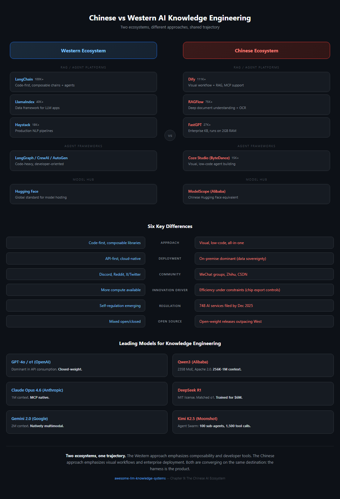

# Chapter 9: The Chinese AI Knowledge Engineering Landscape

> **In one sentence:** China has built a parallel AI ecosystem with its own open-source platforms, models, and community -- often innovating in different directions than the West.
>
> **Why it matters:** Half the world's AI researchers are in China. Ignoring this ecosystem means missing half the innovation.

The global conversation about LLM knowledge engineering is incomplete without examining the Chinese ecosystem. With over 748 AI services filed with regulators by December 2025, China has developed a parallel --- and in some areas, divergent --- approach to building knowledge systems with large language models. This chapter maps the key platforms, models, and cultural differences that shape how Chinese developers and enterprises approach knowledge engineering.

## A. Open-Source RAG and Agent Platforms

China's open-source AI ecosystem has produced several platforms that rival or exceed their Western counterparts in GitHub popularity. What distinguishes these projects is their emphasis on visual workflows, enterprise deployment readiness, and deep document understanding --- reflecting the practical demands of Chinese enterprise customers.

### Dify (136K+ GitHub Stars)

[Dify](https://github.com/langgenius/dify) is the most-starred agentic AI platform globally. Licensed under Apache 2.0, it provides a visual canvas for building RAG pipelines, agentic workflows, and multi-step reasoning chains. Since version 1.0, Dify has supported the Model Context Protocol (MCP), allowing seamless integration with external tool servers. Its strength lies in bridging the gap between no-code users who design workflows visually and developers who need programmatic control. Enterprise users can self-host the entire stack, which is critical in the Chinese market where data sovereignty requirements often preclude cloud-only solutions.

### RAGFlow (62-75K+ GitHub Stars)

[RAGFlow](https://github.com/infiniflow/ragflow) differentiates itself through deep document understanding. Rather than treating documents as flat text, RAGFlow applies layout-aware parsing, OCR, and table extraction across 20+ file formats including scanned PDFs, spreadsheets, and slide decks. Its "agentic RAG" approach means the system can autonomously decide which retrieval strategy to apply based on the query type. For enterprises dealing with legacy document archives --- a common scenario in Chinese state-owned enterprises and manufacturing firms --- this capability is not a nice-to-have but a requirement.

### FastGPT (27K+ GitHub Stars)

[FastGPT](https://github.com/labring/FastGPT) targets enterprise knowledge base Q&A with a focus on resource efficiency. Its QA-pair extraction pipeline automatically converts documents into question-answer pairs, which can then be used for both retrieval and fine-tuning. The platform is designed to run on machines with as little as 2GB of RAM, making it accessible to small and medium enterprises that cannot afford dedicated GPU infrastructure. This frugality reflects a broader pattern in the Chinese ecosystem: optimization under constraint.

### MaxKB (18K+ GitHub Stars)

[MaxKB](https://github.com/1Panel-dev/MaxKB) positions itself as an enterprise agent platform with one-click deployment. It supports MCP for tool integration and provides pre-built templates for common enterprise scenarios: customer service, internal knowledge retrieval, and document summarization. Its appeal is in reducing the time from "we want an AI assistant" to "we have one running" from weeks to hours.

### Coze Studio (15K+ GitHub Stars, ByteDance)

[Coze Studio](https://github.com/coze-dev/coze-studio) is ByteDance's open-source visual agent development platform. Originally a closed product, ByteDance open-sourced it in July 2025 and it accumulated 10,000 GitHub stars within three days --- a testament to both pent-up demand and ByteDance's distribution power. Coze Studio provides a drag-and-drop interface for building agents with built-in memory, tool use, and multi-turn conversation management. Its integration with ByteDance's Doubao model family gives it a native advantage in Chinese-language tasks.

### DB-GPT (17K+ GitHub Stars)

[DB-GPT](https://github.com/eosphoros-ai/DB-GPT) specializes in AI-native data interaction. Its core capability is natural-language-to-SQL conversion, allowing non-technical users to query databases conversationally. It extends this with visualization generation and multi-agent data analysis pipelines. For enterprises sitting on large structured datasets --- which describes most Chinese companies in finance, logistics, and manufacturing --- DB-GPT provides an accessible entry point to AI-augmented analytics.

## B. Chinese LLMs for Knowledge Management

The foundation model landscape in China has matured rapidly, with several models now competitive with or superior to Western counterparts on specific benchmarks.

### Qwen3 (Alibaba Cloud)

Qwen3 is Alibaba's flagship model family. The largest variant is a 235-billion-parameter Mixture of Experts (MoE) model released under Apache 2.0. Qwen3-Coder-480B, the coding-specialized variant, supports context windows from 256K up to 1M tokens. The Apache 2.0 licensing is strategically significant: it enables unrestricted commercial use, which has driven adoption across Chinese startups that cannot afford proprietary API costs. Qwen's multilingual capabilities are particularly strong in Chinese, Japanese, and Korean --- languages where Western models historically underperform.

### DeepSeek R1

DeepSeek R1 matched OpenAI's o1 on mathematical and scientific reasoning benchmarks while being released under the MIT license. The model was reportedly trained for under $6 million, a fraction of comparable Western models. This cost efficiency sent shockwaves through the industry: enterprise adoption of open-source models in China jumped from 23% to 67% in the months following its release. DeepSeek R1 demonstrated that frontier-level reasoning does not require frontier-level budgets, fundamentally shifting the economics of knowledge engineering.

In April 2026, DeepSeek extended its architectural contributions with **manifold-constrained hyper-connections (mHC)**, a generalization of the residual connection used in Transformer++-style models. Where a standard residual stream carries a single channel of information forward across layers, mHC carries **multiple internal streams** that are each constrained to lie on a learned low-dimensional manifold. The construction is designed to give later layers richer access to earlier representations without the dimensional collapse that simple multi-stream residuals suffer from at scale. DeepSeek's blog reports gains on long-horizon reasoning benchmarks at comparable parameter counts, with the largest improvements on tasks where information must be carried across many intervening layers. As of April 2026 the result should be **flagged as awaiting independent replication** --- it is a single-lab disclosure on a single-lab model, and the field has been burned by architectural claims that did not survive third-party reproduction. If the result holds, mHC joins MoE, MLA, and DeepSeek's earlier multi-token prediction work as the third or fourth architectural primitive that originated in the Chinese open-weight ecosystem before crossing into mainstream use.

### DeepSeek V4 (April 2026)

DeepSeek's **V4 preview** (April 24, 2026) extends the R1 narrative on three axes simultaneously: economics, capability, and **inference substrate**. The release ships two open-weight Mixture-of-Experts models under MIT license on Hugging Face --- **V4-Pro at 1.6 trillion parameters / 49B active**, **V4-Flash at 284B / 13B active** --- with a 1-million-token context window as default rather than as a tier. API pricing is the most aggressive of any frontier-class model in 2026: **V4-Flash at $0.28 per million output tokens**, V4-Pro at $3.48, reflecting a **73% per-token inference FLOPs reduction** over V3 driven by architectural changes rather than hardware optimization alone. On coding benchmarks --- the area where R1 first established credibility --- V4-Pro takes the top of the leaderboard, with **LiveCodeBench 93.5%** (ahead of Gemini 3.1 Pro at 91.7% and Claude Opus 4.6 at 88.8%) and a **Codeforces rating of 3206** (overtaking GPT-5.4 at 3168).

The structural detail that matters most for this chapter, however, is not pricing or benchmarks but **inference substrate**. Training V4 used a hybrid cluster that included NVIDIA A100 and H20 hardware --- the question of whether frontier *training* can happen entirely outside the NVIDIA stack remains hard. But the model was **day-zero adapted for Huawei's Ascend 950PR**, with DeepSeek and Huawei jointly reporting inference parity --- and on this architecture, approximately **2.8x compute throughput** versus NVIDIA's H20 --- between Ascend NPUs and NVIDIA GPUs serving the model in production. This is the subtler form of the sovereign-silicon thesis: not "we trained without NVIDIA" but **"we serve without NVIDIA."** For Chinese enterprise customers facing US export controls, V4 is the first time a frontier-class open-weight model has shipped with a credible domestic-silicon serving path on day one --- which, for the deployment-heavy Chinese ecosystem this chapter has been describing, is closer to the load-bearing constraint than training optionality. Read alongside R1's January 2025 inflection, V4 closes a one-year story arc: the Chinese open-weight ecosystem can now release a frontier-coding model **and** the substrate to serve it, on the same day.

On **June 29-30, 2026**, DeepSeek announced that this V4 preview graduates to **official release in mid-July 2026** with a 1M-token context window across the lineup, paired with a structural pricing change: **peak-hour API pricing** (9:00-12:00 and 14:00-18:00 Beijing time) at **2x the off-peak rate**, with the off-peak baseline unchanged (V4-Pro at $0.435 per million input tokens cache-miss and $0.87 output; V4-Flash at $0.14 / $0.28). Demand-responsive, time-of-day pricing for a frontier open-weight inference API turns *price into a scheduling primitive* --- Chinese enterprises running batch agent workloads can shift them into off-peak windows to halve inference cost, the same lever cloud spot markets have offered for compute for a decade.

### Sovereign Silicon at Carrier Scale (Huawei + China Mobile, June 2026)

The "serve without NVIDIA" thesis got its first carrier-industry validation in June. At MWC Shanghai (June 24, 2026), **Huawei and China Mobile Hubei** ran the first live-network validation in China of Huawei's **AI Inference Acceleration Solution** --- an **Ascend A3 SuperPoD** paired with **OceanStor A800** storage and a **Unified Cache Manager (UCM)** that manages petabyte-scale KV cache. The result was *validated on a live carrier commercial network using simulated 8K-190K-token long-context workloads* (not on real telecom traffic): time-to-first-token cut **51-93%** for GLM-5.1, and throughput up to **+372%** at 128K sequence length. The significance for knowledge engineering is that the domestic-silicon serving path DeepSeek demonstrated at model-launch time now has an independent, infrastructure-vendor-plus-carrier demonstration at production scale --- and the KV-cache management layer (Chapter 3) becomes the battleground where sovereign-silicon economics are won or lost.

### Kimi K2.5 (Moonshot AI)

Kimi K2.5 introduced "Agent Swarm" --- a capability where a single query can spawn up to 100 sub-agents that coordinate through approximately 1,500 tool calls. This is not a research demo; it is a production feature used for complex research tasks where the system parallelizes web search, document analysis, and synthesis across dozens of concurrent agents. Earlier, Kimi achieved a 2-million Chinese character context window (approximately March 2025), making it the longest-context model optimized specifically for Chinese text.

### Kimi K3 (Moonshot AI, July 2026)

On **July 17, 2026**, Moonshot released **Kimi K3** --- at **2.8 trillion parameters** (MoE) the largest open-weight model ever released --- with a 1M-token context window and native vision. It topped Arena's frontend coding leaderboard as an open-weight model and places 4th of 189 on the Artificial Analysis Intelligence Index (score 57), behind only Fable 5 and GPT-5.6 Sol configurations. Full weights followed on **July 27** under a bespoke set of terms Moonshot calls the **Kimi K3 License** --- Moonshot's own framing is "open weight," not "open source," and commercial use above a revenue threshold requires a separate agreement with the company: a middle path between Qwen's Apache 2.0 and closed release. Fortune framed the launch as a "new DeepSeek shock" for markets, and the timing --- the same week WAIC 2026 opened in Shanghai --- made it the anchor of the ecosystem's July wave. One caveat matters for practitioners: at 2.8T parameters K3 is server-class only, so it extends the open-weight frontier upward in scale without changing the local-deployment picture.

### ERNIE 5.0 (Baidu)

ERNIE 5.0 is Baidu's 2.4-trillion-parameter model with native full-modality support --- text, image, audio, and video understanding and generation in a single model. Launched in January 2026, it represents Baidu's bet that the future of knowledge systems is multimodal from the ground up, not multimodal as an afterthought bolted onto a text model.

### GLM-4.5/5 (Zhipu AI)

Zhipu AI's GLM series, culminating in the 744-billion-parameter MoE GLM-5, is purpose-built for agent harnesses. The model architecture includes native tool-use tokens and structured output guarantees that reduce the scaffolding code required to build reliable agents. This "agent-native" design philosophy means less prompt engineering and fewer retries when integrating GLM into production pipelines. On **June 13, 2026**, Zhipu shipped **GLM-5.2** (MIT license on Hugging Face) with **IndexShare**, which reuses the same indexer across every four sparse-attention layers to cut per-token FLOPs **2.9x at full 1M-token context**, plus an improved multi-token-prediction layer that raises speculative-decoding acceptance length **by up to 20%**. Per its Hugging Face card, GLM-5.2 posts HLE 40.5 (54.7 with tools), SWE-Bench Pro 62.1, and AIME 2026 99.2.

### Hunyuan 3.0 / Hy3 (Tencent, July 2026)

On **July 6, 2026**, Tencent released the full **Hunyuan 3.0 ("Hy3")** --- a **295B-parameter MoE** (21B active, 192 experts with top-8 routing, plus a 3.8B multi-token-prediction layer) at 256K context --- and, more consequentially for this chapter, switched from the restricted April 2026 preview license to **unrestricted Apache 2.0**, removing the earlier geographic carve-outs for the EU, UK, and South Korea. Tencent's model card reports the hallucination rate falling from **12.5% to 5.4%** against the preview, and a blind expert evaluation scoring **2.67/4 versus GLM-4's 2.51/4**. The strategic reading is the one the "open-source as strategic imperative" discussion below makes: Hy3 marks the last major closed Chinese frontier lab defaulting to *fully unrestricted open weights*, completing the cross-vendor convergence and making the open-weight default the ecosystem's baseline rather than a challenger's tactic.

## C. Key Differences from the Western Ecosystem

Understanding the Chinese knowledge engineering landscape requires more than cataloging tools and models. The ecosystem operates under fundamentally different constraints and incentives that shape architectural decisions from day one.

### Tool Preferences: Visual-First vs. Code-First

The most popular Chinese platforms --- Dify, Coze Studio, FastGPT --- are visual-first. Users build knowledge pipelines by dragging nodes on a canvas. In contrast, the Western ecosystem's dominant frameworks (LangChain, LlamaIndex, Haystack) are code-first, with visual tools being secondary add-ons. This divergence reflects different user demographics: China's AI adoption is driven heavily by enterprise IT departments and "citizen developers" who may not write Python, while Western early adopters tend to be software engineers comfortable with code.

### Deployment: On-Premise vs. API-First

On-premise deployment dominates in China. This is driven by two reinforcing factors: regulatory requirements for data sovereignty (particularly in finance, healthcare, and government) and practical constraints from US chip export controls that make large-scale cloud GPU access more expensive. The result is that Chinese platforms invest heavily in quantization, distillation, and efficiency --- making models run well on available hardware rather than assuming unlimited cloud compute. Western platforms, by contrast, default to API-first architectures where the model runs on the provider's infrastructure.

### Regulatory Architecture

By December 2025, 748 AI services had been filed with Chinese regulators under the Generative AI Management Measures. Compliance is not optional or aspirational --- it shapes technical architecture from the design phase. Content filtering, audit logging, and user identity verification are built into platforms as core features, not bolted on before launch. This regulatory pressure has, paradoxically, created more standardized architectures: when everyone must implement the same compliance requirements, the platforms that make compliance easy win.

The regulatory story gained an international layer in July 2026. The **World AI Conference (WAIC) 2026** and the High-Level Meeting on Global AI Governance ran July 17-20 in Shanghai --- 100+ countries participating, UN Secretary-General Guterres attending --- and produced the signing of the agreement establishing the **World Artificial Intelligence Cooperation Organization (WAICO)**, the first intergovernmental international organization dedicated to AI, headquartered in Shanghai. Whatever WAICO becomes operationally, its founding extends the pattern this section describes from domestic filing regime to international institution-building --- with the new institution seated in China.

### Community and Knowledge Sharing

The Chinese developer community operates on fundamentally different platforms. WeChat groups (not Slack or Discord) are the primary channel for real-time discussion. Zhihu serves the role of Stack Overflow for longer technical Q&A. CSDN (China Software Developer Network) hosts tutorials and blog posts. GitHub is used for code, but discussion happens elsewhere. This fragmentation means that Western developers searching GitHub Issues or Discord for help with Chinese tools often find sparse English-language support, while the Chinese-language community is vibrant and active --- just invisible to non-Chinese speakers.

### Innovation Through Constraint

US chip export controls have created an unexpected innovation dynamic. Chinese AI labs, unable to simply scale compute, have invested disproportionately in algorithmic efficiency. DeepSeek R1's sub-$6M training cost is the most visible result, but the pattern extends across the ecosystem: smaller models with better inference optimization, more aggressive quantization techniques, and architectures designed to maximize capability per FLOP. The Western ecosystem, with more compute available, tends to innovate through scale. Both approaches produce frontier results, but through different paths.

### Open-Source as Strategic Imperative

Chinese open-weight model releases now outpace the West in volume. This is not altruism --- it is strategy. Open-sourcing builds ecosystem lock-in (developers build on your model), attracts talent (researchers want to work on models people use), and creates diplomatic goodwill in the global developer community. Alibaba's Apache 2.0 licensing of Qwen, DeepSeek's MIT license, and ByteDance's open-sourcing of Coze Studio all follow this pattern. The result is that a solo developer anywhere in the world can now build a production knowledge system entirely on Chinese open-source infrastructure, from model to framework to deployment tooling.

## D. A Note on Bilibili Content

Bilibili (B站) hosts a large volume of AI tutorials, but practitioners should be aware that many are re-uploads or translations of English-language YouTube content. The original value of Bilibili's AI content lies in Chinese-specific tool tutorials: step-by-step Dify deployment guides, Qwen integration walkthroughs, and enterprise deployment case studies that do not exist in English. When researching on Bilibili, always trace content to its original source. If a tutorial is demonstrating LangChain with English narration dubbed into Chinese, the original YouTube version is likely more current.

## Sources

- Dify GitHub Repository: [https://github.com/langgenius/dify](https://github.com/langgenius/dify)
- RAGFlow GitHub Repository: [https://github.com/infiniflow/ragflow](https://github.com/infiniflow/ragflow)
- FastGPT GitHub Repository: [https://github.com/labring/FastGPT](https://github.com/labring/FastGPT)
- MaxKB GitHub Repository: [https://github.com/1Panel-dev/MaxKB](https://github.com/1Panel-dev/MaxKB)
- Coze Studio GitHub Repository: [https://github.com/coze-dev/coze-studio](https://github.com/coze-dev/coze-studio)
- DB-GPT GitHub Repository: [https://github.com/eosphoros-ai/DB-GPT](https://github.com/eosphoros-ai/DB-GPT)
- Qwen3 Technical Report and model cards, Alibaba Cloud (2025) --- canonical entry points: [https://huggingface.co/Qwen](https://huggingface.co/Qwen) and the Qwen team's Hugging Face write-ups. Apache 2.0 licensing detail confirmed via repository LICENSE files.
- DeepSeek R1 Paper: "DeepSeek-R1: Incentivizing Reasoning Capability in LLMs via Reinforcement Learning" (January 2025). [https://github.com/deepseek-ai/DeepSeek-R1](https://github.com/deepseek-ai/DeepSeek-R1) hosts the model and links to the technical report PDF.
- Moonshot AI. Kimi K2.5 Agent Swarm coverage circulated in early 2026 across Moonshot's blog and tech press; the 100-sub-agent / ~1500 tool-call figures cited here are reported from secondary tech-press summaries. Primary access via [https://platform.moonshot.ai](https://platform.moonshot.ai).
- Baidu. ERNIE 5.0 launch (January 2026); 2.4T parameter / native full-modality claims circulated through Baidu official channels and Chinese tech press. No single primary URL is cited here; treat the modality and parameter figures as widely-reported but secondary.
- Zhipu AI. GLM-4/5 model cards on Hugging Face and the official ZhipuAI blog; "744B MoE GLM-5" + agent-native tool tokens are reported across model card and blog coverage. Primary entry point: [https://www.zhipuai.cn](https://www.zhipuai.cn).
- Cyberspace Administration of China, "Generative AI Service Filing" disclosures (December 2025) --- the 748-services figure is widely reproduced in Chinese tech press; the underlying registry is published in batches via the CAC official site.
- "Open Source AI in China" market commentary --- the 23%-to-67% Chinese enterprise open-source adoption shift after R1 is reported across multiple secondary outlets through 2025-2026; treat as widely-cited but no single primary survey is pinned here.
- DeepSeek. "DeepSeek mHC: Manifold-Constrained Hyper-Connections" (April 2026). [https://deepseek.ai/blog/deepseek-mhc-manifold-constrained-hyper-connections](https://deepseek.ai/blog/deepseek-mhc-manifold-constrained-hyper-connections) --- flagged as awaiting independent replication.
- DeepSeek. V4 model release on Hugging Face (April 24, 2026). MIT license; V4-Pro 1.6T (49B active) / V4-Flash 284B (13B active); 1M-token default context.
- Fortune. "DeepSeek unveils V4 model, with rock-bottom prices and close integration with Huawei's chips" (April 24, 2026). [https://fortune.com/2026/04/24/deepseek-v4-ai-model-price-performance-china-open-source/](https://fortune.com/2026/04/24/deepseek-v4-ai-model-price-performance-china-open-source/)
- South China Morning Post. "DeepSeek unveils next-gen AI model as Huawei vows 'full support' with new chips" (April 24, 2026). [https://www.scmp.com/tech/big-tech/article/3351239/deepseek-releases-next-gen-ai-model-world-leading-efficiency](https://www.scmp.com/tech/big-tech/article/3351239/deepseek-releases-next-gen-ai-model-world-leading-efficiency)
- Phemex News. "DeepSeek V4 Matches NVIDIA on Huawei Ascend, Dispels Rumors" (April 2026). [https://phemex.com/news/article/deepseek-v4-matches-nvidia-performance-on-huawei-ascend-dispels-delay-rumors-75616](https://phemex.com/news/article/deepseek-v4-matches-nvidia-performance-on-huawei-ascend-dispels-delay-rumors-75616) --- inference-parity claim, ~2.8x compute throughput vs NVIDIA H20 on Ascend 950PR.
- TechNode. "DeepSeek to launch V4 in mid-July with new peak-time API pricing" (June 30, 2026). [https://technode.com/2026/06/30/deepseek-to-launch-v4-in-mid-july-with-new-peak-time-api-pricing/](https://technode.com/2026/06/30/deepseek-to-launch-v4-in-mid-july-with-new-peak-time-api-pricing/) and ExplainX [https://explainx.ai/blog/deepseek-v4-official-release-peak-pricing-mid-july-2026](https://explainx.ai/blog/deepseek-v4-official-release-peak-pricing-mid-july-2026) --- mid-July official release; peak-hour pricing at 2x off-peak (announcement dated June 29-30).
- Zhipu AI. GLM-5.2 model card on Hugging Face (June 13, 2026). [https://huggingface.co/zai-org/GLM-5.2](https://huggingface.co/zai-org/GLM-5.2) --- IndexShare (2.9x per-token FLOP cut at 1M context); MTP acceptance length up to +20%; HLE 40.5 (54.7 w/tools), SWE-Bench Pro 62.1, AIME 2026 99.2.
- Tencent. Hy3 (Hunyuan 3.0) model card on Hugging Face (July 6, 2026). [https://huggingface.co/tencent/Hy3](https://huggingface.co/tencent/Hy3) --- 295B MoE (21B active), 256K context, Apache 2.0; hallucination 12.5%→5.4%; blind expert eval 2.67/4 vs GLM-4's 2.51/4. Secondary: LetsDataScience [https://letsdatascience.com/news/tencent-open-sources-hy3-295b-moe-model-c3d05258](https://letsdatascience.com/news/tencent-open-sources-hy3-295b-moe-model-c3d05258).
- Huawei. "MWC Shanghai 2026: China Mobile and Huawei on the token economy" (June 24, 2026). [https://www.huawei.com/en/news/2026/6/mwcs-cmcc-token-economy](https://www.huawei.com/en/news/2026/6/mwcs-cmcc-token-economy) --- Ascend A3 SuperPoD + OceanStor A800 + Unified Cache Manager; live carrier network with simulated 8K-190K-token workloads; TTFT cut 51-93% for GLM-5.1, throughput up to +372% at 128K.
- PureAI. "China's Moonshot AI Releases Kimi K3" (July 17, 2026). [https://pureai.com/articles/2026/07/17/china-moonshot-ai-releases-kimi-k3.aspx](https://pureai.com/articles/2026/07/17/china-moonshot-ai-releases-kimi-k3.aspx) --- 2.8T MoE, 1M context, native vision; 4th of 189 on the Artificial Analysis Intelligence Index (score 57); July 27 weights.
- The New Stack. "Kimi K3 tops Arena's coding leaderboard --- and it's open-weight" (July 2026). [https://thenewstack.io/kimi-k3-open-weight-coding/](https://thenewstack.io/kimi-k3-open-weight-coding/) --- the open-weight leaderboard result.
- Reeve, Jonas (Unite.AI). "Moonshot Opens Kimi K3 Weights Under a Revenue-Tiered License" (July 27, 2026). [https://www.unite.ai/moonshot-opens-kimi-k3-weights-under-a-revenue-tiered-license/](https://www.unite.ai/moonshot-opens-kimi-k3-weights-under-a-revenue-tiered-license/) and Willison, Simon. "moonshotai/Kimi-K3" (July 27, 2026). [https://simonwillison.net/2026/Jul/27/kimi-k3/](https://simonwillison.net/2026/Jul/27/kimi-k3/) --- names the bespoke "Kimi K3 License"; revenue-gated commercial terms; Moonshot's own "open weight" rather than "open source" framing.
- Bloomberg. "China's Powerful New Moonshot AI Model Closes Gap With US Rivals" (July 17, 2026). [https://www.bloomberg.com/news/articles/2026-07-17/china-s-powerful-new-moonshot-ai-model-closes-gap-with-us-rivals](https://www.bloomberg.com/news/articles/2026-07-17/china-s-powerful-new-moonshot-ai-model-closes-gap-with-us-rivals)
- Fortune. "China's Moonshot Kimi K3 and the markets" (July 17, 2026). [https://fortune.com/2026/07/17/china-moonshot-kimi-k3-markets-china-ai/](https://fortune.com/2026/07/17/china-moonshot-kimi-k3-markets-china-ai/) --- "new DeepSeek shock" framing.
- Xinhua. "World AI Conference opens in Shanghai" (July 17, 2026). [https://english.news.cn/20260717/7691cc6c17d249089fdcd7afd840c3ba/c.html](https://english.news.cn/20260717/7691cc6c17d249089fdcd7afd840c3ba/c.html) --- WAIC 2026 / WAICO founding agreement; Guterres attendance.
- PRC Ministry of Foreign Affairs. WAICO establishment readout (July 17, 2026). [https://www.mfa.gov.cn/mfa_eng/xw/zyxw/202607/t20260717_11984715.html](https://www.mfa.gov.cn/mfa_eng/xw/zyxw/202607/t20260717_11984715.html)

---

*Next: [Chapter 10 - Building a Real-World Knowledge Harness](10-case-study.md)*
