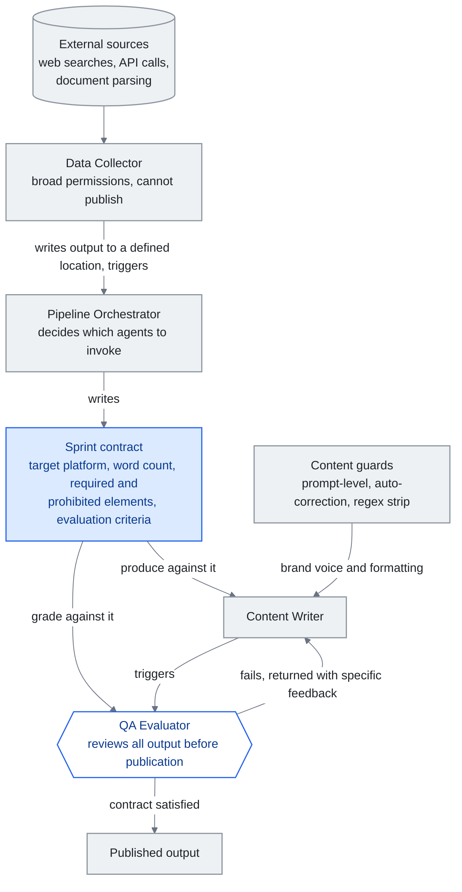

# Chapter 10: Building a Real-World Knowledge Harness

> **In one sentence:** One developer built a complete AI knowledge system with a 4-agent team, progressive disclosure routing, and automated content pipeline.
>
> **Why it matters:** This proves that one person with the right architecture can build what used to require a team. The concepts in this guide are not theoretical.
>
> **Reading time:** ~11 min (2,476 words / 230 wpm)

*Figure: The four-agent team of section "Harness Engineering: The Agent Team", with the sprint contract drawn as the one document three of the agents share. The orchestrator writes the contract, the writer produces against it, and the QA evaluator grades against the same criteria before anything can be published. The edge that carries the argument is the return path from evaluator to writer: this is not a single retry, so the four agents are a loop rather than a pipeline.*

This chapter presents an anonymized case study of a solo developer --- referred to as "the builder" --- who constructed a complete knowledge harness over several months of iterative development. The system described here is real and in daily production use. It demonstrates how the concepts discussed in earlier chapters --- context engineering, progressive disclosure, skill systems, and agent orchestration --- come together in practice.

## The Starting Point

The builder began with a simple problem: too much knowledge, not enough structure. A personal knowledge vault had grown to over 300 notes spanning active projects, technical references, meeting logs, and fleeting ideas. The standard approach --- search when you need something --- broke down as the vault grew. Notes were forgotten, insights were rediscovered instead of retrieved, and context was lost between work sessions.

The initial solution was modest: use an LLM assistant with access to the vault. But raw access to 300+ notes meant flooding the context window. The real engineering challenge was not "can the LLM read my notes" but "how do I give the LLM the right notes at the right time."

## Knowledge Layer: The Vault as Implicit Knowledge Graph

The foundation of the system is an Obsidian vault organized into a deliberate folder hierarchy:

- **Inbox** for capture (all new notes land here)
- **Active** for daily-use notes (kept to 5-10 items)
- **Projects** for time-bound work with deadlines
- **Areas** for ongoing responsibilities without deadlines
- **Notes** for atomic knowledge (one idea per note, titles as assertions)
- **Daily** for journals and review reports
- **Archive** for completed or outdated material

Every note uses wikilinks to connect to related notes, creating an implicit knowledge graph without requiring a formal graph database. The linking convention is simple but strict: if note A references a concept that note B elaborates on, A must link to B. Over time, this produces a navigable web of knowledge where any entry point leads to related context.

The vault is maintained through a review cycle: daily reviews process the inbox and classify new notes; weekly reviews analyze knowledge accumulation trends and resurface valuable older notes; monthly reviews check for contradictions, merge overlapping notes, and archive completed projects. This maintenance is not optional. Without it, the knowledge layer degrades within weeks as notes become stale, redundant, or orphaned.

## Context Engineering: The System Prompt as Index

The builder's context engineering approach treats the system prompt not as a monolithic instruction set but as an index into deeper resources. A central configuration file (analogous to a README for the AI) contains:

- **Environment details**: OS, shell, known quirks to avoid
- **Language preferences**: the builder's working language and formatting conventions
- **A routing table**: a prioritized list of skill categories with trigger keywords and pointers to routing files

This configuration file is always loaded. It is compact --- under 2,000 tokens --- because it contains pointers, not payloads. When the LLM encounters a user request, it matches against the routing table and loads only the relevant routing file, which in turn points to the specific skill needed.

A separate memory system handles cross-session persistence. It stores:

- Active project locations and structures
- User preferences learned from feedback
- Technical patterns and conventions specific to each project
- References to detailed sub-files for complex topics

The memory file grows organically. When the builder corrects the assistant's behavior, that correction is recorded as a preference. When a project's structure is established, it is documented once and referenced thereafter. This eliminates the repetitive "let me re-explain my project" problem that plagues stateless LLM interactions.

## Harness Engineering: The Agent Team

The system employs a four-agent team, each with a defined role:

1. **Data Collector**: Gathers information from external sources (web searches, API calls, document parsing). Operates with broad permissions but no ability to publish.
2. **Pipeline Orchestrator**: Coordinates workflows, decides which agents to invoke, and manages sequencing. Writes "sprint contracts" --- documents specifying expected output criteria for each task.
3. **Content Writer**: Produces output (reports, social media posts, technical documents). Operates under content guards that enforce brand voice and formatting standards.
4. **QA Evaluator**: Reviews all output against the sprint contract before it can be published. Checks factual accuracy, formatting compliance, and brand alignment.

The sprint contract mechanism deserves elaboration. When the orchestrator initiates a content task, it does not simply say "write a post about X." It produces a contract specifying: the target platform, word count range, required elements (e.g., must include a statistic, must end with a call to action), prohibited elements (e.g., no superlatives, no unverified claims), and evaluation criteria. The content writer produces against this contract. The QA evaluator grades against it. If the output fails evaluation, it is returned to the writer with specific feedback referencing the contract criteria. This is not a single retry --- the loop continues until the contract is satisfied or a human intervenes.

Content guards operate at three layers:

- **Prompt-level guards**: Instructions embedded in the system prompt that define what the agent must and must not do
- **Auto-correction**: Post-generation processing that catches and fixes common issues (e.g., removing unwanted formatting patterns, enforcing consistent terminology)
- **Regex strip**: A final pass that removes specific patterns that should never appear in output (e.g., certain characters that break downstream systems, metadata tokens that leak from the model)

Inter-agent communication is trigger-based. Agents do not poll each other. When the data collector finishes gathering information, it writes output to a defined location and triggers the orchestrator. When the writer produces content, it triggers the evaluator. This event-driven architecture keeps the system responsive without unnecessary computation.

## Skill System Evolution

The skill system underwent four distinct evolutionary stages, each driven by practical limitations discovered in production.

**Stage 1: Flat skill files.** Each skill was a standalone markdown file containing instructions. The LLM loaded all skill files at session start. This worked with 5-10 skills but became untenable as the collection grew. Context windows filled with skill definitions, leaving little room for actual work.

**Stage 2: Rich YAML frontmatter.** Skills gained structured metadata: trigger conditions, required context, dependencies, and version numbers. This allowed the system to filter skills by relevance, but the filtering logic itself consumed tokens and added latency.

**Stage 3: Wikilinks between skills.** Skills began linking to each other, creating a skill graph. A skill for "deploy" would link to "run tests" as a prerequisite. This enabled the system to load skill chains rather than individual skills, but navigation of the graph still required loading the graph index.

**Stage 4: Progressive disclosure with routing files.** The final architecture uses a compact index (the routing table in the system prompt) that points to seven category-specific routing files. Each routing file lists the skills in that category with their trigger conditions. The LLM loads only the routing file for the matched category, then loads only the specific skill needed. At any given moment, the system has loaded: the system prompt index (~2K tokens) + one routing file (~500 tokens) + one skill file (~1-2K tokens). Total overhead: under 4K tokens regardless of how many skills exist in the system.

The builder tested this routing architecture with 85 test queries spanning all categories and achieved 85/85 correct routing --- 100% accuracy. Edge cases (ambiguous queries that could match multiple categories) are handled by explicit disambiguation rules in the routing table.

## Results

The measurable outcomes of this architecture:

- **65% token reduction** from progressive disclosure compared to the flat-file approach. The same tasks that previously consumed 8-12K tokens of skill context now require under 4K.
- **Automated content pipeline** producing daily output across multiple platforms with consistent quality, managed by a single person.
- **Knowledge maintenance** via automated vault linting that detects contradictions, orphaned notes, and stale information --- problems that previously required manual review sessions.
- **Cross-session continuity** that eliminates the "cold start" problem. The memory system means the assistant picks up where it left off, every time.

## Lessons Learned

**Start simple, then layer complexity.** The builder did not design the four-agent sprint-contract system on day one. It started as a single agent with a text file of instructions. Each layer of complexity was added in response to a specific failure mode: agents hallucinated (add QA evaluator), output was inconsistent (add content guards), context windows overflowed (add progressive disclosure). Premature architecture would have produced a system optimized for imagined problems rather than real ones.

**Progressive disclosure is worth the setup cost.** Building and maintaining the routing table, seven routing files, and individual skill files requires ongoing effort. But the 65% token reduction pays for itself on every single interaction. More importantly, the system scales: adding a new skill means adding one entry to one routing file, not restructuring the entire prompt.

**Less is more.** Compressed, precise skill definitions outperform verbose ones. A skill file that says "search the vault for notes matching the query, return file paths and relevant excerpts, suggest connections" works better than a 500-word elaboration of the same instructions. The LLM does not need hand-holding; it needs clear intent.

**The harness IS the product.** The builder's competitive advantage is not any single skill or agent. It is the harness --- the routing logic, the sprint contracts, the content guards, the review cycle, the memory system. The individual components are straightforward. The integration is where the value lives. This mirrors a broader truth about knowledge engineering: the models are commoditizing, but the systems that orchestrate them are not.

## Sidebar: Claude Code as Reference Implementation

For most of the period in which the builder's system was evolving, Anthropic's own internal tooling was a black box. Practitioners could infer how Claude Code worked from its behavior, but nobody outside Anthropic had seen the source. That changed on **March 31, 2026**, when Anthropic accidentally shipped a 59.8MB source map inside npm package `@anthropic-ai/claude-code` v2.1.88 --- roughly 513,000 lines of unobfuscated TypeScript across 1,906 files (see Chapter 4 for the full story). The leak gave the community its first empirical look at a production harness from a frontier lab, and several of its patterns rhyme closely with what the builder arrived at independently:

- **Self-Healing Memory, not one big file.** Claude Code's leaked architecture is organized around a three-layer "Self-Healing Memory" system with explicit repair logic between layers. The builder's vault + memory file + sprint-contract loop is a poorer cousin of the same idea: a short-term working state (the current session), a medium-term compacted state (the memory file), and durable long-term knowledge (the vault). In both systems, "memory" is not a place; it is a set of layers with transitions between them.
- **MEMORY.md as index, not store.** Inside Claude Code, `MEMORY.md` is a lightweight pointer-style index into more detailed notes --- not a monolithic transcript. The builder's configuration file plays exactly the same role: it holds routing table and pointers, not payloads, and is the reason baseline context stays under 2K tokens.
- **`KAIROS` and autonomous daemon mode.** The Claude Code source references a `KAIROS` feature flag more than 150 times. It gates an autonomous daemon mode --- an unattended, long-running execution loop that goes well beyond the interactive REPL. The builder's trigger-based, event-driven inter-agent communication is a hand-rolled version of the same idea: agents that wake on events, do work, and hand off, without a human in the loop at every step.

The point of this sidebar is not that the builder's system is secretly Claude Code. The two systems are separated by orders of magnitude in engineering effort, and the builder's version does in hundreds of markdown files what Anthropic does in half a million lines of TypeScript. The point is that **both systems independently converged on the same shape** --- layered memory with an index, routing over payloads, and event-driven orchestration --- which suggests these patterns are not stylistic choices. They are what production harnesses end up looking like when they survive contact with real workloads.

## Implications for Practitioners

This case study illustrates that a single developer, working iteratively over months, can build a knowledge harness that would have required a team of engineers two years ago. The key enablers are: LLMs capable enough to follow complex multi-step instructions, open protocols (MCP) for tool integration, and the emerging discipline of context engineering that provides design patterns for these systems.

The builder's system is not a template to copy. It is a proof of concept that the principles in this guide --- progressive disclosure, context engineering, skill graphs, agent orchestration --- produce measurable results in production. Your harness will look different. The architecture should be the same.

---

## Three things to take away

- **The contract gives writer and evaluator a shared target.** The orchestrator specifies target platform, word count, required and prohibited elements up front, and the evaluator grades against that same document until it is satisfied or a human intervenes.
- **Progressive disclosure caps context overhead at a constant.** Index plus one routing file plus one skill file stays under 4K tokens no matter how many skills exist, a 65% reduction on the flat-file approach it replaced.
- **The harness is the product.** The individual components are straightforward; the integration -- routing logic, sprint contracts, content guards, review cycle, memory system -- is where the value lives.

---

*Next: [Chapter 11 - Key Moments in LLM Knowledge Engineering](11-timeline.md)*
