```mermaid
graph LR
    subgraph Sources["知識來源 Knowledge Sources"]
        RAG["RAG 管線"]
        KG["知識圖譜"]
        LC["長上下文視窗"]
    end

    subgraph Context["上下文工程 Context Engineering"]
        DCA["動態上下文組裝"]
        KVC["KV-Cache 最佳化"]
        SP["系統提示詞 + 指令"]
        TD["工具定義 + Schemas"]
        FSE["Few-shot 範例"]
        CH["對話歷史"]
    end

    subgraph Harness["系統編排工程 Harness Engineering"]
        SK["技能系統 + 路由"]
        MEM["記憶框架"]
        MCP["MCP / 工具層"]
        AR["Agent 執行環境 + 規劃"]
        PD["漸進式揭露"]
    end

    Sources --> Context --> Harness
```

> This is a Chinese translation of the [English README](../README.md). 章節內容目前為英文。

# 每個人都遺漏的地圖：2026 年 LLM 知識工程全景指南

> 我分析了超過 50 份 awesome lists、調查報告和指南——沒有一份把所有東西串起來。RAG 論文不提 harness engineering（系統編排工程）。Memory frameworks（記憶框架）忽略 skill systems（技能系統）。MCP 文件跳過 progressive disclosure（漸進式揭露）。這份指南畫出了完整的地圖。

---

## TL;DR（重點摘要）

- **Prompt engineering（提示工程）只是起點。** 這個領域經歷了三個世代的演進：Prompt Engineering（2022-2024）、Context Engineering（上下文工程，2025）、Harness Engineering（系統編排工程，2026）。每一層都包含前一層。
- **RAG（檢索增強生成）並沒有死。** 71% 嘗試過 context-stuffing（上下文填充）的企業在 12 個月內回歸 RAG（Gartner 2025 Q4）。混合架構正在勝出。
- **Context engineering 關注的是呼叫周圍的環境，而非呼叫本身。** Andrej Karpathy 在 2025 年中的重新定義，將焦點從精心設計提示詞轉移到動態建構整個 context window（上下文視窗）。
- **Harness engineering 是作業系統層。** Martin Fowler 和 OpenAI 在 2025 年底正式提出——模型是 CPU，上下文是 RAM，而 harness 就是協調一切的作業系統。
- **直到現在，沒有任何一份指南把這些全部串起來。** RAG、知識圖譜、長上下文、MCP、技能路由、記憶系統和漸進式揭露都是同一個生態系統的一部分。這就是那張地圖。

---

## 從這裡開始

AI 工具每年都在變得更聰明，但只有在正確的時間接收到正確的資訊時，它們才能發揮最佳效果。這份指南解釋了其中的運作原理——從最基本的告訴 AI 該做什麼，一路到圍繞 AI 模型設計整個系統。

把 AI 想像成一個出色的新員工，今天是他的第一天。Prompt engineering 是給他一個任務。Context engineering 是給他完成任務所需的所有背景資訊。Harness engineering 是設計他的整個工作環境——他的辦公桌、工具、檔案系統、團隊架構——讓他能穩定地發揮最佳表現。這份指南涵蓋了這三個層面，並展示它們之間的關聯。

如果你是新手，先從 [Glossary（術語表）](../glossary.md) 開始瞭解關鍵術語的定義。如果你在開發 AI 應用程式，直接跳到下面的章節。如果你只想看大局，看看這個頁面下方的 Ecosystem Map（生態系統地圖）。

---

## 你該走哪條路？

不確定從哪裡開始？選擇最符合你的描述：

- **「我只是想了解這些 AI 流行詞到底是什麼意思。」** ——先看 [Glossary（術語表）](../glossary.md)，再讀 [第 1 章：三個世代](../chapters/01-evolution.md)。
- **「我正在開發 AI 應用程式。」** ——依序閱讀 [第 2 章：RAG、長上下文與知識圖譜](../chapters/02-knowledge-layer.md)、[第 3 章：Context Engineering](../chapters/03-context-engineering.md)、[第 4 章：Harness Engineering](../chapters/04-harness-engineering.md)。
- **「我想讓我的 AI 工具更好用。」** ——閱讀 [第 5 章：Skill Systems（技能系統）](../chapters/05-skill-systems.md)、[第 6 章：Agent Memory（代理記憶）](../chapters/06-agent-memory.md)、[第 10 章：案例研究](../chapters/10-case-study.md)。
- **「我想看實際案例。」** ——直接跳到 [第 10 章：案例研究](../chapters/10-case-study.md)。
- **「我使用中國的 AI 工具。」** ——從 [第 9 章：中國 AI 生態系統](../chapters/09-china-ecosystem.md) 開始。
- **「我想要完整的全貌。」** ——從第 1 章開始，從頭讀到尾。

---

## 演進歷程

```
2022-2024               2025                    2026
提示工程            -->  上下文工程          -->  系統編排工程
PROMPT ENG               CONTEXT ENG              HARNESS ENG
                         (Karpathy)               (Fowler, OpenAI)

「精心設計              「動態建構                「圍繞模型
 完美的提示詞」          上下文視窗」              編排整個系統」
```

每個世代並不取代前一代——而是包含它。Harness engineering 包含 context engineering，context engineering 包含 prompt engineering。

---

## 生態系統地圖

```
+---------------------------+     +---------------------------+     +---------------------------+
|        知識來源            |     |       上下文工程           |     |       系統編排工程          |
|    KNOWLEDGE SOURCES      |     |   CONTEXT ENGINEERING     |     |   HARNESS ENGINEERING     |
|                           |     |                           |     |                           |
|  +---------------------+ | --> |  +---------------------+ | --> |  +---------------------+ |
|  | RAG 管線            | |     |  | 動態上下文組裝       | |     |  | 技能系統             | |
|  | - Self-RAG          | |     |  |   Dynamic Context   | |     |  | - 路由邏輯           | |
|  | - Corrective RAG    | |     |  |   Assembly          | |     |  | - 漸進式揭露         | |
|  | - Adaptive RAG      | |     |  |                     | |     |  |   Progressive        | |
|  +---------------------+ |     |  | KV-Cache 最佳化     | |     |  |   Disclosure         | |
|                           |     |  |                     | |     |  +---------------------+ |
|  +---------------------+ |     |  | 系統提示詞          | |     |                           |
|  | 知識圖譜             | |     |  |   + 指令            | |     |  +---------------------+ |
|  | - GraphRAG          | |     |  |                     | |     |  | 記憶框架             | |
|  | - 實體關係           | |     |  | 工具定義            | |     |  | - 短期記憶           | |
|  | - 多跳查詢           | |     |  |   + Schemas         | |     |  | - 長期記憶           | |
|  +---------------------+ |     |  |                     | |     |  | - 情節記憶           | |
|                           |     |  | Few-shot 範例       | |     |  +---------------------+ |
|  +---------------------+ |     |  |                     | |     |                           |
|  | 長上下文             | |     |  | 對話歷史            | |     |  +---------------------+ |
|  | - 1M+ token 視窗    | |     |  |                     | |     |  | MCP / 工具層         | |
|  | - 靜態文件匯入       | |     |  +---------------------+ |     |  | - 協定標準           | |
|  +---------------------+ |     +---------------------------+     |  | - 工具路由           | |
+---------------------------+                                       |  | - 驗證 + 沙箱        | |
                                                                    |  +---------------------+ |
                                                                    |                           |
                                                                    |  +---------------------+ |
                                                                    |  | Agent 執行環境       | |
                                                                    |  | - 規劃迴圈           | |
                                                                    |  | - 錯誤恢復           | |
                                                                    |  | - 多 Agent 協調      | |
                                                                    |  +---------------------+ |
                                                                    +---------------------------+
```



---

## 目錄

### 章節

| # | 章節 | 說明 |
|---|------|------|
| 01 | [三個世代](../chapters/01-evolution.md) | 從 prompt engineering 到 context engineering 再到 harness engineering |
| 02 | [RAG、長上下文與知識圖譜](../chapters/02-knowledge-layer.md) | 知識檢索層——什麼有效、什麼無效、為什麼混合架構勝出 |
| 03 | [Context Engineering（上下文工程）](../chapters/03-context-engineering.md) | 填充 context window 的藝術——KV-cache、100:1 比率、動態組裝 |
| 04 | [Harness Engineering（系統編排工程）](../chapters/04-harness-engineering.md) | 圍繞模型建構作業系統——引導、感測器，以及 6 倍效能差距 |
| 05 | [Skill Systems 與 Skill Graphs（技能系統與技能圖）](../chapters/05-skill-systems.md) | 從平面檔案到可遍歷的圖——漸進式揭露的實踐 |
| 06 | [Agent Memory（代理記憶）](../chapters/06-agent-memory.md) | 缺失的一層——情節記憶、語義記憶與程序記憶架構 |
| 07 | [MCP：勝出的標準](../chapters/07-mcp.md) | Model Context Protocol——從發布到月下載量超過 9,700 萬次 |
| 08 | [AI 原生知識管理](../chapters/08-tools-landscape.md) | 工具全景——Notion AI、Obsidian、Mem，以及 AI 原生差距 |
| 09 | [中國 AI 生態系統](../chapters/09-china-ecosystem.md) | Dify、RAGFlow、DeepSeek、Kimi——一個平行的創新宇宙 |
| 10 | [案例研究：真實世界的知識 Harness](../chapters/10-case-study.md) | 一位開發者如何建構完整的 harness 並實現 65% 的 token 縮減 |
| 11 | [時間線](../chapters/11-timeline.md) | LLM 知識工程的關鍵時刻，2022-2026 |

---

## 這份指南適合誰？

- **AI 工程師**：正在建構生產環境 LLM 應用程式，需要完整全貌而非單一切面的人
- **開發者體驗團隊**：正在設計圍繞 LLM 的 SDK 和工具整合的人
- **技術決策者**：正在評估 RAG、Agent 和工具使用等跨架構決策的人
- **AI 編程工具的進階用戶**（Cursor、Claude Code、Copilot）：想了解你的設定為什麼有效——或無效的人
- **研究者**：正在尋找一份從業者視角的地圖，展示理論進展如何在生產環境中串聯的人

你不需要博士學位就能讀懂這份指南。但你需要在乎把東西做好。

---

## 為什麼要寫這份指南

2026 年的 LLM 生態系統有一個碎片化問題。不是缺乏資訊——而是過多的、互不相連的資訊。

市面上有大量 RAG 調查報告。全面的 prompt engineering 指南。MCP 規格文件。Agent framework 比較。記憶系統論文。每一份單獨來看都很出色。但沒有任何一份告訴你這些碎片如何拼在一起。

這份指南就是那個缺失的層。它把 RAG 連接到 context engineering，把 context engineering 連接到 harness engineering，把 harness engineering 連接到 agent runtimes——並展示在每個邊界上真正重要的決策。

---

## 貢獻

歡迎貢獻。這是一份持續更新的文件。

- **勘誤**：如果某個論述有誤或來源過時，請開一個 issue，附上正確資訊和連結。
- **新增內容**：新章節、案例研究或圖表——請開一個 PR，清楚描述你新增的內容及原因。
- **翻譯**：翻譯 PR 放在 `/translations/` 目錄下，保持相同的檔案結構。

請保持語調專業但平易近人。引用來源。不浮誇。

---

## 授權條款

MIT License。詳見 [LICENSE](../LICENSE)。

隨意使用。標注出處非必要，但感謝你這麼做。

---

*最後更新：2026 年 4 月*
