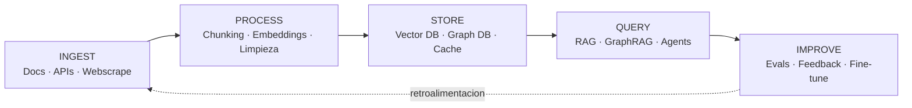

```mermaid
graph LR
    subgraph Sources["Fuentes de Conocimiento"]
        RAG["Pipelines de RAG"]
        KG["Grafos de Conocimiento"]
        LC["Ventanas de Contexto Largo"]
    end

    subgraph Context["Ingenieria de Contexto"]
        DCA["Ensamblaje Dinamico de Contexto"]
        KVC["Optimizacion de KV-Cache"]
        SP["Prompts del Sistema + Instrucciones"]
        TD["Definiciones de Herramientas + Schemas"]
        FSE["Ejemplos Few-shot"]
        CH["Historial de Conversacion"]
    end

    subgraph Harness["Ingenieria de Harness"]
        SK["Sistemas de Habilidades + Enrutamiento"]
        MEM["Frameworks de Memoria"]
        MCP["MCP / Capa de Herramientas"]
        AR["Runtime de Agentes + Planificacion"]
        PD["Divulgacion Progresiva"]
    end

    Sources --> Context --> Harness
```

# El Mapa que Todos Pasan por Alto: Ingenieria de Conocimiento LLM en 2026

[English](../README.md) | [繁體中文](README-zh.md) | [简体中文](README_zh-CN.md) | [日本語](README_ja.md) | [한국어](README_ko.md) | **Español**

> Esta es una traduccion al espanol del [English README](../README.md). El contenido de los capitulos esta actualmente en ingles.

> Analice mas de 50 awesome lists, encuestas y guias -- ninguna de ellas conectaba los puntos. Los papers de RAG no mencionan la ingenieria de harness. Los frameworks de memoria ignoran los sistemas de habilidades. La documentacion de MCP omite la divulgacion progresiva. Esta guia dibuja el mapa completo.

---

## TL;DR (Resumen Ejecutivo)

- **La ingenieria de prompts fue solo el comienzo.** El campo ha evolucionado a traves de tres generaciones: Prompt Engineering (2022-2024), Context Engineering (ingenieria de contexto, 2025) y Harness Engineering (ingenieria de orquestacion, 2026). Cada capa subsume la anterior.
- **RAG (Generacion Aumentada por Recuperacion) no esta muerto.** El 71% de las empresas que probaron context-stuffing (relleno de contexto) volvieron a RAG en 12 meses (Gartner Q4 2025). Las arquitecturas hibridas estan ganando.
- **Context engineering se trata de lo que rodea la llamada, no de la llamada en si.** La redefinicion de Andrej Karpathy a mediados de 2025 cambio el enfoque de disenar prompts a construir dinamicamente toda la ventana de contexto.
- **Harness engineering es la capa del sistema operativo.** Birgitta Böckeler (en la serie *Exploring Generative AI* de Martin Fowler, abril de 2026) y el enfoque de diseno de harness del equipo Codex de OpenAI formalizaron esto -- el modelo es la CPU, el contexto es la RAM, y el harness es el SO que orquesta todo.
- **Hasta ahora, ninguna guia habia conectado todo esto.** RAG, grafos de conocimiento, contexto largo, MCP, enrutamiento de habilidades, sistemas de memoria y divulgacion progresiva son todos parte de un mismo ecosistema. Este es el mapa.

---

## Empieza Aqui

Las herramientas de IA se vuelven mas inteligentes cada ano, pero solo funcionan bien cuando reciben la informacion correcta en el momento correcto. Esta guia explica como funciona -- desde lo basico de decirle a una IA que hacer, hasta disenar sistemas completos alrededor de modelos de IA.

Piensa en la IA como un brillante empleado nuevo en su primer dia. Prompt engineering es darle una tarea. Context engineering es darle toda la informacion de fondo que necesita para hacer bien la tarea. Harness engineering es disenar todo su entorno de trabajo -- su escritorio, sus herramientas, su sistema de archivos, la estructura de su equipo -- para que pueda rendir al maximo de forma consistente. Esta guia cubre los tres niveles y muestra como se conectan.

Si eres nuevo en este tema, comienza con el [Glosario](glossary_es.md) para conocer las definiciones de los terminos clave. Si desarrollas aplicaciones de IA, salta directamente a los capitulos de abajo. Si solo quieres ver el panorama general, mira el Ecosystem Map (mapa del ecosistema) mas abajo en esta pagina.

---

## Que Camino Deberias Tomar?

No estas seguro de por donde empezar? Elige la descripcion que mejor te describa:

- **"Solo quiero entender que significan todos estos terminos de IA."** -- Empieza con el [Glosario](glossary_es.md), luego lee el [Capitulo 1: Las Tres Generaciones](../chapters/01-evolution.md).
- **"Estoy desarrollando una aplicacion de IA."** -- Lee en orden el [Cap. 2: RAG, Contexto Largo y Grafos de Conocimiento](../chapters/02-knowledge-layer.md), [Cap. 3: Context Engineering](../chapters/03-context-engineering.md), [Cap. 4: Harness Engineering](../chapters/04-harness-engineering.md).
- **"Quiero que mis herramientas de IA funcionen mejor."** -- Lee el [Cap. 5: Sistemas de Habilidades](../chapters/05-skill-systems.md), [Cap. 6: Memoria de Agentes](../chapters/06-agent-memory.md), [Cap. 10: Caso de Estudio](../chapters/10-case-study.md).
- **"Quiero ver ejemplos reales."** -- Salta directamente al [Cap. 10: Caso de Estudio](../chapters/10-case-study.md).
- **"Trabajo con herramientas de IA chinas."** -- Comienza con el [Cap. 9: El Ecosistema de IA Chino](../chapters/09-china-ecosystem.md).
- **"Quiero el panorama completo."** -- Lee de principio a fin, empezando por el Capitulo 1.

---

## Casos de Uso

Esta guia te ayuda a disenar sistemas para estos escenarios del mundo real. Cada fila enlaza a los capitulos mas importantes para esa construccion:

| Escenario | Que estas construyendo | Capitulos centrales |
|-----------|------------------------|---------------------|
| **Segundo Cerebro Personal** | Notas personales + papers + recortes web buscables mediante consultas en lenguaje natural | [Ch02](/chapters/02-knowledge-layer.md) · [Ch05](/chapters/05-skill-systems.md) · [Ch08](/chapters/08-tools-landscape.md) |
| **Base de Conocimiento Interna** | Empleados consultan politicas / manuales / runbooks — baja tolerancia a alucinacion, citas requeridas | [Ch02](/chapters/02-knowledge-layer.md) · [Ch04](/chapters/04-harness-engineering.md) · [Ch06](/chapters/06-agent-memory.md) |
| **Asistente de Documentacion para Desarrolladores** | Ingenieros consultan codebases / docs de API / postmortems de incidentes pasados en entornos multi-repo | [Ch02](/chapters/02-knowledge-layer.md) · [Ch05](/chapters/05-skill-systems.md) · [Ch07](/chapters/07-mcp.md) |
| **Agente de Soporte / QA** | Tickets de cliente o internos → respuestas con conciencia de contexto, fuentes citadas y memoria de seguimiento | [Ch03](/chapters/03-context-engineering.md) · [Ch06](/chapters/06-agent-memory.md) · [Ch04](/chapters/04-harness-engineering.md) |
| **Automatizacion de Conocimiento de Dominio Especifico** *(legal, salud, finanzas, ingenieria)* | Reutilizar decadas de documentos del dominio — regulado, sensible en IP, a menudo requiere modelos locales y rastros de auditoria | [Ch02](/chapters/02-knowledge-layer.md) · [Ch09](/chapters/09-china-ecosystem.md) · [Ch12](/chapters/12-local-models.md) |

Si tu escenario no encaja limpiamente, probablemente sea una composicion de estos — empieza desde la fila mas cercana y adapta.

---

## La Evolucion

```
2022-2024               2025                    2026
ING. DE PROMPTS   -->   ING. DE CONTEXTO  -->   ING. DE HARNESS
PROMPT ENG               CONTEXT ENG              HARNESS ENG
                         (Karpathy)               (Fowler, OpenAI)

"Disenar el             "Construir                "Orquestar todo
 prompt perfecto"        dinamicamente la          el sistema
                         ventana de contexto"      alrededor del modelo"
```

Cada generacion no reemplaza a la anterior -- la contiene. Harness engineering incluye context engineering, que incluye prompt engineering.

---

## El Ciclo de Vida

El Mapa del Ecosistema muestra **cuales son las piezas**. El ciclo de vida muestra **como se mueven los datos a traves de ellas**:

```
                    ┌───── retroalimentacion ──────┐
                    ▼                              │
 INGEST  ───▶ PROCESS  ───▶ STORE  ───▶ QUERY ───▶ IMPROVE
 ingestar     procesar     almacenar   consultar  mejorar
    │             │            │          │           │
 Docs          Chunking      Vector DB    RAG       Evals
 APIs          Embeddings    Graph DB     GraphRAG  Feedback
 Web clips     Limpieza      Cache        Agents    Fine-tune
 Crawlers      Multi-modal   Long doc     Tool use  Skill updates
    │             │            │          │           │
   Ch02       Ch02 · Ch03   Ch02-08     Ch02-07     Ch06
```



Todo sistema en produccion mueve datos a traves de las cinco etapas — incluso si algunas son implicitas. Un buen diseno de harness hace que **cada etapa sea inspeccionable y reemplazable**. Ch02 cubre Ingest/Process/Store; Ch03–Ch07 cubren Query; Ch06 y Ch10 cubren Improve.

---

## Mapa del Ecosistema

```
+---------------------------+     +---------------------------+     +---------------------------+
|    FUENTES DE CONOCIMIENTO|     |   ING. DE CONTEXTO        |     |   ING. DE HARNESS         |
|    KNOWLEDGE SOURCES      |     |   CONTEXT ENGINEERING     |     |   HARNESS ENGINEERING     |
|                           |     |                           |     |                           |
|  +---------------------+ | --> |  +---------------------+ | --> |  +---------------------+ |
|  | Pipelines de RAG    | |     |  | Ensamblaje Dinamico | |     |  | Sistemas de          | |
|  | - Self-RAG          | |     |  |   de Contexto       | |     |  |   Habilidades        | |
|  | - Corrective RAG    | |     |  |                     | |     |  | - Logica de          | |
|  | - Adaptive RAG      | |     |  | Optimizacion de     | |     |  |   Enrutamiento       | |
|  +---------------------+ |     |  |   KV-Cache          | |     |  | - Divulgacion        | |
|                           |     |  |                     | |     |  |   Progresiva         | |
|  +---------------------+ |     |  | Prompts del Sistema | |     |  +---------------------+ |
|  | Grafos de           | |     |  |   + Instrucciones   | |     |                           |
|  |   Conocimiento      | |     |  |                     | |     |  +---------------------+ |
|  | - GraphRAG          | |     |  | Definiciones de     | |     |  | Frameworks de        | |
|  | - Relaciones de     | |     |  |   Herramientas      | |     |  |   Memoria            | |
|  |   Entidades         | |     |  |   + Schemas         | |     |  | - Memoria a corto    | |
|  | - Consultas         | |     |  |                     | |     |  |   plazo              | |
|  |   Multi-hop         | |     |  | Ejemplos Few-shot   | |     |  | - Memoria a largo    | |
|  +---------------------+ |     |  |                     | |     |  |   plazo              | |
|                           |     |  | Historial de        | |     |  | - Memoria episodica  | |
|  +---------------------+ |     |  |   Conversacion      | |     |  +---------------------+ |
|  | Contexto Largo      | |     |  +---------------------+ |     |                           |
|  | - Ventanas de       | |     +---------------------------+     |  +---------------------+ |
|  |   1M+ tokens        | |                                       |  | MCP / Capa de        | |
|  | - Ingesta de docs   | |                                       |  |   Herramientas       | |
|  |   estaticos         | |                                       |  | - Estandar de        | |
|  +---------------------+ |                                       |  |   Protocolo          | |
+---------------------------+                                       |  | - Enrutamiento de    | |
                                                                    |  |   Herramientas       | |
                                                                    |  | - Auth + Sandbox     | |
                                                                    |  +---------------------+ |
                                                                    |                           |
                                                                    |  +---------------------+ |
                                                                    |  | Runtime de Agentes   | |
                                                                    |  | - Bucles de          | |
                                                                    |  |   Planificacion      | |
                                                                    |  | - Recuperacion de    | |
                                                                    |  |   Errores            | |
                                                                    |  | - Coordinacion       | |
                                                                    |  |   Multi-agente       | |
                                                                    |  +---------------------+ |
                                                                    +---------------------------+
```



---

## Tabla de Contenidos

### Capitulos

| # | Capitulo | Descripcion |
|---|----------|-------------|
| 01 | [Las Tres Generaciones](../chapters/01-evolution.md) | De la ingenieria de prompts a la ingenieria de contexto y la ingenieria de harness |
| 02 | [RAG, Contexto Largo y Grafos de Conocimiento](../chapters/02-knowledge-layer.md) | La capa de recuperacion de conocimiento -- que funciona, que no, y por que gana lo hibrido |
| 03 | [Context Engineering (Ingenieria de Contexto)](../chapters/03-context-engineering.md) | El arte de llenar la ventana de contexto -- KV-cache, la proporcion 100:1, ensamblaje dinamico |
| 04 | [Harness Engineering (Ingenieria de Harness)](../chapters/04-harness-engineering.md) | Construyendo el SO alrededor del modelo -- guias, sensores y la brecha de rendimiento de 6x |
| 05 | [Sistemas de Habilidades y Grafos de Habilidades](../chapters/05-skill-systems.md) | De archivos planos a grafos recorribles -- divulgacion progresiva en la practica |
| 06 | [Memoria de Agentes](../chapters/06-agent-memory.md) | La capa que falta -- arquitecturas de memoria episodica, semantica y procedimental |
| 07 | [MCP: El Estandar que Gano](../chapters/07-mcp.md) | Model Context Protocol -- del lanzamiento a mas de 97 millones de descargas mensuales |
| 08 | [Gestion de Conocimiento AI-Nativa](../chapters/08-tools-landscape.md) | Panorama de herramientas -- Notion AI, Obsidian, Mem y la brecha AI-nativa |
| 09 | [El Ecosistema de IA Chino](../chapters/09-china-ecosystem.md) | Dify, RAGFlow, DeepSeek, Kimi -- un universo paralelo de innovacion |
| 10 | [Caso de Estudio: Un Harness de Conocimiento del Mundo Real](../chapters/10-case-study.md) | Como un desarrollador construyo un harness completo con 65% de reduccion de tokens |
| 11 | [Linea de Tiempo](../chapters/11-timeline.md) | Momentos clave en la ingenieria de conocimiento LLM, 2022-2026 |
| 12 | [Modelos Locales para la Ingenieria de Conocimiento](../chapters/12-local-models.md) | Ejecuta tu harness de conocimiento localmente — embedding, RAG, compilacion y el endgame de fine-tuning |

---

## Para Quien es Esta Guia?

- **Ingenieros de IA**: construyendo aplicaciones LLM en produccion que necesitan el panorama completo, no solo una porcion
- **Equipos de experiencia de desarrollador**: disenando integraciones de SDK y herramientas alrededor de LLMs
- **Lideres tecnicos**: evaluando decisiones de arquitectura entre RAG, agentes y uso de herramientas
- **Usuarios avanzados de herramientas de codificacion IA** (Cursor, Claude Code, Copilot): que quieren entender por que su configuracion funciona -- o no
- **Investigadores**: buscando un mapa desde la perspectiva del practicante de como los avances teoricos se conectan en produccion

NO necesitas un doctorado para leer esto. SI necesitas preocuparte por construir cosas que funcionen.

---

## Por Que Existe Esta Guia

El ecosistema LLM en 2026 tiene un problema de fragmentacion. No una falta de informacion -- un exceso de informacion desconectada.

Hay encuestas masivas sobre RAG. Guias completas de ingenieria de prompts. Documentos de especificacion de MCP. Comparaciones de frameworks de agentes. Papers sobre sistemas de memoria. Cada uno es excelente por separado. Ninguno te muestra como encajan las piezas.

Esta guia es esa capa que faltaba. Conecta RAG con context engineering, context engineering con harness engineering, harness engineering con runtimes de agentes -- y te muestra las decisiones que importan en cada frontera.

---

## Contribuir

Las contribuciones son bienvenidas. Este es un documento vivo.

- **Correcciones**: Si una afirmacion es incorrecta o una fuente esta desactualizada, abre un issue con la informacion correcta y un enlace.
- **Adiciones**: Nuevos capitulos, casos de estudio o diagramas -- abre un PR con una descripcion clara de lo que agregas y por que.
- **Traducciones**: Los PR de traduccion van en `/translations/`. Mantiene la misma estructura de archivos.

Mantiene un tono profesional pero accesible. Cita fuentes. Sin exageraciones.

---

## Licencia

MIT License. Ver [LICENSE](../LICENSE) para detalles.

Usa esto como quieras. La atribucion se agradece pero no es obligatoria.

---

*Ultima actualizacion: mayo 2026*
