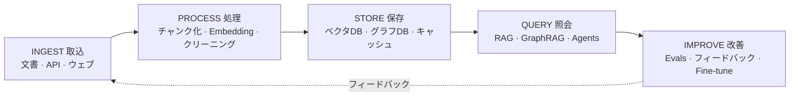

```mermaid
graph LR
    subgraph Sources["知識ソース Knowledge Sources"]
        RAG["RAGパイプライン"]
        KG["ナレッジグラフ"]
        LC["ロングコンテキストウィンドウ"]
    end

    subgraph Context["コンテキスト工学 Context Engineering"]
        DCA["動的コンテキストアセンブリ"]
        KVC["KV-Cache最適化"]
        SP["システムプロンプト + 指示"]
        TD["ツール定義 + スキーマ"]
        FSE["Few-shotサンプル"]
        CH["会話履歴"]
    end

    subgraph Harness["ハーネス工学 Harness Engineering"]
        SK["スキルシステム + ルーティング"]
        MEM["メモリフレームワーク"]
        MCP["MCP / ツール層"]
        AR["エージェントランタイム + 計画"]
        PD["プログレッシブ・ディスクロージャー"]
    end

    Sources --> Context --> Harness
```

# 誰もが見落としている地図：2026年 LLMナレッジエンジニアリング完全ガイド

[English](../README.md) | [繁體中文](README-zh.md) | [简体中文](README_zh-CN.md) | **日本語** | [한국어](README_ko.md) | [Español](README_es.md)

> これは [English README](../README.md) の日本語翻訳です。各章の内容は現在英語のままです。

> 50以上のawesome list、調査レポート、ガイドを分析しましたが、すべてを繋げているものは一つもありませんでした。RAGの論文はハーネスエンジニアリングに触れません。メモリフレームワークはスキルシステムを無視しています。MCPのドキュメントはプログレッシブ・ディスクロージャーを飛ばしています。このガイドが完全な地図を描きます。

---

## TL;DR（要点まとめ）

- **プロンプトエンジニアリングは始まりに過ぎない。** この分野は3つの世代を経て進化してきました：Prompt Engineering（2022-2024）、Context Engineering（コンテキストエンジニアリング、2025）、Harness Engineering（ハーネスエンジニアリング、2026）。各層は前の層を包含しています。
- **RAG（検索拡張生成）は死んでいない。** context-stuffing（コンテキスト詰め込み）を試した企業の71%が12ヶ月以内にRAGに戻りました（Gartner 2025 Q4）。ハイブリッドアーキテクチャが勝っています。
- **Context engineeringは呼び出しそのものではなく、呼び出しの周囲に注目する。** Andrej Karpathyが2025年半ばに再定義し、焦点をプロンプトの設計からコンテキストウィンドウ全体の動的構築へと移しました。
- **Harness engineeringはオペレーティングシステム層。** Birgitta Böckeler（Martin Fowlerの *Exploring Generative AI* シリーズ、2026年4月）とOpenAI Codexチームのharness設計フレーミングがこれを定式化しました。モデルはCPU、コンテキストはRAM、ハーネスはすべてを統括するOSです。
- **今まで、これらすべてを繋げたガイドは存在しなかった。** RAG、ナレッジグラフ、ロングコンテキスト、MCP、スキルルーティング、メモリシステム、プログレッシブ・ディスクロージャーはすべて一つのエコシステムの一部です。これがその地図です。

---

## ここから始めよう

AIツールは年々賢くなっていますが、正しい情報を正しいタイミングで受け取ったときにのみ最高のパフォーマンスを発揮します。このガイドはその仕組みを説明します——AIに何をすべきか伝える基本から、AIモデルを中心にシステム全体を設計するところまで。

AIを優秀な新入社員の初日だと想像してください。Prompt engineeringは一つのタスクを与えること。Context engineeringはタスクを遂行するために必要なすべての背景情報を与えること。Harness engineeringは仕事環境全体を設計すること——デスク、ツール、ファイルシステム、チーム構成——安定して最高のパフォーマンスを発揮できるようにすること。このガイドはこの3つの層すべてをカバーし、それらがどう繋がるかを示します。

初めての方は、まず [用語集](glossary_ja.md) で主要な用語の定義を確認してください。AIアプリケーションを開発している方は、以下の章に直接進んでください。全体像だけ知りたい方は、このページの下にあるEcosystem Map（エコシステムマップ）をご覧ください。

---

## どのパスを選ぶべき？

どこから始めればいいか分からない？最も当てはまる説明を選んでください：

- **「AIのバズワードが何を意味するのか理解したい」** ——まず [用語集](glossary_ja.md) を見て、次に [第1章：3つの世代](../chapters/01-evolution.md) を読む。
- **「AIアプリケーションを開発している」** ——順番に [第2章：RAG、ロングコンテキスト＆ナレッジグラフ](../chapters/02-knowledge-layer.md)、[第3章：Context Engineering](../chapters/03-context-engineering.md)、[第4章：Harness Engineering](../chapters/04-harness-engineering.md) を読む。
- **「AIツールをもっと使いこなしたい」** ——[第5章：スキルシステム](../chapters/05-skill-systems.md)、[第6章：エージェントメモリ](../chapters/06-agent-memory.md)、[第10章：ケーススタディ](../chapters/10-case-study.md) を読む。
- **「実際の事例が見たい」** ——直接 [第10章：ケーススタディ](../chapters/10-case-study.md) へ。
- **「中国のAIツールを使っている」** ——[第9章：中国AIエコシステム](../chapters/09-china-ecosystem.md) から始める。
- **「完全な全体像が欲しい」** ——第1章から最後まで通して読む。

---

## ユースケース

このガイドは以下の現実のシナリオに合わせたシステム設計を支援します。各行は、そのシナリオで最も重要な章へのリンクです：

| シナリオ | 何を構築しているか | 中核となる章 |
|----------|--------------------|--------------|
| **個人のセカンドブレイン** | 個人のメモ、論文、ウェブクリップを自然言語クエリで検索可能にする | [Ch02](/chapters/02-knowledge-layer.md) · [Ch05](/chapters/05-skill-systems.md) · [Ch08](/chapters/08-tools-landscape.md) |
| **社内ナレッジベース** | 従業員がポリシー／ハンドブック／ランブックを照会——ハルシネーション許容度が低く、引用必須 | [Ch02](/chapters/02-knowledge-layer.md) · [Ch04](/chapters/04-harness-engineering.md) · [Ch06](/chapters/06-agent-memory.md) |
| **開発者ドキュメントアシスタント** | エンジニアが複数リポジトリにまたがるコードベース／APIドキュメント／過去のインシデントポストモーテムを照会 | [Ch02](/chapters/02-knowledge-layer.md) · [Ch05](/chapters/05-skill-systems.md) · [Ch07](/chapters/07-mcp.md) |
| **サポート／QAエージェント** | 顧客または社内チケット → 引用元付きの文脈対応の返信＋フォローアップメモリ | [Ch03](/chapters/03-context-engineering.md) · [Ch06](/chapters/06-agent-memory.md) · [Ch04](/chapters/04-harness-engineering.md) |
| **ドメイン特化ナレッジ自動化** *（法務、医療、金融、エンジニアリング）* | 数十年分のドメイン文書を再利用——規制対象、知財センシティブ、しばしばローカルモデルと監査ログが必要 | [Ch02](/chapters/02-knowledge-layer.md) · [Ch09](/chapters/09-china-ecosystem.md) · [Ch12](/chapters/12-local-models.md) |

シナリオがきれいに当てはまらない場合、それは恐らくこれらの組み合わせです——最も近い行から始めて適応させてください。

---

## 進化の歴程

```
2022-2024               2025                    2026
プロンプト工学      -->  コンテキスト工学    -->  ハーネス工学
PROMPT ENG               CONTEXT ENG              HARNESS ENG
                         (Karpathy)               (Fowler, OpenAI)

「完璧な                「動的にコンテキスト      「モデルを中心に
 プロンプトを設計」      ウィンドウを構築」        システム全体を統括」
```

各世代は前の世代を置き換えるのではなく、包含します。Harness engineeringはcontext engineeringを含み、context engineeringはprompt engineeringを含みます。

---

## ライフサイクル

エコシステムマップは**部品が何か**を示します。ライフサイクルは**データが部品の間をどう流れるか**を示します：

```
                    ┌───── フィードバック ──────────┐
                    ▼                              │
 INGEST  ───▶ PROCESS  ───▶ STORE  ───▶ QUERY ───▶ IMPROVE
 取込          処理          保存        照会       改善
    │             │            │          │           │
 文書          チャンク化     ベクタDB     RAG        Evals
 API           Embedding      グラフDB     GraphRAG   フィードバック
 ウェブクリップ クリーニング   キャッシュ   Agents     Fine-tune
 クローラ      マルチモーダル  長文書      ツール使用 スキル更新
    │             │            │          │           │
   Ch02       Ch02 · Ch03   Ch02-08     Ch02-07      Ch06
```



すべての本番システムは、暗黙的なものも含めてデータを5つの段階に流します。良いハーネス設計は**各段階を検査可能かつ置換可能にします**。Ch02はIngest／Process／Store、Ch03–Ch07はQuery、Ch06とCh10はImproveをカバーします。

---

## エコシステムマップ

```
+---------------------------+     +---------------------------+     +---------------------------+
|       知識ソース           |     |    コンテキスト工学         |     |      ハーネス工学           |
|    KNOWLEDGE SOURCES      |     |   CONTEXT ENGINEERING     |     |   HARNESS ENGINEERING     |
|                           |     |                           |     |                           |
|  +---------------------+ | --> |  +---------------------+ | --> |  +---------------------+ |
|  | RAGパイプライン      | |     |  | 動的コンテキスト     | |     |  | スキルシステム       | |
|  | - Self-RAG          | |     |  |   アセンブリ         | |     |  | - ルーティング       | |
|  | - Corrective RAG    | |     |  |                     | |     |  | - プログレッシブ     | |
|  | - Adaptive RAG      | |     |  | KV-Cache最適化      | |     |  |   ディスクロージャー | |
|  +---------------------+ |     |  |                     | |     |  +---------------------+ |
|                           |     |  | システムプロンプト   | |     |                           |
|  +---------------------+ |     |  |   + 指示            | |     |  +---------------------+ |
|  | ナレッジグラフ       | |     |  |                     | |     |  | メモリフレームワーク | |
|  | - GraphRAG          | |     |  | ツール定義          | |     |  | - 短期記憶           | |
|  | - エンティティ関係   | |     |  |   + スキーマ        | |     |  | - 長期記憶           | |
|  | - マルチホップクエリ | |     |  |                     | |     |  | - エピソード記憶     | |
|  +---------------------+ |     |  | Few-shotサンプル    | |     |  +---------------------+ |
|                           |     |  |                     | |     |                           |
|  +---------------------+ |     |  | 会話履歴            | |     |  +---------------------+ |
|  | ロングコンテキスト   | |     |  |                     | |     |  | MCP / ツール層       | |
|  | - 1M+トークン       | |     |  +---------------------+ |     |  | - プロトコル標準     | |
|  | - 静的文書取込      | |     +---------------------------+     |  | - ツールルーティング | |
|  +---------------------+ |                                       |  | - 認証 + サンドボックス |
+---------------------------+                                       |  +---------------------+ |
                                                                    |                           |
                                                                    |  +---------------------+ |
                                                                    |  | エージェントランタイム |
                                                                    |  | - 計画ループ         | |
                                                                    |  | - エラー回復         | |
                                                                    |  | - マルチエージェント | |
                                                                    |  |   協調               | |
                                                                    |  +---------------------+ |
                                                                    +---------------------------+
```



---

## 目次

### 章

| # | 章 | 説明 |
|---|---|------|
| 01 | [3つの世代](../chapters/01-evolution.md) | プロンプトエンジニアリングからコンテキストエンジニアリング、ハーネスエンジニアリングへ |
| 02 | [RAG、ロングコンテキスト＆ナレッジグラフ](../chapters/02-knowledge-layer.md) | 知識検索層——何が有効で、何が無効で、なぜハイブリッドが勝つのか |
| 03 | [Context Engineering（コンテキスト工学）](../chapters/03-context-engineering.md) | コンテキストウィンドウを埋める技術——KV-cache、100:1比率、動的アセンブリ |
| 04 | [Harness Engineering（ハーネス工学）](../chapters/04-harness-engineering.md) | モデルの周りにOSを構築——ガイド、センサー、6倍のパフォーマンスギャップ |
| 05 | [スキルシステム＆スキルグラフ](../chapters/05-skill-systems.md) | フラットファイルから走査可能なグラフへ——プログレッシブ・ディスクロージャーの実践 |
| 06 | [エージェントメモリ](../chapters/06-agent-memory.md) | 欠けている層——エピソード記憶、意味記憶、手続き記憶のアーキテクチャ |
| 07 | [MCP：勝利した標準](../chapters/07-mcp.md) | Model Context Protocol——ローンチから月間9,700万以上のダウンロードへ |
| 08 | [AI ネイティブ知識管理](../chapters/08-tools-landscape.md) | ツールランドスケープ——Notion AI、Obsidian、Mem、AIネイティブギャップ |
| 09 | [中国AIエコシステム](../chapters/09-china-ecosystem.md) | Dify、RAGFlow、DeepSeek、Kimi——イノベーションの並行宇宙 |
| 10 | [ケーススタディ：実世界のナレッジハーネス](../chapters/10-case-study.md) | 一人の開発者が完全なハーネスを構築し65%のトークン削減を達成した方法 |
| 11 | [タイムライン](../chapters/11-timeline.md) | LLMナレッジエンジニアリングの重要な瞬間、2022-2026 |
| 12 | [ローカルモデルとナレッジエンジニアリング](../chapters/12-local-models.md) | 自分のハードウェアでナレッジハーネスを動かす——Embedding、RAG、コンパイル、ファインチューニングのエンドゲーム |

---

## 対象読者

- **AIエンジニア**：本番環境のLLMアプリケーションを構築しており、一つの断片ではなく全体像を必要としている方
- **開発者エクスペリエンスチーム**：LLM周辺のSDKやツール統合を設計している方
- **技術リーダー**：RAG、エージェント、ツール利用にわたるアーキテクチャの意思決定を評価している方
- **AIコーディングツールのパワーユーザー**（Cursor、Claude Code、Copilot）：自分のセットアップがなぜ機能するのか——あるいは機能しないのかを理解したい方
- **研究者**：理論的な進歩が本番環境でどう繋がるかを示す実務者の地図を探している方

このガイドを読むのに博士号は必要ありません。しかし、ちゃんと動くものを作ることに関心を持っている必要があります。

---

## このガイドが存在する理由

2026年のLLMエコシステムには断片化の問題があります。情報が不足しているのではなく、互いに繋がっていない情報が過剰なのです。

RAGに関する大規模な調査があります。包括的なプロンプトエンジニアリングガイドがあります。MCP仕様書があります。エージェントフレームワークの比較があります。メモリシステムの論文があります。それぞれ単独では優れています。しかし、それらのピースがどう組み合わさるかを示すものはありません。

このガイドがその欠けている層です。RAGをcontext engineeringに、context engineeringをharness engineeringに、harness engineeringをエージェントランタイムに接続し、各境界で重要な意思決定を示します。

---

## コントリビューション

コントリビューションを歓迎します。これは生きたドキュメントです。

- **訂正**：主張が間違っている、またはソースが古い場合は、正しい情報とリンクを添えてissueを開いてください。
- **追加**：新しい章、ケーススタディ、または図——追加する内容とその理由を明確に説明してPRを開いてください。
- **翻訳**：翻訳PRは `/translations/` に配置してください。同じファイル構造を維持してください。

プロフェッショナルでありながら親しみやすいトーンを保ってください。ソースを引用してください。誇大表現は不要です。

---

## ライセンス

MIT License。詳細は [LICENSE](../LICENSE) を参照。

自由にお使いください。帰属表示は必須ではありませんが、歓迎します。

---

*最終更新：2026年5月*
