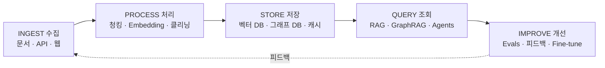

```mermaid
graph LR
    subgraph Sources["지식 소스 Knowledge Sources"]
        RAG["RAG 파이프라인"]
        KG["지식 그래프"]
        LC["롱 컨텍스트 윈도우"]
    end

    subgraph Context["컨텍스트 공학 Context Engineering"]
        DCA["동적 컨텍스트 조립"]
        KVC["KV-Cache 최적화"]
        SP["시스템 프롬프트 + 지시"]
        TD["도구 정의 + 스키마"]
        FSE["Few-shot 예제"]
        CH["대화 이력"]
    end

    subgraph Harness["하네스 공학 Harness Engineering"]
        SK["스킬 시스템 + 라우팅"]
        MEM["메모리 프레임워크"]
        MCP["MCP / 도구 계층"]
        AR["에이전트 런타임 + 계획"]
        PD["점진적 공개"]
    end

    Sources --> Context --> Harness
```

# 모두가 놓치고 있는 지도: 2026년 LLM 지식 공학 완전 가이드

[English](../README.md) | [繁體中文](README-zh.md) | [简体中文](README_zh-CN.md) | [日本語](README_ja.md) | **한국어** | [Español](README_es.md)

> 이 문서는 [English README](../README.md)의 한국어 번역입니다. 각 장의 내용은 현재 영어로 되어 있습니다.

> 50개 이상의 awesome list, 설문조사, 가이드를 분석했지만, 모든 것을 연결한 것은 하나도 없었습니다. RAG 논문은 하네스 엔지니어링을 언급하지 않습니다. 메모리 프레임워크는 스킬 시스템을 무시합니다. MCP 문서는 점진적 공개를 건너뜁니다. 이 가이드가 완전한 지도를 그립니다.

---

## TL;DR (핵심 요약)

- **프롬프트 엔지니어링은 시작에 불과했습니다.** 이 분야는 세 세대에 걸쳐 진화했습니다: Prompt Engineering(2022-2024), Context Engineering(컨텍스트 엔지니어링, 2025), Harness Engineering(하네스 엔지니어링, 2026). 각 층은 이전 층을 포함합니다.
- **RAG(검색 증강 생성)는 죽지 않았습니다.** context-stuffing(컨텍스트 채우기)을 시도한 기업의 71%가 12개월 이내에 RAG로 돌아왔습니다(Gartner 2025 Q4). 하이브리드 아키텍처가 승리하고 있습니다.
- **Context engineering은 호출 자체가 아닌 호출 주변 환경에 초점을 맞춥니다.** Andrej Karpathy가 2025년 중반에 재정의하며, 프롬프트 설계에서 전체 컨텍스트 윈도우의 동적 구성으로 초점을 전환했습니다.
- **Harness engineering은 운영체제 계층입니다.** Birgitta Böckeler(Martin Fowler의 *Exploring Generative AI* 시리즈, 2026년 4월)와 OpenAI Codex 팀의 harness 설계 프레이밍이 이를 공식화했습니다. 모델은 CPU, 컨텍스트는 RAM, 하네스는 모든 것을 조율하는 OS입니다.
- **지금까지 이 모든 것을 연결한 가이드는 없었습니다.** RAG, 지식 그래프, 롱 컨텍스트, MCP, 스킬 라우팅, 메모리 시스템, 점진적 공개는 모두 하나의 생태계의 일부입니다. 이것이 그 지도입니다.

---

## 여기서 시작하세요

AI 도구는 매년 더 똑똑해지고 있지만, 올바른 정보를 올바른 시간에 받을 때만 최고의 성능을 발휘합니다. 이 가이드는 그 작동 원리를 설명합니다 -- AI에게 무엇을 할지 알려주는 기본부터, AI 모델을 중심으로 전체 시스템을 설계하는 것까지.

AI를 첫 출근한 뛰어난 신입사원이라고 상상해 보세요. Prompt engineering은 하나의 작업을 주는 것입니다. Context engineering은 작업을 잘 수행하는 데 필요한 모든 배경 정보를 주는 것입니다. Harness engineering은 전체 업무 환경을 설계하는 것입니다 -- 책상, 도구, 파일 시스템, 팀 구조 -- 꾸준히 최고의 성과를 낼 수 있도록. 이 가이드는 이 세 가지 계층을 모두 다루고, 그것들이 어떻게 연결되는지 보여줍니다.

이 주제가 처음이라면, 먼저 [용어집](glossary_ko.md)에서 주요 용어의 정의를 확인하세요. AI 애플리케이션을 개발하고 있다면, 아래 장으로 바로 이동하세요. 전체 그림만 보고 싶다면, 이 페이지 아래의 Ecosystem Map(생태계 지도)을 보세요.

---

## 어떤 경로를 선택할까요?

어디서 시작할지 모르겠나요? 가장 잘 맞는 설명을 선택하세요:

- **"AI 버즈워드가 무슨 뜻인지 이해하고 싶다."** -- 먼저 [용어집](glossary_ko.md)를 보고, [제1장: 세 세대](../chapters/01-evolution.md)를 읽으세요.
- **"AI 애플리케이션을 개발하고 있다."** -- 순서대로 [제2장: RAG, 롱 컨텍스트 & 지식 그래프](../chapters/02-knowledge-layer.md), [제3장: Context Engineering](../chapters/03-context-engineering.md), [제4장: Harness Engineering](../chapters/04-harness-engineering.md)을 읽으세요.
- **"AI 도구를 더 잘 활용하고 싶다."** -- [제5장: 스킬 시스템](../chapters/05-skill-systems.md), [제6장: 에이전트 메모리](../chapters/06-agent-memory.md), [제10장: 사례 연구](../chapters/10-case-study.md)를 읽으세요.
- **"실제 사례를 보고 싶다."** -- 바로 [제10장: 사례 연구](../chapters/10-case-study.md)로 이동하세요.
- **"중국 AI 도구를 사용하고 있다."** -- [제9장: 중국 AI 생태계](../chapters/09-china-ecosystem.md)에서 시작하세요.
- **"완전한 전체 그림을 원한다."** -- 제1장부터 끝까지 읽으세요.

---

## 사용 사례

이 가이드는 다음과 같은 실제 시나리오에 맞춘 시스템을 설계하는 데 도움을 줍니다. 각 행은 해당 시나리오에서 가장 중요한 장에 대한 링크입니다:

| 시나리오 | 무엇을 구축하는가 | 핵심 장 |
|----------|---------------------|---------|
| **개인 세컨드 브레인** | 개인 메모, 논문, 웹 클리핑을 자연어 쿼리로 검색 | [Ch02](/chapters/02-knowledge-layer.md) · [Ch05](/chapters/05-skill-systems.md) · [Ch08](/chapters/08-tools-landscape.md) |
| **사내 지식 베이스** | 직원이 정책 / 핸드북 / 런북을 조회 — 환각 허용도 낮음, 인용 필수 | [Ch02](/chapters/02-knowledge-layer.md) · [Ch04](/chapters/04-harness-engineering.md) · [Ch06](/chapters/06-agent-memory.md) |
| **개발자 문서 어시스턴트** | 엔지니어가 멀티 레포 환경에서 코드베이스 / API 문서 / 과거 인시던트 포스트모템 조회 | [Ch02](/chapters/02-knowledge-layer.md) · [Ch05](/chapters/05-skill-systems.md) · [Ch07](/chapters/07-mcp.md) |
| **지원 / QA 에이전트** | 고객 또는 사내 티켓 → 인용된 출처가 있는 문맥 인식 응답과 후속 메모리 | [Ch03](/chapters/03-context-engineering.md) · [Ch06](/chapters/06-agent-memory.md) · [Ch04](/chapters/04-harness-engineering.md) |
| **도메인 특화 지식 자동화** *(법률, 의료, 금융, 엔지니어링)* | 수십 년의 도메인 문서 재활용 — 규제 대상, IP 민감, 종종 로컬 모델과 감사 로그 필요 | [Ch02](/chapters/02-knowledge-layer.md) · [Ch09](/chapters/09-china-ecosystem.md) · [Ch12](/chapters/12-local-models.md) |

시나리오가 깔끔하게 맞지 않으면, 보통은 위의 조합입니다 — 가장 가까운 행에서 시작하여 적응시키세요.

---

## 진화 과정

```
2022-2024               2025                    2026
프롬프트 공학       -->  컨텍스트 공학       -->  하네스 공학
PROMPT ENG               CONTEXT ENG              HARNESS ENG
                         (Karpathy)               (Fowler, OpenAI)

"완벽한                 "동적으로 컨텍스트        "모델을 중심으로
 프롬프트 설계"          윈도우 구성"              전체 시스템 조율"
```

각 세대는 이전 세대를 대체하는 것이 아니라 포함합니다. Harness engineering은 context engineering을 포함하고, context engineering은 prompt engineering을 포함합니다.

---

## 라이프사이클

생태계 지도는 **부품이 무엇인지** 보여줍니다. 라이프사이클은 **데이터가 부품 사이를 어떻게 흐르는지** 보여줍니다:

```
                    ┌───── 피드백 ──────────────────┐
                    ▼                              │
 INGEST  ───▶ PROCESS  ───▶ STORE  ───▶ QUERY ───▶ IMPROVE
 수집          처리          저장        조회       개선
    │             │            │          │           │
 문서          청킹           벡터 DB      RAG        Evals
 API           Embedding      그래프 DB    GraphRAG   피드백
 웹 클립       클리닝         캐시        Agents     Fine-tune
 크롤러        멀티모달       장문 문서    도구 사용  스킬 업데이트
    │             │            │          │           │
   Ch02       Ch02 · Ch03   Ch02-08     Ch02-07      Ch06
```



모든 프로덕션 시스템은 암묵적으로라도 데이터를 다섯 단계로 통과시킵니다. 좋은 하네스 설계는 **각 단계를 검사 가능하고 교체 가능하게** 만듭니다. Ch02는 Ingest / Process / Store, Ch03–Ch07은 Query, Ch06과 Ch10은 Improve를 다룹니다.

---

## 생태계 지도

```
+---------------------------+     +---------------------------+     +---------------------------+
|        지식 소스           |     |      컨텍스트 공학          |     |       하네스 공학           |
|    KNOWLEDGE SOURCES      |     |   CONTEXT ENGINEERING     |     |   HARNESS ENGINEERING     |
|                           |     |                           |     |                           |
|  +---------------------+ | --> |  +---------------------+ | --> |  +---------------------+ |
|  | RAG 파이프라인      | |     |  | 동적 컨텍스트 조립  | |     |  | 스킬 시스템         | |
|  | - Self-RAG          | |     |  |   Dynamic Context   | |     |  | - 라우팅 로직       | |
|  | - Corrective RAG    | |     |  |   Assembly          | |     |  | - 점진적 공개       | |
|  | - Adaptive RAG      | |     |  |                     | |     |  |   Progressive       | |
|  +---------------------+ |     |  | KV-Cache 최적화     | |     |  |   Disclosure        | |
|                           |     |  |                     | |     |  +---------------------+ |
|  +---------------------+ |     |  | 시스템 프롬프트     | |     |                           |
|  | 지식 그래프          | |     |  |   + 지시            | |     |  +---------------------+ |
|  | - GraphRAG          | |     |  |                     | |     |  | 메모리 프레임워크   | |
|  | - 엔티티 관계       | |     |  | 도구 정의           | |     |  | - 단기 기억         | |
|  | - 멀티홉 쿼리       | |     |  |   + 스키마          | |     |  | - 장기 기억         | |
|  +---------------------+ |     |  |                     | |     |  | - 에피소드 기억     | |
|                           |     |  | Few-shot 예제       | |     |  +---------------------+ |
|  +---------------------+ |     |  |                     | |     |                           |
|  | 롱 컨텍스트         | |     |  | 대화 이력           | |     |  +---------------------+ |
|  | - 1M+ 토큰 윈도우   | |     |  |                     | |     |  | MCP / 도구 계층     | |
|  | - 정적 문서 수집    | |     |  +---------------------+ |     |  | - 프로토콜 표준     | |
|  +---------------------+ |     +---------------------------+     |  | - 도구 라우팅       | |
+---------------------------+                                       |  | - 인증 + 샌드박스   | |
                                                                    |  +---------------------+ |
                                                                    |                           |
                                                                    |  +---------------------+ |
                                                                    |  | 에이전트 런타임     | |
                                                                    |  | - 계획 루프         | |
                                                                    |  | - 오류 복구         | |
                                                                    |  | - 멀티 에이전트     | |
                                                                    |  |   협조              | |
                                                                    |  +---------------------+ |
                                                                    +---------------------------+
```



---

## 목차

### 장

| # | 장 | 설명 |
|---|---|------|
| 01 | [세 세대](../chapters/01-evolution.md) | 프롬프트 엔지니어링에서 컨텍스트 엔지니어링, 하네스 엔지니어링으로 |
| 02 | [RAG, 롱 컨텍스트 & 지식 그래프](../chapters/02-knowledge-layer.md) | 지식 검색 계층 -- 무엇이 효과적이고, 무엇이 아닌지, 왜 하이브리드가 이기는지 |
| 03 | [Context Engineering(컨텍스트 공학)](../chapters/03-context-engineering.md) | 컨텍스트 윈도우 채우기의 기술 -- KV-cache, 100:1 비율, 동적 조립 |
| 04 | [Harness Engineering(하네스 공학)](../chapters/04-harness-engineering.md) | 모델 주변에 OS 구축 -- 가이드, 센서, 6배 성능 격차 |
| 05 | [스킬 시스템 & 스킬 그래프](../chapters/05-skill-systems.md) | 플랫 파일에서 순회 가능한 그래프로 -- 점진적 공개의 실천 |
| 06 | [에이전트 메모리](../chapters/06-agent-memory.md) | 빠진 계층 -- 에피소드 기억, 의미 기억, 절차 기억 아키텍처 |
| 07 | [MCP: 승리한 표준](../chapters/07-mcp.md) | Model Context Protocol -- 출시부터 월간 9,700만 이상 다운로드까지 |
| 08 | [AI 네이티브 지식 관리](../chapters/08-tools-landscape.md) | 도구 전경 -- Notion AI, Obsidian, Mem, AI 네이티브 격차 |
| 09 | [중국 AI 생태계](../chapters/09-china-ecosystem.md) | Dify, RAGFlow, DeepSeek, Kimi -- 혁신의 평행 우주 |
| 10 | [사례 연구: 실제 세계의 지식 하네스](../chapters/10-case-study.md) | 한 개발자가 완전한 하네스를 구축하여 65% 토큰 절감을 달성한 방법 |
| 11 | [타임라인](../chapters/11-timeline.md) | LLM 지식 공학의 핵심 순간, 2022-2026 |
| 12 | [로컬 모델과 지식 공학](../chapters/12-local-models.md) | 자신의 하드웨어에서 지식 하네스를 실행 — Embedding, RAG, 컴파일, 파인튜닝의 엔드게임 |

---

## 대상 독자

- **AI 엔지니어**: 프로덕션 LLM 애플리케이션을 구축하며, 하나의 조각이 아닌 전체 그림이 필요한 분
- **개발자 경험 팀**: LLM 주변의 SDK 및 도구 통합을 설계하는 분
- **기술 리더**: RAG, 에이전트, 도구 사용에 걸친 아키텍처 결정을 평가하는 분
- **AI 코딩 도구 파워 유저** (Cursor, Claude Code, Copilot): 자신의 설정이 왜 작동하는지 -- 또는 작동하지 않는지 이해하고 싶은 분
- **연구자**: 이론적 진보가 프로덕션에서 어떻게 연결되는지 보여주는 실무자의 지도를 찾는 분

이 가이드를 읽는 데 박사 학위는 필요 없습니다. 하지만 제대로 작동하는 것을 만드는 데 관심이 있어야 합니다.

---

## 이 가이드가 존재하는 이유

2026년의 LLM 생태계에는 파편화 문제가 있습니다. 정보가 부족한 것이 아니라, 서로 연결되지 않은 정보가 과잉입니다.

RAG에 대한 대규모 설문조사가 있습니다. 포괄적인 프롬프트 엔지니어링 가이드가 있습니다. MCP 사양 문서가 있습니다. 에이전트 프레임워크 비교가 있습니다. 메모리 시스템 논문이 있습니다. 각각 단독으로는 훌륭합니다. 하지만 이 조각들이 어떻게 맞춰지는지 보여주는 것은 없습니다.

이 가이드가 그 빠진 계층입니다. RAG를 context engineering에, context engineering을 harness engineering에, harness engineering을 에이전트 런타임에 연결하고, 각 경계에서 중요한 결정을 보여줍니다.

---

## 기여

기여를 환영합니다. 이것은 살아있는 문서입니다.

- **정정**: 주장이 잘못되었거나 출처가 오래된 경우, 올바른 정보와 링크를 포함하여 이슈를 열어주세요.
- **추가**: 새로운 장, 사례 연구 또는 다이어그램 -- 추가하는 내용과 이유를 명확히 설명하는 PR을 열어주세요.
- **번역**: 번역 PR은 `/translations/`에 배치하세요. 동일한 파일 구조를 유지하세요.

전문적이면서도 친근한 톤을 유지해 주세요. 출처를 인용하세요. 과대 광고는 불필요합니다.

---

## 라이선스

MIT License. 자세한 내용은 [LICENSE](../LICENSE)를 참조하세요.

자유롭게 사용하세요. 출처 표기는 필수가 아니지만, 감사드립니다.

---

*최종 업데이트: 2026년 5월*
