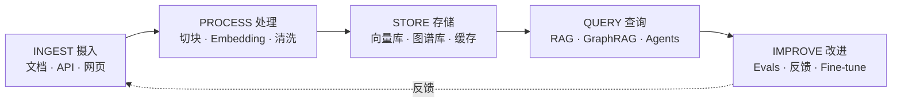

```mermaid
graph LR
    subgraph Sources["知识来源 Knowledge Sources"]
        RAG["RAG 管线"]
        KG["知识图谱"]
        LC["长上下文窗口"]
    end

    subgraph Context["上下文工程 Context Engineering"]
        DCA["动态上下文组装"]
        KVC["KV-Cache 优化"]
        SP["系统提示词 + 指令"]
        TD["工具定义 + Schemas"]
        FSE["Few-shot 范例"]
        CH["对话历史"]
    end

    subgraph Harness["系统编排工程 Harness Engineering"]
        SK["技能系统 + 路由"]
        MEM["记忆框架"]
        MCP["MCP / 工具层"]
        AR["Agent 执行环境 + 规划"]
        PD["渐进式揭露"]
    end

    Sources --> Context --> Harness
```

# 每个人都遗漏的地图：2026 年 LLM 知识工程全景指南

[English](../README.md) | [繁體中文](README-zh.md) | **简体中文** | [日本語](README_ja.md) | [한국어](README_ko.md) | [Español](README_es.md)

> 此为 [English README](../README.md) 的简体中文翻译。章节内容目前为英文。

> 我分析了超过 50 份 awesome lists、调查报告和指南——没有一份把所有东西串起来。RAG 论文不提 harness engineering（系统编排工程）。Memory frameworks（记忆框架）忽略 skill systems（技能系统）。MCP 文件跳过 progressive disclosure（渐进式揭露）。这份指南画出了完整的地图。

---

## TL;DR（重点摘要）

- **Prompt engineering（提示工程）只是起点。** 这个领域经历了三个世代的演进：Prompt Engineering（2022-2024）、Context Engineering（上下文工程，2025）、Harness Engineering（系统编排工程，2026）。每一层都包含前一层。
- **RAG（检索增强生成）并没有死。** 71% 尝试过 context-stuffing（上下文填充）的企业在 12 个月内回归 RAG（Gartner 2025 Q4）。混合架构正在胜出。
- **Context engineering 关注的是调用周围的环境，而非调用本身。** Andrej Karpathy 在 2025 年中的重新定义，将焦点从精心设计提示词转移到动态构建整个 context window（上下文窗口）。
- **Harness engineering 是操作系统层。** Birgitta Böckeler（在 Martin Fowler 的 *Exploring Generative AI* 系列，2026 年 4 月）和 OpenAI Codex 团队的 harness 设计框架共同奠定——模型是 CPU，上下文是 RAM，而 harness 就是协调一切的操作系统。
- **直到现在，没有任何一份指南把这些全部串起来。** RAG、知识图谱、长上下文、MCP、技能路由、记忆系统和渐进式揭露都是同一个生态系统的一部分。这就是那张地图。

---

## 从这里开始

AI 工具每年都在变得更聪明，但只有在正确的时间接收到正确的信息时，它们才能发挥最佳效果。这份指南解释了其中的运作原理——从最基本的告诉 AI 该做什么，一路到围绕 AI 模型设计整个系统。

把 AI 想象成一个出色的新员工，今天是他的第一天。Prompt engineering 是给他一个任务。Context engineering 是给他完成任务所需的所有背景信息。Harness engineering 是设计他的整个工作环境——他的办公桌、工具、文件系统、团队架构——让他能稳定地发挥最佳表现。这份指南涵盖了这三个层面，并展示它们之间的关联。

如果你是新手，先从 [Glossary（术语表）](../glossary.md) 开始了解关键术语的定义。如果你在开发 AI 应用程序，直接跳到下面的章节。如果你只想看大局，看看这个页面下方的 Ecosystem Map（生态系统地图）。

---

## 你该走哪条路？

不确定从哪里开始？选择最符合你的描述：

- **"我只是想了解这些 AI 流行词到底是什么意思。"** ——先看 [Glossary（术语表）](../glossary.md)，再读 [第 1 章：三个世代](../chapters/01-evolution.md)。
- **"我正在开发 AI 应用程序。"** ——依序阅读 [第 2 章：RAG、长上下文与知识图谱](../chapters/02-knowledge-layer.md)、[第 3 章：Context Engineering](../chapters/03-context-engineering.md)、[第 4 章：Harness Engineering](../chapters/04-harness-engineering.md)。
- **"我想让我的 AI 工具更好用。"** ——阅读 [第 5 章：Skill Systems（技能系统）](../chapters/05-skill-systems.md)、[第 6 章：Agent Memory（代理记忆）](../chapters/06-agent-memory.md)、[第 10 章：案例研究](../chapters/10-case-study.md)。
- **"我想看实际案例。"** ——直接跳到 [第 10 章：案例研究](../chapters/10-case-study.md)。
- **"我使用中国的 AI 工具。"** ——从 [第 9 章：中国 AI 生态系统](../chapters/09-china-ecosystem.md) 开始。
- **"我想要完整的全貌。"** ——从第 1 章开始，从头读到尾。

---

## 应用场景

这份指南帮你针对以下真实情境设计系统。每一行都链接到该情境最重要的章节：

| 情境 | 你在构建什么 | 核心章节 |
|------|--------------|----------|
| **个人第二大脑** | 把个人笔记、论文、网页剪藏以自然语言查询的方式检索 | [Ch02](/chapters/02-knowledge-layer.md) · [Ch05](/chapters/05-skill-systems.md) · [Ch08](/chapters/08-tools-landscape.md) |
| **公司内部知识库** | 员工查询制度、手册、操作流程——容错空间低，必须附引用 | [Ch02](/chapters/02-knowledge-layer.md) · [Ch04](/chapters/04-harness-engineering.md) · [Ch06](/chapters/06-agent-memory.md) |
| **开发者文档助手** | 工程师查询跨仓库代码、API 文档、过往事故报告 | [Ch02](/chapters/02-knowledge-layer.md) · [Ch05](/chapters/05-skill-systems.md) · [Ch07](/chapters/07-mcp.md) |
| **客服／QA Agent** | 客户或内部工单 → 带引用来源的情境感知回复＋后续记忆 | [Ch03](/chapters/03-context-engineering.md) · [Ch06](/chapters/06-agent-memory.md) · [Ch04](/chapters/04-harness-engineering.md) |
| **特定领域知识自动化** *（法律、医疗、金融、工程）* | 复用数十年领域文档——受监管、知识产权敏感、常需本地模型与审计轨迹 | [Ch02](/chapters/02-knowledge-layer.md) · [Ch09](/chapters/09-china-ecosystem.md) · [Ch12](/chapters/12-local-models.md) |

如果你的情境并不完全对应，那它通常是这些情境的组合——从最相近的一行开始改编。

---

## 演进历程

```
2022-2024               2025                    2026
提示工程            -->  上下文工程          -->  系统编排工程
PROMPT ENG               CONTEXT ENG              HARNESS ENG
                         (Karpathy)               (Fowler, OpenAI)

"精心设计                "动态构建                "围绕模型
 完美的提示词"            上下文窗口"              编排整个系统"
```

每个世代并不取代前一代——而是包含它。Harness engineering 包含 context engineering，context engineering 包含 prompt engineering。

---

## 生命周期

生态系统地图告诉你**有哪些零件**。生命周期告诉你**数据如何在零件之间流动**：

```
                    ┌───── 反馈 ──────────────────┐
                    ▼                              │
 INGEST  ───▶ PROCESS  ───▶ STORE  ───▶ QUERY ───▶ IMPROVE
 摄入          处理          存储        查询       改进
    │             │            │          │           │
 文档          切块          向量库       RAG        Evals
 API           Embedding     图谱库       GraphRAG   反馈
 网页剪藏      清洗          缓存         Agents     Fine-tune
 爬虫          多模态        长文档       工具用     技能更新
    │             │            │          │           │
   Ch02       Ch02 · Ch03   Ch02-08     Ch02-07      Ch06
```



每个生产系统都会把数据推过五个阶段——即使有些是隐性的。一个好的 harness 设计，会让**每个阶段都可检视、可替换**。Ch02 涵盖 Ingest／Process／Store；Ch03–Ch07 涵盖 Query；Ch06 与 Ch10 涵盖 Improve。

---

## 生态系统地图

```
+---------------------------+     +---------------------------+     +---------------------------+
|        知识来源            |     |       上下文工程           |     |       系统编排工程          |
|    KNOWLEDGE SOURCES      |     |   CONTEXT ENGINEERING     |     |   HARNESS ENGINEERING     |
|                           |     |                           |     |                           |
|  +---------------------+ | --> |  +---------------------+ | --> |  +---------------------+ |
|  | RAG 管线            | |     |  | 动态上下文组装       | |     |  | 技能系统             | |
|  | - Self-RAG          | |     |  |   Dynamic Context   | |     |  | - 路由逻辑           | |
|  | - Corrective RAG    | |     |  |   Assembly          | |     |  | - 渐进式揭露         | |
|  | - Adaptive RAG      | |     |  |                     | |     |  |   Progressive        | |
|  +---------------------+ |     |  | KV-Cache 优化       | |     |  |   Disclosure         | |
|                           |     |  |                     | |     |  +---------------------+ |
|  +---------------------+ |     |  | 系统提示词          | |     |                           |
|  | 知识图谱             | |     |  |   + 指令            | |     |  +---------------------+ |
|  | - GraphRAG          | |     |  |                     | |     |  | 记忆框架             | |
|  | - 实体关系           | |     |  | 工具定义            | |     |  | - 短期记忆           | |
|  | - 多跳查询           | |     |  |   + Schemas         | |     |  | - 长期记忆           | |
|  +---------------------+ |     |  |                     | |     |  | - 情节记忆           | |
|                           |     |  | Few-shot 范例       | |     |  +---------------------+ |
|  +---------------------+ |     |  |                     | |     |                           |
|  | 长上下文             | |     |  | 对话历史            | |     |  +---------------------+ |
|  | - 1M+ token 窗口    | |     |  |                     | |     |  | MCP / 工具层         | |
|  | - 静态文件导入       | |     |  +---------------------+ |     |  | - 协议标准           | |
|  +---------------------+ |     +---------------------------+     |  | - 工具路由           | |
+---------------------------+                                       |  | - 验证 + 沙箱        | |
                                                                    |  +---------------------+ |
                                                                    |                           |
                                                                    |  +---------------------+ |
                                                                    |  | Agent 执行环境       | |
                                                                    |  | - 规划回路           | |
                                                                    |  | - 错误恢复           | |
                                                                    |  | - 多 Agent 协调      | |
                                                                    |  +---------------------+ |
                                                                    +---------------------------+
```



---

## 目录

### 章节

| # | 章节 | 说明 |
|---|------|------|
| 01 | [三个世代](../chapters/01-evolution.md) | 从 prompt engineering 到 context engineering 再到 harness engineering |
| 02 | [RAG、长上下文与知识图谱](../chapters/02-knowledge-layer.md) | 知识检索层——什么有效、什么无效、为什么混合架构胜出 |
| 03 | [Context Engineering（上下文工程）](../chapters/03-context-engineering.md) | 填充 context window 的艺术——KV-cache、100:1 比率、动态组装 |
| 04 | [Harness Engineering（系统编排工程）](../chapters/04-harness-engineering.md) | 围绕模型构建操作系统——引导、传感器，以及 6 倍性能差距 |
| 05 | [Skill Systems 与 Skill Graphs（技能系统与技能图）](../chapters/05-skill-systems.md) | 从平面文件到可遍历的图——渐进式揭露的实践 |
| 06 | [Agent Memory（代理记忆）](../chapters/06-agent-memory.md) | 缺失的一层——情节记忆、语义记忆与程序记忆架构 |
| 07 | [MCP：胜出的标准](../chapters/07-mcp.md) | Model Context Protocol——从发布到月下载量超过 9,700 万次 |
| 08 | [AI 原生知识管理](../chapters/08-tools-landscape.md) | 工具全景——Notion AI、Obsidian、Mem，以及 AI 原生差距 |
| 09 | [中国 AI 生态系统](../chapters/09-china-ecosystem.md) | Dify、RAGFlow、DeepSeek、Kimi——一个平行的创新宇宙 |
| 10 | [案例研究：真实世界的知识 Harness](../chapters/10-case-study.md) | 一位开发者如何构建完整的 harness 并实现 65% 的 token 缩减 |
| 11 | [时间线](../chapters/11-timeline.md) | LLM 知识工程的关键时刻，2022-2026 |
| 12 | [本地模型与知识工程](../chapters/12-local-models.md) | 在自己硬件上跑整个知识 harness——Embedding、RAG、编译流程，以及微调终局 |

---

## 这份指南适合谁？

- **AI 工程师**：正在构建生产环境 LLM 应用程序，需要完整全貌而非单一切面的人
- **开发者体验团队**：正在设计围绕 LLM 的 SDK 和工具集成的人
- **技术决策者**：正在评估 RAG、Agent 和工具使用等跨架构决策的人
- **AI 编程工具的高级用户**（Cursor、Claude Code、Copilot）：想了解你的设置为什么有效——或无效的人
- **研究者**：正在寻找一份从业者视角的地图，展示理论进展如何在生产环境中串联的人

你不需要博士学位就能读懂这份指南。但你需要在乎把东西做好。

---

## 为什么要写这份指南

2026 年的 LLM 生态系统有一个碎片化问题。不是缺乏信息——而是过多的、互不相连的信息。

市面上有大量 RAG 调查报告。全面的 prompt engineering 指南。MCP 规范文件。Agent framework 比较。记忆系统论文。每一份单独来看都很出色。但没有任何一份告诉你这些碎片如何拼在一起。

这份指南就是那个缺失的层。它把 RAG 连接到 context engineering，把 context engineering 连接到 harness engineering，把 harness engineering 连接到 agent runtimes——并展示在每个边界上真正重要的决策。

---

## 贡献

欢迎贡献。这是一份持续更新的文件。

- **勘误**：如果某个论述有误或来源过时，请开一个 issue，附上正确信息和链接。
- **新增内容**：新章节、案例研究或图表——请开一个 PR，清楚描述你新增的内容及原因。
- **翻译**：翻译 PR 放在 `/translations/` 目录下，保持相同的文件结构。

请保持语调专业但平易近人。引用来源。不浮夸。

---

## 授权条款

MIT License。详见 [LICENSE](../LICENSE)。

随意使用。标注出处非必要，但感谢你这么做。

---

*最后更新：2026 年 5 月*
