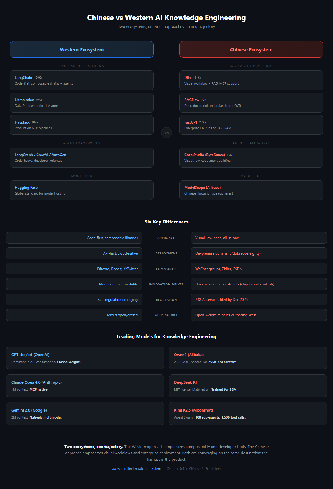

# 第 9 章：中國 AI 知識工程地景

> **一句話總結：** 中國建出一套平行 AI 生態系, 配自己的開源平臺、模型、社群——常常朝與西方不同的方向創新。
>
> **為什麼重要：** 全球一半的 AI 研究者在中國。忽略這個生態系意味錯過一半的創新。

關於 LLM 知識工程的全球對話, 不檢視中國生態系就不完整。截至 2025 年 12 月已向監管機構申報超過 748 項 AI 服務, 中國發展出一套平行——某些領域且發散——的方法來用大型語言模型建知識系統。本章繪製塑造中國開發者與企業如何處理知識工程的關鍵平臺、模型、文化差異。

## A. 開源 RAG 與 Agent 平臺

中國開源 AI 生態系產生幾個在 GitHub 流行度上匹敵或超越西方對手的平臺。這些專案的特徵是它們對視覺化工作流、企業部署就緒度、深度檔案理解的強調——反映中國企業客戶的實務需求。

### Dify（136K+ GitHub Stars）

[Dify](https://github.com/langgenius/dify) 是全球最多 star 的 agentic AI 平臺。Apache 2.0 授權, 它提供視覺畫布建構 RAG 管線、agentic 工作流、多步推理鏈。從 1.0 版起 Dify 支援 Model Context Protocol（MCP）, 讓外部工具伺服器能無縫整合。它的強項在於橋接視覺設計工作流的無程式碼使用者與需要程式化控制的開發者之間的差距。企業使用者能自架整個堆疊, 這在資料主權要求常排除僅雲端解法的中國市場關鍵。

### RAGFlow（62-75K+ GitHub Stars）

[RAGFlow](https://github.com/infiniflow/ragflow) 透過深度檔案理解差異化。不是把檔案當扁平文書處理, RAGFlow 跨 20+ 檔案格式（包括掃描 PDF、試算表、投影片）應用版面感知解析、OCR、表格提取。它的「agentic RAG」做法意味系統能根據查詢型別自主決定要應用哪種檢索策略。對處理遺留檔案庫的企業——中國國營企業與製造公司常見的情境——這能力不是 nice-to-have 而是要求。

### FastGPT（27K+ GitHub Stars）

[FastGPT](https://github.com/labring/FastGPT) 瞄準企業知識庫 Q&A, 聚焦在資源效率。它的 QA 對提取管線自動把檔案轉成 question-answer 對, 然後能用於檢索與微調。該平臺被設計成能在低至 2GB RAM 的機器上跑, 讓請不起專用 GPU 基礎設施的中小企業能存取。這個節儉反映中國生態系的更廣 pattern: 在約束下的最佳化。

### MaxKB（18K+ GitHub Stars）

[MaxKB](https://github.com/1Panel-dev/MaxKB) 把自己定位為配一鍵部署的企業 agent 平臺。它支援 MCP 做工具整合, 併為常見企業情境提供預建模板: 客服、內部知識檢索、檔案總結。它的吸引力在於把「我們要個 AI 助手」到「我們有一個在跑」的時間從數週縮到數小時。

### Coze Studio（15K+ GitHub Stars, ByteDance）

[Coze Studio](https://github.com/coze-dev/coze-studio) 是 ByteDance 的開源視覺 agent 開發平臺。原本是閉源產品, ByteDance 在 2025 年 7 月開源它, 三天內累積 10,000 GitHub stars——既證明壓抑需求也證明 ByteDance 的分發力。Coze Studio 提供拖放介面建 agent, 含內建記憶、工具使用、多輪對話管理。它與 ByteDance 的豆包模型家族整合給它在中文任務上原生優勢。

### DB-GPT（17K+ GitHub Stars）

[DB-GPT](https://github.com/eosphoros-ai/DB-GPT) 專精在 AI 原生資料互動。它的核心能力是自然語言轉 SQL 轉換, 讓非技術使用者能對話式查詢資料庫。它用視覺化生成與多 agent 資料分析管線延伸這。對坐擁大型結構化資料集的企業——這描述大多數中國金融、物流、製造公司——DB-GPT 提供 AI 增強分析的可親入口。

## B. 中國 LLM 的知識管理

中國基礎模型地景已快速成熟, 幾個模型現在在特定基準上與西方對手競爭或勝過。

### Qwen3（阿里雲）

Qwen3 是阿里的旗艦模型家族。最大變體是 2,350 億引數 Mixture of Experts（MoE）模型, Apache 2.0 授權釋出。Qwen3-Coder-480B, 程式設計專門化變體, 支援 256K 到 1M token 的上下文視窗。Apache 2.0 授權策略性重要: 它啟用無限制商用, 推動跨負擔不起專有 API 成本中國創業公司的採納。Qwen 的多語言能力在中文、日文、韓文上特別強——這些語言西方模型歷史上表現差。

### DeepSeek R1

DeepSeek R1 在數學與科學推理基準上與 OpenAI 的 o1 持平, 同時 MIT 授權釋出。該模型據報訓練成本不到 600 萬美元, 是可比西方模型的小部分。這個成本效率在行業引發震盪: R1 釋出後數月, 中國企業開源模型採納率從 23% 跳到 67%。DeepSeek R1 證明前沿級推理不需前沿級預算, 根本上轉移知識工程的經濟學。

2026 年 4 月, DeepSeek 用 **流形受限超連線（mHC）** 延伸它的架構貢獻, 這是 Transformer++ 風格模型用的殘差連線的泛化。當標準殘差流跨層向前攜帶單一通道資訊, mHC 攜帶 **多個內部流**, 每個被約束在一個學到的低維流形上。這個構造被設計來給後期層更豐富存取早期表示, 而不受簡單多流殘差在規模上承受的維度崩塌。DeepSeek 的部落格在引數量相當下報告長程推理基準上的增益, 在資訊必須跨許多中間層攜帶的任務上有最大改進。截至 2026 年 4 月, 該結果應被 **標記為等獨立複製**——這是單一實驗室對單一實驗室模型的披露, 而該領域在沒經過第三方再現的架構主張上吃過虧。如果結果成立, mHC 加入 MoE、MLA、DeepSeek 早期 multi-token prediction 工作, 成為在中國開源權重生態系起源後跨入主流使用的第三或第四個架構 primitive。

### DeepSeek V4（2026 年 4 月）

DeepSeek 的 **V4 preview**（2026 年 4 月 24 日）在三軸同時延伸 R1 敘事: 經濟學、能力、**推論基底**。該釋出在 Hugging Face 以 MIT 授權出貨兩個開源權重 Mixture-of-Experts 模型——**V4-Pro 1.6 萬億引數 / 49B 活躍**、**V4-Flash 284B / 13B 活躍**——配 100 萬 token 上下文視窗作為預設而非分層。API 定價是 2026 年任何前沿級模型最激進: **V4-Flash 每百萬輸出 token $0.28**、V4-Pro $3.48, 反映 V4 比 V3 **每 token 推論 FLOPs 減少 73%**, 由架構變更驅動而非僅硬體最佳化。在程式設計基準上——R1 首先建立信譽的領域——V4-Pro 拿下排行榜首, **LiveCodeBench 93.5%**（領先 Gemini 3.1 Pro 91.7% 與 Claude Opus 4.6 88.8%）和 **Codeforces 評分 3206**（超越 GPT-5.4 3168）。

但對本章最重要的結構細節, 不是定價或基準, 而是 **推論基底**。訓練 V4 用了含 NVIDIA A100 與 H20 硬體的混合叢集——前沿*訓練*能否完全在 NVIDIA 堆疊外發生的問題仍困難。但模型 **day-zero 適配 Huawei Ascend 950PR**, DeepSeek 與 Huawei 聯合報告在為模型生產服務上 Ascend NPU 與 NVIDIA H20 GPU 之間的 **推論對等——在這個架構上, 約 2.8 倍運算吞吐**。這是主權矽論點的微妙形式: 不是「我們沒用 NVIDIA 訓練」而是 **「我們沒用 NVIDIA 服務」**。對面對美國出口管制的中國企業客戶, V4 是首次有前沿級開源權重模型在 day-one 就有可信的國產矽服務路徑——對本章一直在描述的部署重的中國生態系, 這比訓練可選性更接近承重約束。讀在 R1 2025 年 1 月拐點旁邊, V4 關閉一個一年的故事弧線: 中國開源權重生態系現在能在同一天釋出前沿程式設計模型 **與** 為它服務的基底。

### Kimi K2.5（Moonshot AI）

Kimi K2.5 引入「Agent Swarm」——一個能力, 單一查詢能 spawn 至多 100 個子 agent, 透過約 1,500 次工具呼叫協作。這不是研究 demo; 它是用於複雜研究任務的生產功能, 系統並行 web 搜尋、檔案分析、跨數十併發 agent 綜合。早些時候, Kimi 達到 200 萬中文字元上下文視窗（約 2025 年 3 月）, 讓它成為針對中文最佳化的最長 context 模型。

### ERNIE 5.0（百度）

ERNIE 5.0 是百度的 2.4 萬億引數模型, 配原生全模態支援——單一模型內的文字、影象、聲音、影片理解與生成。2026 年 1 月推出, 它代表百度的賭注: 知識系統的未來從地基起就是多模態, 不是把多模態附加到文字模型作為事後想法。

### GLM-4.5/5（Zhipu AI）

Zhipu AI 的 GLM 系列, 以 7,440 億引數 MoE GLM-5 為高峰, 是為 agent harness 量身打造。模型架構含原生工具使用 token 與結構化輸出保證, 減少建可靠 agent 整合到生產管線所需的 scaffolding 程式碼。這種「agent 原生」設計哲學意味較少 prompt engineering 與較少把 GLM 整合進生產管線的重試。

## C. 與西方生態系的關鍵差異

理解中國知識工程地景需要不只編纂工具與模型。生態系在根本不同的約束與誘因下運作, 這些從第一天起就塑造架構決策。

### 工具偏好：視覺優先 vs. 程式碼優先

最受歡迎中國平臺——Dify、Coze Studio、FastGPT——是視覺優先。使用者透過在畫布上拖放節點建知識管線。相反, 西方生態系的主導框架（LangChain、LlamaIndex、Haystack）是程式碼優先, 視覺工具是次要附加。這個發散反映不同使用者人口統計: 中國 AI 採納大量由企業 IT 部門與可能不寫 Python 的「公民開發者」推動, 而西方早期採用者傾向是擅長程式碼的軟體工程師。

### 部署：On-premise vs. API 優先

On-premise 部署在中國主導。這由兩個相互加強因素驅動: 資料主權的監管要求（特別在金融、醫療、政府）和實務約束自美國晶片出口管制讓大規模雲端 GPU 存取更貴。結果是中國平臺大量投資量化、蒸餾、效率——讓模型在可用硬體上跑得好, 而非假設無限雲端運算。西方平臺相反預設 API 優先架構, 模型跑在供應商基礎設施上。

### 監管架構

到 2025 年 12 月, 已有 748 個 AI 服務在《生成式 AI 管理辦法》下向中國監管機構申報。合規不是可選或抱負——它從設計階段塑造技術架構。內容過濾、稽核日誌、使用者身分驗證作為核心功能內建在平臺中, 不是釋出前栓上的。這個監管壓力悖論地創造了更標準化架構: 當每個人都必須實現同樣合規要求, 讓合規容易的平臺勝出。

### 社群與知識分享

中國開發者社群在根本不同平臺上運作。微信群組（不是 Slack 或 Discord）是即時討論的主要頻道。知乎擔任長技術 Q&A 的 Stack Overflow 角色。CSDN（中國軟體開發網路）託管教程與博文。GitHub 用於程式碼, 但討論在別處發生。這個碎片化意味西方開發者搜 GitHub Issues 或 Discord 求中國工具的幫助常找到稀疏的英文支援, 而中文社群充滿活力——只是對非中文使用者不可見。

### 透過約束創新

美國晶片出口管制創造了意外創新動態。中國 AI 實驗室無法簡單擴充套件運算, 不成比例地投資在演算法效率。DeepSeek R1 不到 600 萬美元訓練成本是最可見結果, 但該 pattern 跨整個生態系延伸: 較小模型配更好推論最佳化、更激進量化技術、為最大化每 FLOP 能力設計的架構。西方生態系運算更多, 傾向透過規模創新。兩個做法都產生前沿結果, 但透過不同路徑。

### 開源作為策略性必要

中國開源權重模型釋出在數量上現已超越西方。這不是利他——是策略。開源建生態系鎖定（開發者基於你的模型建）、吸引人才（研究者想做人們用的模型）、在全球開發者社群創造外交善意。Alibaba 的 Apache 2.0 授權 Qwen、DeepSeek 的 MIT 授權、ByteDance 的 Coze Studio 開源都遵循這 pattern。結果是任何地方的 solo 開發者現在能完全在中國開源基礎設施上建生產知識系統, 從模型到框架到部署工具。

## D. 關於 Bilibili 內容的註記

Bilibili（B 站）託管大量 AI 教程, 但從業者應注意許多是英文 YouTube 內容的重新上傳或翻譯。Bilibili AI 內容的原創價值在於中文專屬工具教程: Dify 步步部署指南、Qwen 整合走讀、英文不存在的企業部署案例研究。在 Bilibili 上研究時, 永遠把內容追溯到原始來源。如果一個教程示範英文敘述配中文配音的 LangChain, 原始 YouTube 版本可能更新。

## 來源

- Dify GitHub Repository: [https://github.com/langgenius/dify](https://github.com/langgenius/dify)
- RAGFlow GitHub Repository: [https://github.com/infiniflow/ragflow](https://github.com/infiniflow/ragflow)
- FastGPT GitHub Repository: [https://github.com/labring/FastGPT](https://github.com/labring/FastGPT)
- MaxKB GitHub Repository: [https://github.com/1Panel-dev/MaxKB](https://github.com/1Panel-dev/MaxKB)
- Coze Studio GitHub Repository: [https://github.com/coze-dev/coze-studio](https://github.com/coze-dev/coze-studio)
- DB-GPT GitHub Repository: [https://github.com/eosphoros-ai/DB-GPT](https://github.com/eosphoros-ai/DB-GPT)
- Qwen3 技術報告與模型卡, 阿里雲（2025）——主要入口: [https://huggingface.co/Qwen](https://huggingface.co/Qwen) 與 Qwen 團隊的 Hugging Face 文章。Apache 2.0 授權細節透過倉庫 LICENSE 檔確認。
- DeepSeek R1 論文: "DeepSeek-R1: Incentivizing Reasoning Capability in LLMs via Reinforcement Learning"（2025 年 1 月）。[https://github.com/deepseek-ai/DeepSeek-R1](https://github.com/deepseek-ai/DeepSeek-R1) 託管模型並連結到技術報告 PDF。
- Moonshot AI. Kimi K2.5 Agent Swarm 報道在 2026 年初跨 Moonshot 部落格與科技媒體流通; 這裡引用的 100 子 agent / 約 1500 工具呼叫數字從次級科技媒體總結報告。主要存取透過 [https://platform.moonshot.ai](https://platform.moonshot.ai)。
- 百度. ERNIE 5.0 推出（2026 年 1 月）; 2.4T 引數 / 原生全模態主張透過百度官方頻道與中國科技媒體流通。這裡沒引用單一主要 URL; 把模態與引數數字當作廣為報告但次級。
- Zhipu AI. GLM-4/5 模型卡在 Hugging Face 與官方 ZhipuAI 部落格;「744B MoE GLM-5」+ agent 原生工具 token 跨模型卡與部落格報道報告。主要入口: [https://www.zhipuai.cn](https://www.zhipuai.cn)。
- Cyberspace Administration of China,「生成式 AI 服務申報」披露（2025 年 12 月）——748 服務數字在中國科技媒體廣為複製; 底層 registry 透過 CAC 官方網站分批發布。
-「中國開源 AI」市場評論——R1 後中國企業開源採納從 23% 到 67% 的轉變跨多個次級出口在 2025-2026 報告; 視為廣為引用但這裡沒釘單一主要調查。
- DeepSeek. "DeepSeek mHC: Manifold-Constrained Hyper-Connections"（2026 年 4 月）。[https://deepseek.ai/blog/deepseek-mhc-manifold-constrained-hyper-connections](https://deepseek.ai/blog/deepseek-mhc-manifold-constrained-hyper-connections) ——標記為等獨立複製。
- DeepSeek. V4 模型在 Hugging Face 釋出（2026 年 4 月 24 日）。MIT 授權; V4-Pro 1.6T（49B 活躍）/ V4-Flash 284B（13B 活躍）; 1M token 預設 context。
- Fortune. "DeepSeek unveils V4 model, with rock-bottom prices and close integration with Huawei's chips"（2026 年 4 月 24 日）。[https://fortune.com/2026/04/24/deepseek-v4-ai-model-price-performance-china-open-source/](https://fortune.com/2026/04/24/deepseek-v4-ai-model-price-performance-china-open-source/)
- South China Morning Post. "DeepSeek unveils next-gen AI model as Huawei vows 'full support' with new chips"（2026 年 4 月 24 日）。[https://www.scmp.com/tech/big-tech/article/3351239/deepseek-releases-next-gen-ai-model-world-leading-efficiency](https://www.scmp.com/tech/big-tech/article/3351239/deepseek-releases-next-gen-ai-model-world-leading-efficiency)
- Phemex News. "DeepSeek V4 Matches NVIDIA on Huawei Ascend, Dispels Rumors"（2026 年 4 月）。[https://phemex.com/news/article/deepseek-v4-matches-nvidia-performance-on-huawei-ascend-dispels-delay-rumors-75616](https://phemex.com/news/article/deepseek-v4-matches-nvidia-performance-on-huawei-ascend-dispels-delay-rumors-75616) ——推論對等主張, 在 Ascend 950PR 上比 NVIDIA H20 約 2.8 倍運算吞吐。

---

*下一章: [第 10 章 —— 構建一個真實世界的知識 Harness](10-case-study.md)*
